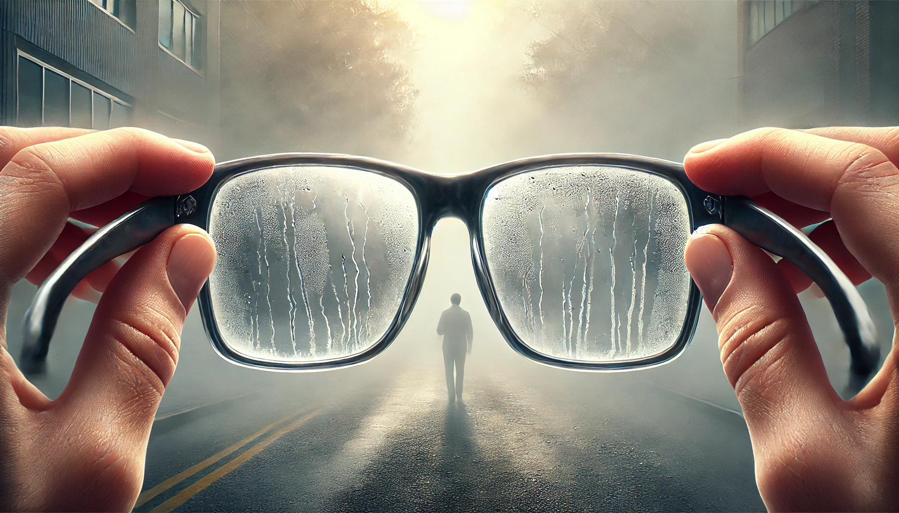
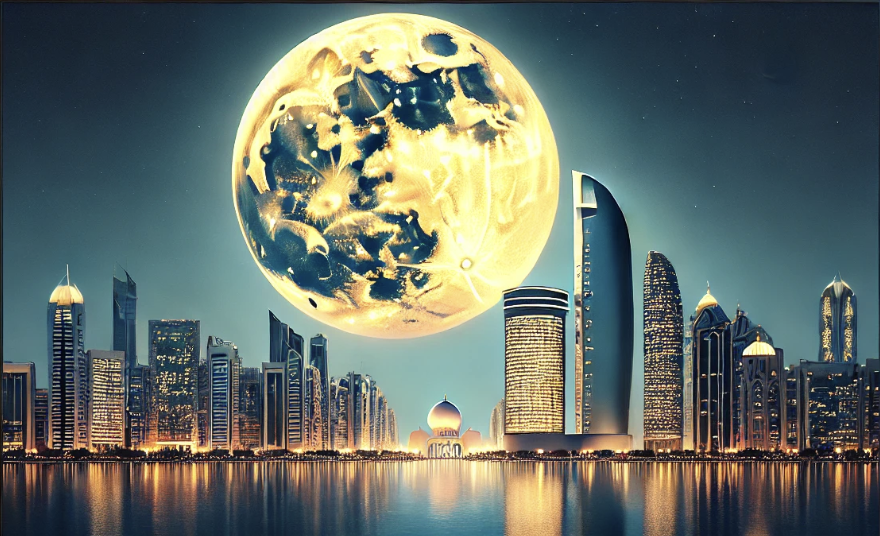

# 【随笔】阿布扎比的真正桑拿天

一直感觉最近运动量不够，想着哪天早上跟着太阳一同起床，出门走一走，算是运动一下。但是，每天晚睡，导致这早起的愿望一直不能实现。

昨天我想，既然如此，不如晚上出门走走吧。

等到太阳落山，快到8点钟的时候，想着外面应该不会那么热了，便换上运动鞋、运动裤走出了酒店。推开门的刹那，一股热气汹涌而来，我的眼镜瞬间蒙上了一层厚厚的水汽，什么都看不见了。我赶忙摘下眼镜，四下张望，找到了之前在楼上窗前就看好的路标，躲开车辆，过了马路，开始往海边的方向走。

一路上很多车，但是行人也不少。感觉还是印巴人居多，也有不少黑人。与此同时，还有一些橙色、绿色骑着摩托的外卖小哥穿梭在汽车与行人之间。和沙特阿拉伯不一样，这里的红绿灯、人行横道颇为完善，汽车也大多谦和地礼让行人（不知道是不是交规比较严格）。纵然是车水马龙的市中心街道，作为行人走在路上，依然没什么困扰。

但是，这温度。我感觉和桑拿房里真没什么两样，还没怎么走路，汗水就开始全方位地涌出来。我很想掏出手机来看一看现在室外温度是多少，摸了摸口袋却发现自己把手机拉在了房间里。虽然没有40摄氏度，应该有38摄氏度吧，至少体感温度如此。这效果，和去做个桑拿想必是一样一样的，想必放松效果也能差不多吧。

唯一的区别就是，在这外面做「桑拿」，我必须把衣服穿得整整齐齐。

走到海边就已经是全身湿透了，连拿在手里的布包都被汗水浸得透透的。我拿出水杯，喝了一口水。沿海边的走廊人不多，偶尔会见到有一小群印巴小哥聚在一起散步，更偶尔会遇到一两个慢跑的女士。虽然在海边，可是完全没有风，实在太热了，连钓鱼的人都少了许多。不过，那些小孩子依旧生龙活虎地在这里奔跑追逐，直吓得路上的野猫紧张地躲到一边观望。

猛一回头，发现一轮圆月在高楼大厦间升起，又大又亮，黄澄澄的。也不知是十五还是十六，看到圆圆的月亮，就忍不住思念起家人来。虽然这不是中秋，但还是忍不住会想起，陪大宝一起赏月的那许多个月圆之时。

「但愿人长久，千里共婵娟」

沿着海边，在这露天桑拿室里暴走了一个多小时，回到酒店已经是九点四十了。我赶紧洗澡，读玫瑰经，把闹钟调到早上6点半，赶在10点四十前关上了所有的灯，想着这次一定要在太阳高升之前，出去看看外面温度如何。

然而，早上我一直没有听到闹钟的声音，爬起来一看时间，已经是9点27了。原来，室外桑拿后可以休息这么好的？