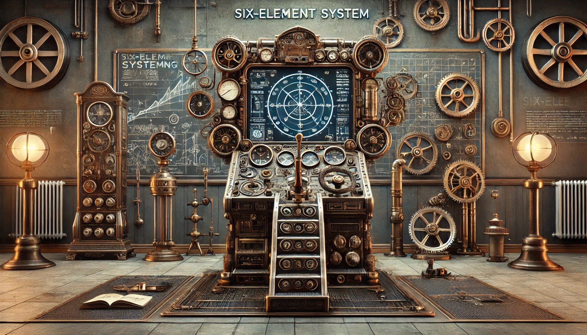
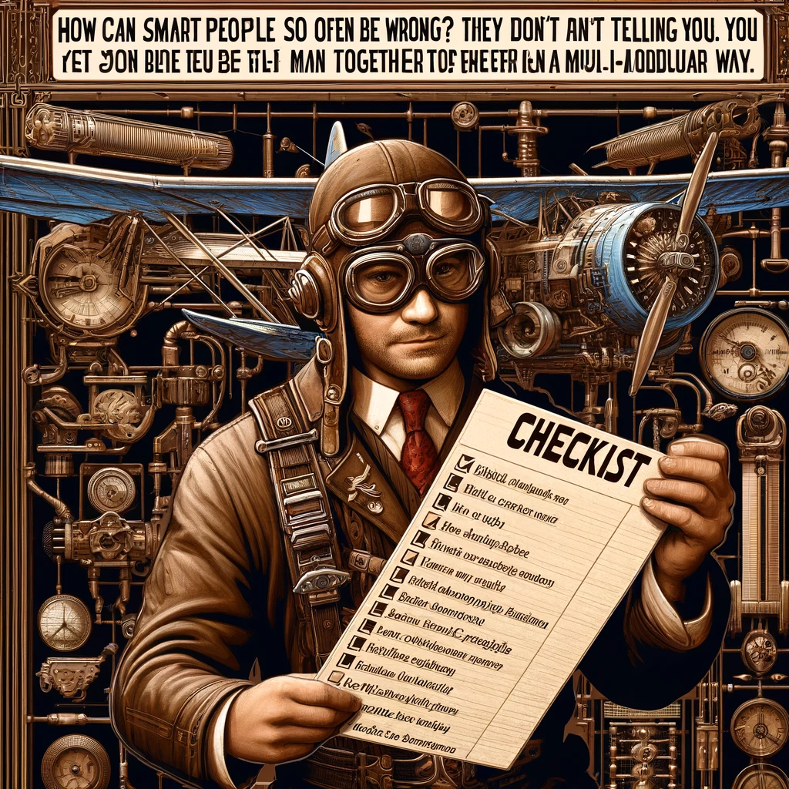

# 【生命⋅修行】重温长者的智慧——再读芒格的《穷查理年鉴》（四）

本来想把周末多花点时间，把第五讲——《需要多元学科技能教育》读完再做个笔记的。但是：

* 被其他紧急的工作打断了

* 同时精神状态也不够好

所以，眨眼一天就过去了。直到接近一个小时前，我才打开了这篇演讲稿。等来回看了两遍，终于确认——想完整地把第五讲读明白，不是今天可以完成的任务了。

我原以为答案就是简单的：「需要」二字，但并不是。芒格在这篇演讲中围绕着五个问题展开「多元学科教育」这个论题：

1. 职业人士是否需要增强多元学科技能
2. 教育是否已具备足够的学科一体性
3. **在人文科学的尖端领域中，多元学科教育最佳的实践形式是什么**
4. 过去 50 年来，学术界尖端领域在探讨多学科教育最佳形式方面的进展如何
5. **什么样的教学实践才能加快这种进程**

出于攫取最用得上的经验考虑，我打算只重点关注第3和第5个问题。第5个问题更难理解，我打算下次再啃，先把第三个问题的答案记录下来，供自己将来学习参考。也就是培养飞行员的六因素系统（six-element system）：

1. 所接受的正规教育的广度足以让他应付飞行实践中几乎所有可能遇上的问题；
2. 所接受的必要的专业教育不仅能让他顺利通过一两项测试，而且能够让他应付自如地实践问题，甚至能同时处理一至两个复杂的危险状况。
3. 必须学会正向和逆向思考，还必须学会何时把注意力放在期待的效果上，何时放在避免错误上。
4. 训练内容应根据学科的不同合理分配，以追求未来实践错误损失最小化为目标。针对实践中最重要的内容，进行强化训练，达到灵活运用的地步。
5. 必须养成检查“清单”的习惯。
6. 接受以上教育之后，必须养成复习知识的习惯——经常使用飞行模拟器，防止应对罕见和重要问题的知识在长期闲置后发生钝化。

简单来说，就是需要广泛的知识打底，针对实践的强化训练与复习，同时学会使用正、逆向思考并养成用「检查清单」的好习惯。

----

上面这第6条，我是深有感触，用进废退。在某个方面长期不用，脑力和水平真的是会发生严重钝化的。

一定要把这学习和实践有机地、真正地、结合到每一天的日常工作与生活中去！

关于清单，芒格在各个演讲中强调过多次。他说：

> 聪明人怎么会经常出错？他们没有做我告诉你们要做的事：使用清单来确保你能获得所有主要的模式，并以多模块的方式一起使用它们。How can smart people so often be wrong? They don't do that I'm telling you to do: use a checklist to be sure you get all the main modes and use them together in a multi-modular way.
>
> ——芒格

