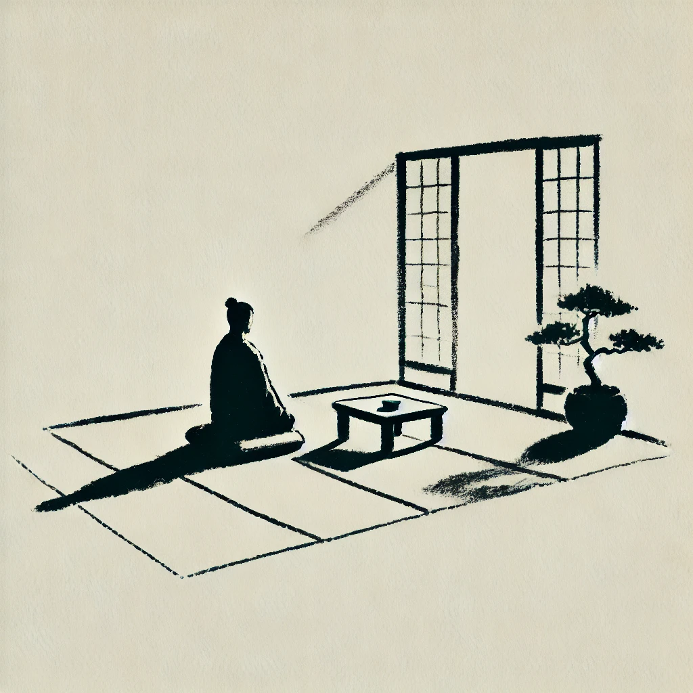
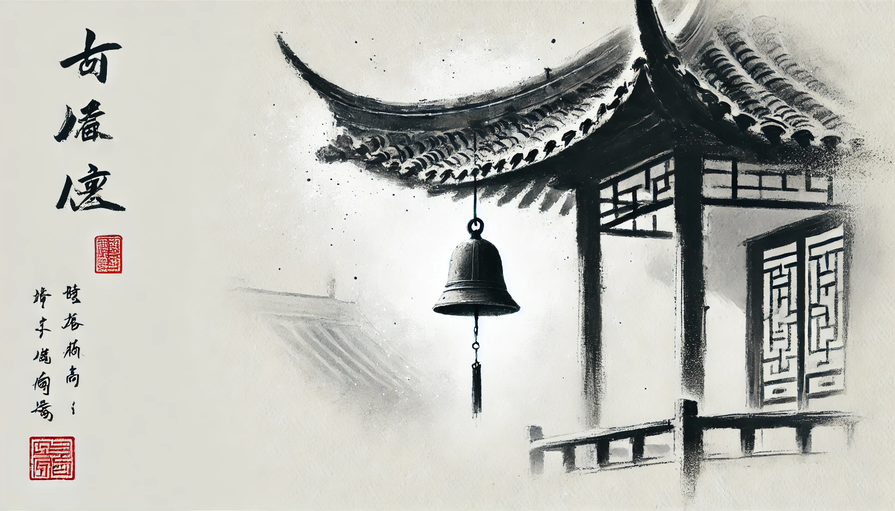

# 【生命⋅修行】还是要如实观照

那天中午，我想趁周末好好打个坐，然而正好是午睡时间，自己一直在昏昏沉沉的状态中晃荡着。我甚至一度在想，要不干脆先去睡个午觉算了……

忽然之间，我的思绪跳到了最近看过的那篇李松蔚写的公号文章《[回到被驯化之前](https://mp.weixin.qq.com/s/MpRQhYaxb-rw-qL79R0aIA)》，说有时候面对「恶人」，要回到「驯化」前的状态——激发并使用那种捍卫领地的原始本能。似乎被这个念头点燃了，我也忽然愤怒了起来，并且在脑海中迅速搜寻了一下符合这个标准的「恶人」，一面幻想着如何报复，一面被愤怒的火焰灼烧着……

昏沉是消失了，取而代之的是愤怒。我感受着自己的呼吸越来越急促，甚至汗水也一点一点浸透了后背的衣服，开始有汗珠从身上、腰间点点滴滴地滚落。一丝不甘与难受冒上心头，我心想，这「不甘心」的感觉怎么就这么熟悉呢？我好像经常如此啊，总是惦记着之前的「想要」，却不肯接受此刻的「实相」……

这么想着，不知不觉，整个人又渐渐沉入悲伤的情绪里了。

不知道为什么，这次我也不打算去问为什么。就这么坐着、坐着。忽然，睁开眼，结束了静坐。我甚至都没反应过来，是哪个念头让我直接行动起来的，又是一次几乎来不及觉察的习性反应！

我在屋子里走了两圈，明显自己还陷在悲伤的情绪中。我知道，这种自己内心情绪与状态的波澜，没有办法如实地表达，也没有必要向别人表达。情绪如天气一般，变化莫测。这时，手机传来滴滴的微信消息声，我以为是大宝的消息，结果并不是。几乎又是来不及觉察的下意识，我打开了微信公众号消息，又点开了最上面来自「蔡志忠」公众号的文章——《[蔡志忠：都说活在当下，你真正了解“当下”吗？](https://mp.weixin.qq.com/s/fzNocH-cctH2WWHak4PmcA)》

文章里讲的是佛印与苏东坡的故事。

> 浑身似口挂虚空，
>
> 不问东西南北风，
>
> 一律为他说般若，
>
> 叮叮咚咚叮叮咚！

苏东坡说，风铃声孤寂愁苦。佛印却说：

> 我即是铃声，当下如是，不分境我。

猛然一个激灵，各种情绪如烟云散开。我意识到，打坐的那个时候，和没打坐的时候毫无区别。一切所期冀的，必将被无常粉碎。而过去、现在所有曾种下的「业果」终将一一成熟、一一浮现，再与这无常一起相互碰撞，激荡——

**是为当下！**

