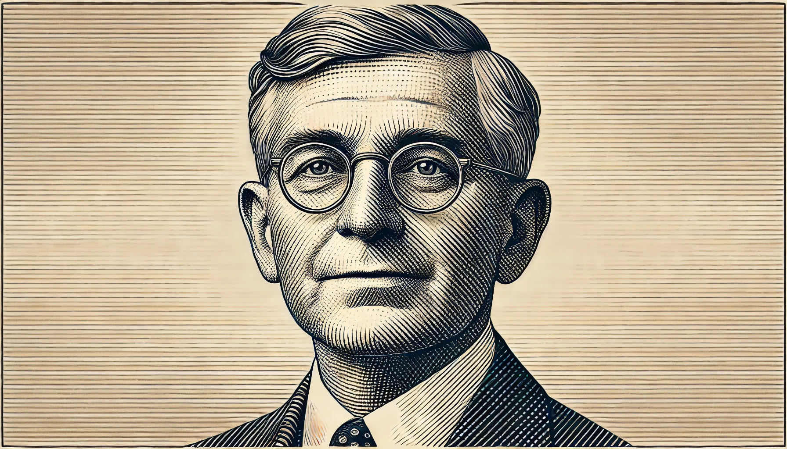
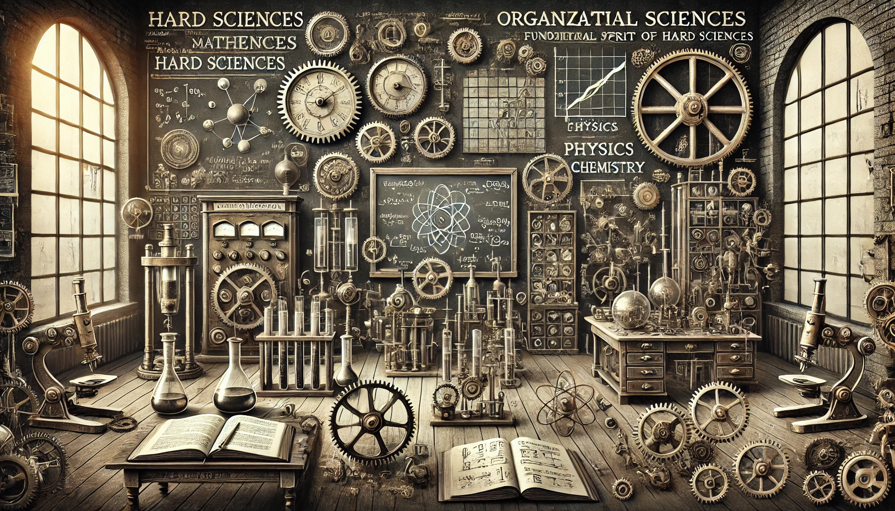
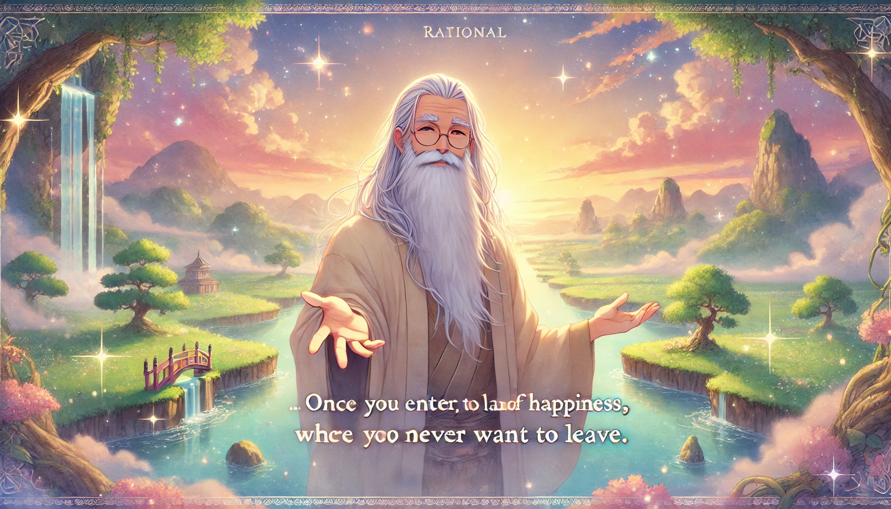

# 【生命⋅修行】重温长者的智慧——再读芒格的《穷查理年鉴》（五）

在第五讲——《需要多元学科技能教育》的最后，芒格解答了最后这个最关键的问题：

> **在精英人文学科教育中，什么样的行为将能够加快学科一体化的进展？**

芒格的回答不仅简单明了，而且与之前回答第三个问题的见解遥相呼应，让我们来看一下他的真知灼见：

## 在精英人文学科教育中，怎么加快学科一体化的进展

1. ==**首先，要有更多的课程是必修而不是选修课。**==

   这要求进行这课程设置的人必须具备广泛、多学科的知识，并保持这些知识的流利度。芒格举例说——心理学和会计学就应该是法律专业的必修课。

2. ==**其次，应该有更多跨学科的问题解决实践。**==

   包括类似于飞行模拟器功能的练习，以防止技能因不用而丧失。芒格又讲了一个哈佛商学院案例课的例子，教授让学生给刚刚继承了鞋厂的老妇人给建议。只有那个这么回答的学生得了最高分：

   > 她们处在特殊的商业领域和特殊的行业，不能靠别人的帮助来化解这些复杂但重要的问题，考虑到其中的难度和无法避免的代理成本，她们应及时脱手这家鞋厂，或许应该卖给一家拥有最高边际效应优势的竞争者。

   这里的「代理成本」、「边际效益」等概念，用到了来自本科阶段的心理学和经济学课程。

   所以，基础概念和跨学科的实操练习最为重要。

3. ==**第三，应该在人文科学教育中，多多使用商业期刊。**==

   例如《华尔街日报》、《福布斯》、《财富》。这些期刊非常优秀，可以促使学生将事件与多学科原因联系起来进行练习，类似于飞行模拟器的作用。有时，这些期刊甚至会引入新的原因模型。商业中有良好判断力的人通常会使用这些期刊来维护他们的智慧。学生也应该在学校里练习他在正式教育结束后必须终身练习的东西，以最大化他的良好判断力。

   

4. ==第四，避免极端政治意识形态。==

   不论是学生还是教授，都应该避免那些持有**极端政治意识形态**（super strong,passionate, political ideology）的人。

5. ==第五，借鉴硬科学的基本组织精神==

   软科学（如心理学、社会学等）应借鉴硬科学（如数学、物理、化学和工程）的基本组织精神。这种精神包括严格的实验方法、数据分析和理论验证。芒格推荐好好读一读费曼的书《你一定在开玩笑，费曼先生！Surely You're Joking, Mr. Feynman!》

显然，芒格非常重视这种来自硬科学的「**基本组织精神**」，并在随后花费了大量的篇幅来阐述这个概念。

## 什么是来自硬科学的「**基本组织精神**」

他说，这种基本的组织精神包括：

### 1）你必须按照学科的基础性进行排序和使用。

### 2）无论喜欢与否，必须熟练掌握并经常使用基础四学科组合（数学、物理、化学、工程）的关键部分，特别是重视比自己学科更基础的部分。

提到「**无论喜欢与否**」这句话，他再次想起了飞行员培训这个例子。就像飞行员培训一样，硬科学的精神不是说“拿走你喜欢的”，而是说“无论喜欢与否，都要熟练掌握全部内容”。毕竟，这可不是巧合，背后是现实世界的需求：

==**Reality is talking to anyone who will listen.**==
==**现实世界在对愿意听的人说话。**==

### 3）你绝不能在没有归因的情况下进行跨学科吸收，也不能违反‘经济原则’，该原则禁止用其他方式解释任何可以从自己学科或其他学科的更基础材料中轻松解释的事情。

这句话结构颇为复杂，我理解这里讲了两个跨学科吸收知识的原则：

> * 归因：一定要明确、正确的指出其来源
> * 遵循「经济原则」：能基础绝不空中楼阁，能简单绝不复杂——这个和奥卡姆剃刀原则有点像

### 4）如果第三步不能创建新的、有用的洞见，那么应该通过假设和测试来建立新的原则。这里又有两个注意事项：

* 新原则的建立通常使用与成功旧原则相似的方法。
* 新的原则必须与旧的原则一致，除非可以证明旧的原则是不正确的。

上述第三步他认为非常重要，因此再次强调，理性地组织多学科知识需通过强制执行以下两条来实现：

1. ==对跨学科引用必须强制进行全面归因==
2. ==强制优先选择最基本的解释==

由于这原则看起来太简单，为了强调其重要性，他不惜重复地两次引用另一条古老的原则来佐证：

==(1) Take a simple, basic idea and (2) take it very seriously.== 
==（1） 采用一个简单、基础的想法，（2）并非常认真地对待它。==

芒格以自己为例，说他进入大学时教育基础一塌糊涂，但凭借普通的意志力，以基本组织精神为指南，他在所热爱的所有事物上的能力得到了极大提升，远超预期。

例如，他被有效地引导进入心理学这个他原本完全没有计划涉足的领域，并取得了巨大的成就。

Jared Diamond 贾里德·戴蒙德是另一个例子，这位普利策奖得主的最新作品《崩溃：社会如何选择成败 Collapse, how societies choose to fail or succeed》值得一看。

他还引用了约翰逊博士的话：

> **Truth is hard to assimilate in any mind when opposed by interest.** 
>
> 当真理与利益相冲突时，任何人都难以接受真理。

然而，既然是利益驱动，那么就有办法解决，毕竟机构的激励政策是可以改变的。

芒格说，像他自己这样，通过多学科的方法解决许多问题，无论是常见问题还是罕见问题，都会有巨大的世俗回报，并且会带来更多的乐趣和成就。

而且，他所推荐的这个，也是一个更加幸福的精神国度。是一个一旦进入就没人想回头的地方。让他回头和让他把自己双手砍了没啥区别。

后来，2006年芒格在回顾这篇演讲稿时说：

> 我不会改变一个字。我仍然认为我的观点很重要。

即便他像塞缪尔·约翰逊那样，认真审视这篇文稿后，他依然坚定地保持以上观点。。

> Read over your compositions, and when you meet a Passage which you think is particularly fine, strike it out. 读你的作品，当你遇到一段你认为特别好的文字时，把它删掉。
>
> ——Samuel Johnson 塞缪尔·约翰逊

## 这些建议，对我们这样的个人有什么价值

说实话，我感觉完全可以一一照抄！

1、2、3、4都不用仰仗学校，自己照着做就是。最最关键的是第5点，

我们可以就像芒格那样，凭借普通的意志力，以基本组织精神为指南，学习多学科方法，并在所有的问题上，无论是常见的，还是罕见的，进行持续的实践！

直到这个过程带给你的激励，无论是世俗上的，还是精神上的，让你乐死不疲，再也无法回头为止！