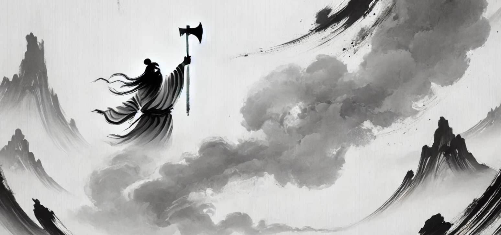

# 【生命⋅修行】芒格智慧中最最核心的关键

在GPT超强翻译功能的加持下，我重读了芒格的第六篇演讲——《领先慈善基金会的投资实践》。芒格在这里主要批评了那种收钱不办事的基金管理费制度，并提出：

> 最好的投资策略选择，除了直接投资ETF以外，就是效仿伯克希尔的投资策略——聚焦少数真正优秀的公司进行长期投资。

同样，在这篇演讲里，芒格再一次提及并强调物理学家理查德•费曼的那句话：

> The first principle is that you must not fool yourself, and you're the easiest person to fool.
>
> 第一原则是你不能自欺，而你是最容易被自己欺骗的人。

这不禁让我想起，在重读芒格《穷查理宝典》的这段时间，一直萦绕心头的那个问题：

> 芒格智慧中，最最核心的关键是什么？

此刻，我更加坚定了这个答案：

## 认清自己的无知，是一切的起点

 symbol. The design should feature the classic yin-yang symbol with flowing, balanced lines and con.webp)我想，这就像是「混沌生太极」的原点。而且，在整个生命的过程中，永远不要忘记，并需要一次又一次地回到这个原点。萨古鲁也提到过这句话，他甚至觉得这不仅仅是智慧的起点，更是完全幸福与自由的起点：

> If you’re beginning to realize there don’t seem to be one damn thing that I know about life, that means from by-lanes, you’re moving to the highway of spiritual process. If you don’t know anything, it will leave you utterly free.
>
> 如果你开始意识到我对于生命简直是一无所知，那意味着你正从小巷子驶向精神修行的高速公路。如果你什么都不知道，这会让你彻底自由。
>
> Absolutely, no conclusions about anything, suddenly you find life is peaceful, really nice. Because you don’t know anything. The day you truly realize that you don’t know an iota of this life, then you’re on the highway of realization. You’re on the highway to enlightenment, simply to zoom…
>
> 完全不对任何事情下结论，忽然之间，你就发现生命平静了下来，真的很好。因为你什么都不知道。在你真正意识到你对这生命一无所知的那天，你就走上了觉悟的高速公路。你在通往开悟的高速公路上，只管一路嗖嗖飞驰……

《道德经》里说：

> 无，名天地之始。
>
> 有，名万物之母。

一切众生，走向智慧的起点，怕都是在认识的这「无」的刹那间吧！但在这之后，这「有」的道路是什么呢？法门四万八千，各有各的不同，芒格所指引的，是一条由理性基石修筑的大道。

《道德经》里又说：

> 道生一，
>
> 一生二，
>
> 二生三，
>
> 三生万物。

从混沌——不知道自己不知道的状态，走到这起点——知道自己不知道的「一」之后，芒格体系中的「二」是什么呢？让我好好想一想，组织一下思路，下次细说！

