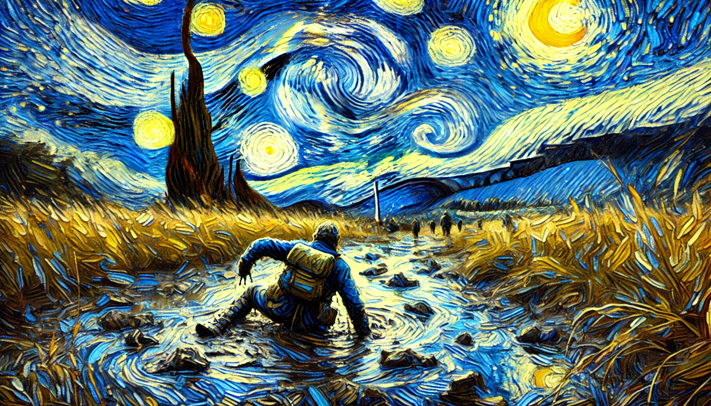

# 【生命⋅修行】困境与出路

越来越觉得，这个世界玄妙莫测。大宝说她上次去拳场练拳，遇到很久不见的W师兄。然后W师兄的出现，自然而然地开解了她正无法自拔的压力与问题。她说，很神奇，最近每次都这样。

每当有解决不了的情绪，也没法找我时，就会正好出现一个人，恰到好处地聊一聊，就解决了她当下的问题。

她还感叹说，或许她的出路是与人聊天，而我似乎都是靠自己读书就可以了。

但我也觉得冥冥之中，这是一件神奇的事情。我也常常会觉得每到极度困惑之时，就会有某种机缘看到一本书，一篇文章，或者只是一段文字，把自己从这困惑中拔出来。这一次，我遇到的问题是那一直困扰我，但无法对其他人解释的事情——**报销**！

我一拖再拖，直到自己接近崩溃，开始影响和耽误手头的其他事情。然后，我就看到了和菜头的这篇文章《[在最好的年华里](https://mp.weixin.qq.com/s/JuXdhqUZEaiN5OFQLzPeUg)》。菜头叔叔本来是要「骂醒」一位17岁的高中女生来着，却成功地开解了我的心结。他说：

> 我猜想那些想尽（办法？）描述自己困境的人，要么不是在面对真正的困境，真实情况远没有那么糟糕；要么就是一早就打定了主意，准备搜集这些困境的资料，好为将来的自己提供理由，证明放弃和失败不是自己的责任。
>
> ……
>
> 仔细观察困境，得到更多具体困境。仔细观察出路，得到更多可能出路。
>
> 或者……
>
> 继续观察总结困境，继续、沉溺把玩困境，让时光匆匆流逝。

是的，这就是一个困难而已。不管这个困难看起来多么莫名其妙，多么的荒诞不经，他依然是一个「困难」，不论真假。我的选择也无非就是像菜头所说，两条路而已：

1. 观察出路，然后尝试，不行就再观察寻找出路、再尝试，直到摆脱困境。
2. 继续沉溺把玩困境，让时光匆匆流逝。

两条路没什么好坏区别，只是不同。但是自己要清楚，自己的选择是什么。

