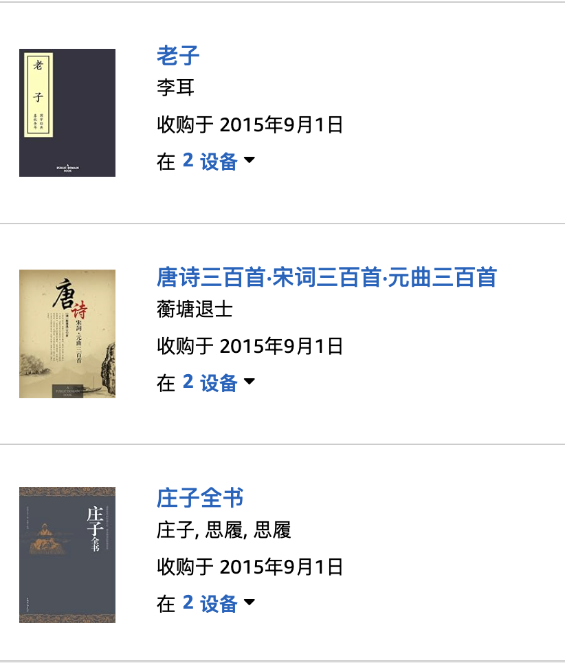
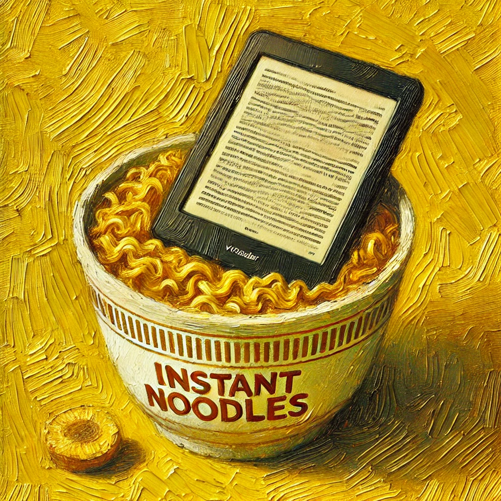

# 【随笔】抢在最后一天备份Kindle里的书

明天就是Kindle完全停止运营的日子了，从Kindle在国内停止买书，再到这最后一天，其实有整整一年的时间。但我还是拖啊、拖啊、直到今天才开始备份自己在Kindle里的电子书。

一开始我以为，下载一个Kindle的Mac版APP，就可以把书都备份下来了。但没想到的是，这个APP根本没有入口可以让我选择登陆哪个区域的账号。等我一次又一次输入密码错误，不得不重置密码后。发现自己似乎进入了一个全新的亚马逊账号，里面一本书也没有。

只好在网上寻找攻略，才发现几乎所有Z.cn相关网站都已经开始打他们家其他业务的广告。好歹发现了一个依然存在的入口：

https://www.amazon.cn/kindle-help/index.html

终于可以从这里进去，一本一本的把我买过的电子书下载下来——是的，不能批量下载。我和大宝一人一部Kindle，还得下载两次。好在，这么多年来，我买的书并不多。

最早的三本书来自2015年9月1日，分别是《庄子》、《唐诗三百首•宋词三百首•元曲三百首》、《老子》，看上去好像都是公版书。

然后，再买了两本漫画之后，我就开始读王阳明、叔本华，还有那几部经典的阿西莫夫的科幻小说，比如《永恒的终结》、《神们自己》……

同样在这一年9月份，还买了《大秦帝国》却从来没有读过，《星际穿越》也没有读过，倒是《乌合之众》、和《反乌托邦三部曲》这些以前好像读过的书，又买了读了一遍。

然后，在这近10年的时间里，和大宝一起买了一共194本书，去掉那些没能读完，甚至根本没敢开始读的大部头，可能平均下来，自己每年也算读了10来本书。但回顾这么多年（不止这近10年）来，自己读书的心境和热情其实变化不小。

记得曾经最开始的时候，颇以自己爱读书为荣，甚至挺爱炫耀自己从书本里看来的知识。这段日子一直从上学期间持续到自己工作后好多年。真是像《黄帝内经》中所说愚者一摸一样：

> 道者，圣人行之，愚者佩之。
>
> ——《黄帝内经•素问•四气调神大论》

后来有一天，大约在2007年，参加一次领导力培训时，在经历一次掌控不住局面，靠同组的老哥跳出来解救我的经历之后。顿时觉得自己是个「百无一用」的书生，书读了不少，实践经验却太少。于是乎，当时决定自己从此后要多多实践，不再追求多读书，要把读过的书，学过的道理都用起来。

但免不了，还是爱读书……

事后看，自己这个要「实践为先」的决心其实执行得根本不到位。

只是慢慢地，遇到想买的书，又忍不住买了读起来。期间，我甚至想学曾国藩那样「读书不二」，但最终没能做到。《资治通鉴》就没能读完，好像当时把柏杨版的《白话资治通鉴》读到唐代就没继续了。

直到遇到大宝，开始和她一起读书的日子之后。才发现，原来我怎么也做不到的「践行」，在她这里，却是如吃饭喝水一样自然。前提是，她从书里真的收到了那一两条当时她正需要的道理。而我也开始相信，颜夫子那样「得一善则拳拳服膺不失之矣」的人，是有可能存在的。

大宝很高兴，她说我帮助她开启了一条可以从书本学习的新路径。我也很高兴可以看到一个身边的榜样，知道原来真正的实践是这样。

在这段时间里，有些书我开始一读再读。再一次又一次地惊讶于：

> 为什么之前读的时候，没看到（没看懂）这句。

我终于越来越深刻地意识到，原来好书真多是需要读很多遍的！这次我是真的不再狂妄地满足于：

> 这本书我读过了！

哪怕当年不是走马观花，真的曾经细细读过，写过读书笔记或读后感也一样。只要再读，有时候即便是第三遍或者第四遍，总有收获。我开始相信，只要想读某本书的时候，不管以前读过没有，都值得把它捧起来，打开看看——我觉得，这种感觉，算是一种冥冥之中的呼唤。

《跨越不可能》这本书中，曾经详细论证了读书的性价比。一本书背后，常常是作者数年、甚至数十年乃至一辈子的经验、心血倾注其中。所以也难怪，为之读上几十分钟或者几个小时，所能得到的常常还是凤毛麟角呀。

但读书依然是最值的。

只不过，以后再要读新书，没了Kindle，又该用什么软件？什么设备呢？微信读书？得到？或者其他啥墨水屏设备？

想到这里，我忍不住打开电脑，搜索比较了半天，最终默默关掉了所有的测评网站和电商平台。现在没钱，就先别想什么设备的事情了。实在需要，就在微信读书里买书或者买会员，在Kindle浏览器上先凑活着看吧。

