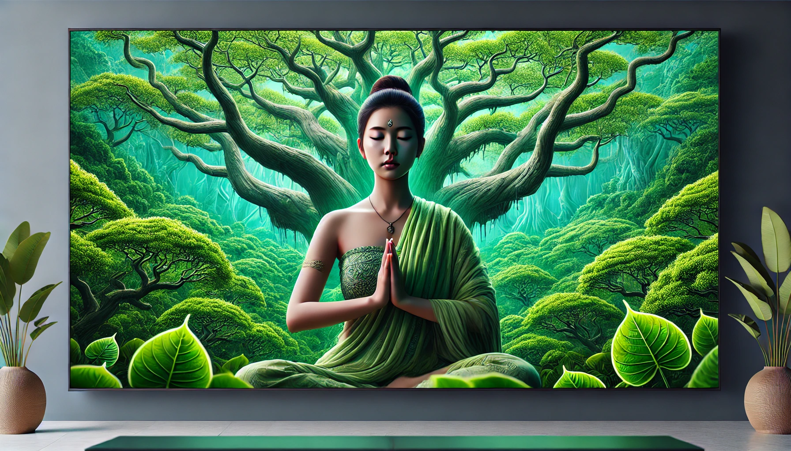
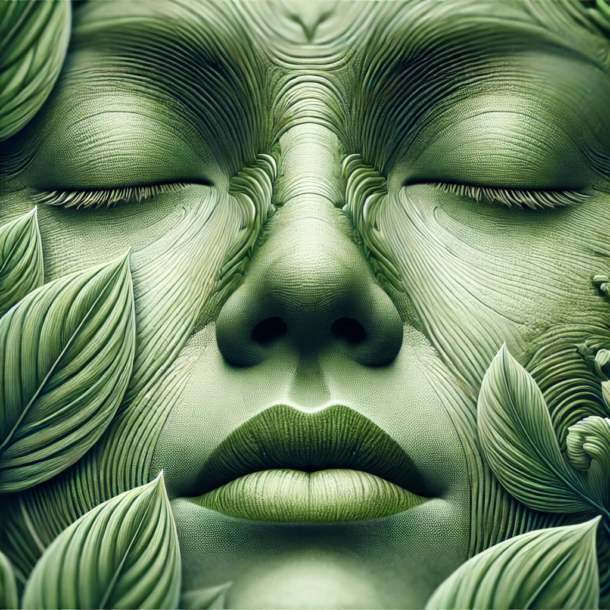
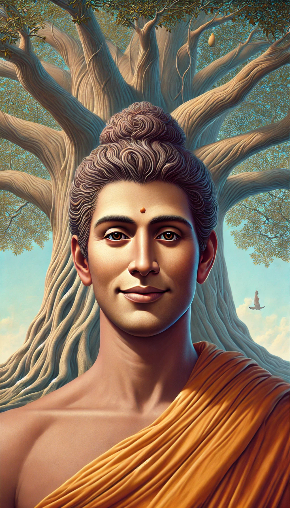

# 【随笔】观呼吸

昨天备份Kindle上的电子书，同时想起来尝试了一下用Kindle自带的浏览器使用微信读书。

方法倒是简单：用Kindle上的「体验版网页浏览器」访问r.qq.com ，然后微信扫码登陆即可。虽然我10年的老旧Kindle访问这个现代网站、跑起来颇有不堪，也算勉强能用。不过，我的微信账户里只躺着两本看过的书，其中一本是[和菜头推荐的疗愈心灵宝典——宝德禅师所著的《观呼吸》](https://mp.weixin.qq.com/s/BCzoVjOD8eCBKEonLFKvPQ)。

于是乎，我又翻开了这本《观呼吸》，仗着刚刚下载微信读书送的新手红包，得以再一次的免费阅读这本书。

除了更不伤眼，Kindle网页版的体验大大不如微信读书的应用程序，但是不妨碍这本书的内容是真的简单、清晰、极具可操作、可实践性的指导意义。我只不过大略把前面9章翻了一遍，18年前第一次听说内观（Vipassana https://www.dhamma.org/）以及10年前第一次去丹东参加《十日内观禅修》的情景就又都一一浮现心头。

是的，依然还是那些方法，也就是那些最简单的方法——从观察、觉知自己的一呼一吸开始，再到观察自己身体的感受，再一步一步深入。

也依然还是那个目的，不为禅定，不为神通，甚至不为所谓狂喜等终极体验，只为在一次又一次地练习中，锻炼并积蓄力量，以便最终在生活的真实操练中获得「如何生活的终极智慧」。

不由得注意力回到了自己身上，顿时发现其实每一分、每一秒、每一次呼吸，自己身体的每一处都在随之变化着。而窗外空调的轰鸣，远处公路上车流的噪音，太阳炙烤下的不锈钢窗棂一点一点地膨胀、一丝丝老化，这过程也从未止歇。

总想着要如何如何，才可能去除痛苦，迎来幸福。却忘记了，只有先全然地接受——并且包括这「痛苦」，才能离真正地活着更进一步。

初心易忘啊，想来自己又被那厚重的凡尘所蒙蔽住了。「拥有真正活着的终极智慧」——这其实才是自己这一生最最究竟的追求啊！——难道你又忘了吗？

