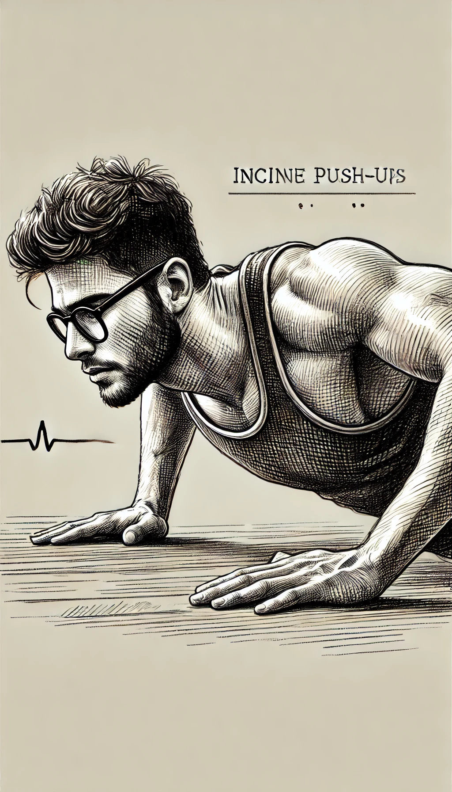
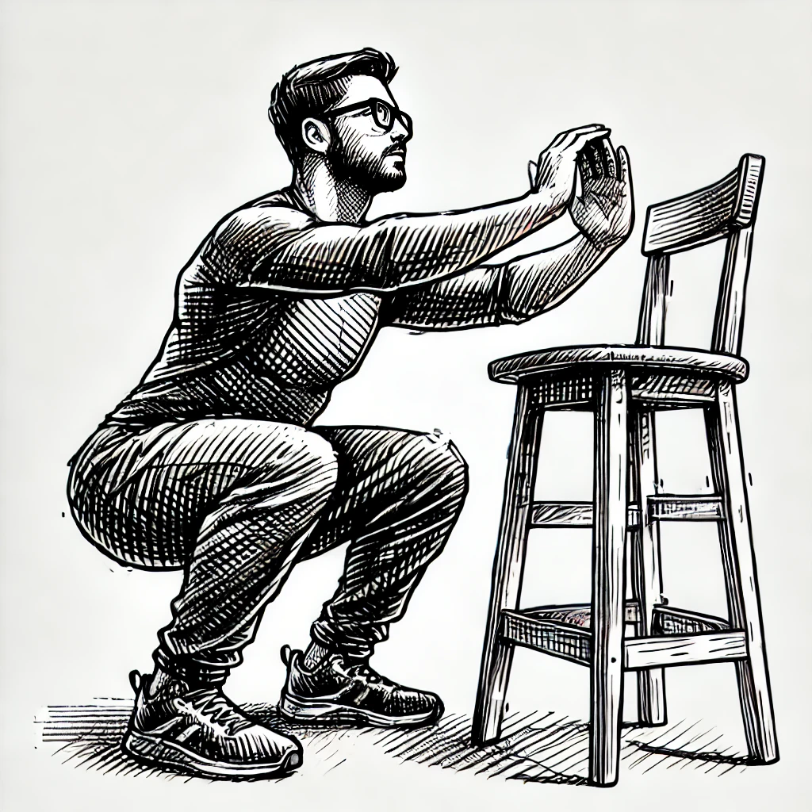
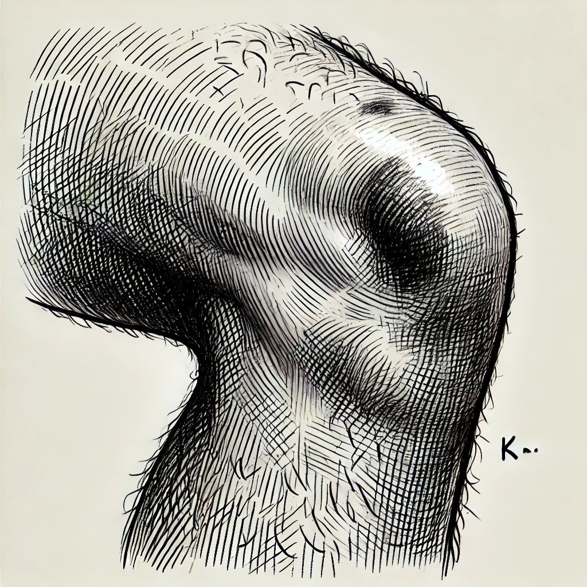
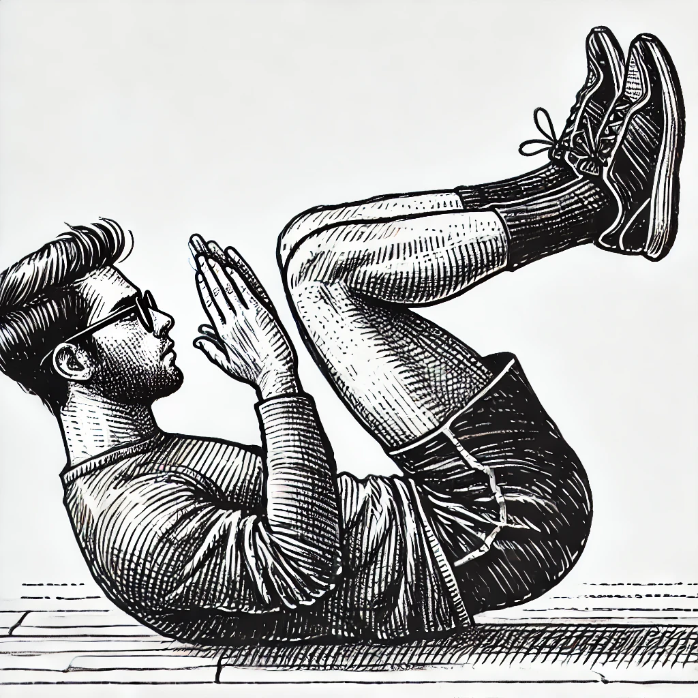

# 【随笔】沙沙作响的膝盖

原计划3个小时想搞定的事情，愣是干了近8个小时。再加上其他事儿，一整天的伏案时间怕是要过10了。中途有一阵子又困又乏，本想打个盹来着，忽然一转念：

> 何不干脆运动一下呢？

完成了两组100个上斜式俯卧撑之后，我打算来几组折刀深蹲。

. The man.webp)

谁曾想，刚刚做了一个，我就听见哪里传来「沙沙」的声音。环顾四周，并没有什么东西被我弄坏。再做一个仔细听，惊恐地发现「沙沙」声竟然来自我的左膝盖。

我停下来，抚摸了一下自己的膝盖。最近左膝是有些疼呢，也不知怎么撞到的，膝盖内侧还有一块暗红色的淤青。我又慢慢地做了两个，一次把耳朵贴近左膝，一次把耳朵贴近右膝。其实两边都有声音，但左边更明显。

上网一搜，竟然都说「沙沙」声是「膝关节过劳，软组织磨损」。

呜呼，那这还要不要运动呢？我踌躇半晌，心想自己最近这一个月本来就几乎没怎么运动，咋还整了这出呢？好令人伤感。犹豫许久，我决定还是继续运动吧，想来是整天吹空调，运动太少。筋骨、软组织都粘住了吧。于是我决定，还是回到囚徒健身中深蹲练习的第一式：

**肩倒立深蹲**

愚蠢的GPT没法画出标准的肩倒立深蹲来，算了，反正我做得也不标准。但竟然，这个动作膝盖不会响了。就这么练练吧。

毕竟再也不可能拥有20岁时折腾不坏的身体，但想要多用些年月，还是得继续保持恰当的运动才是！