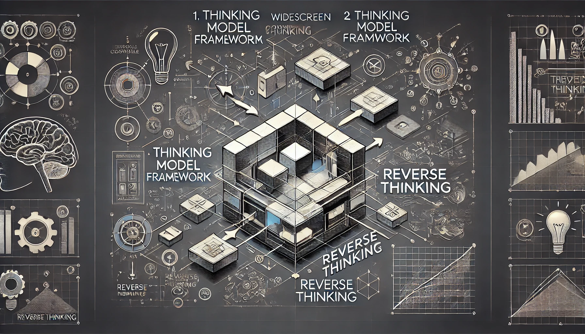
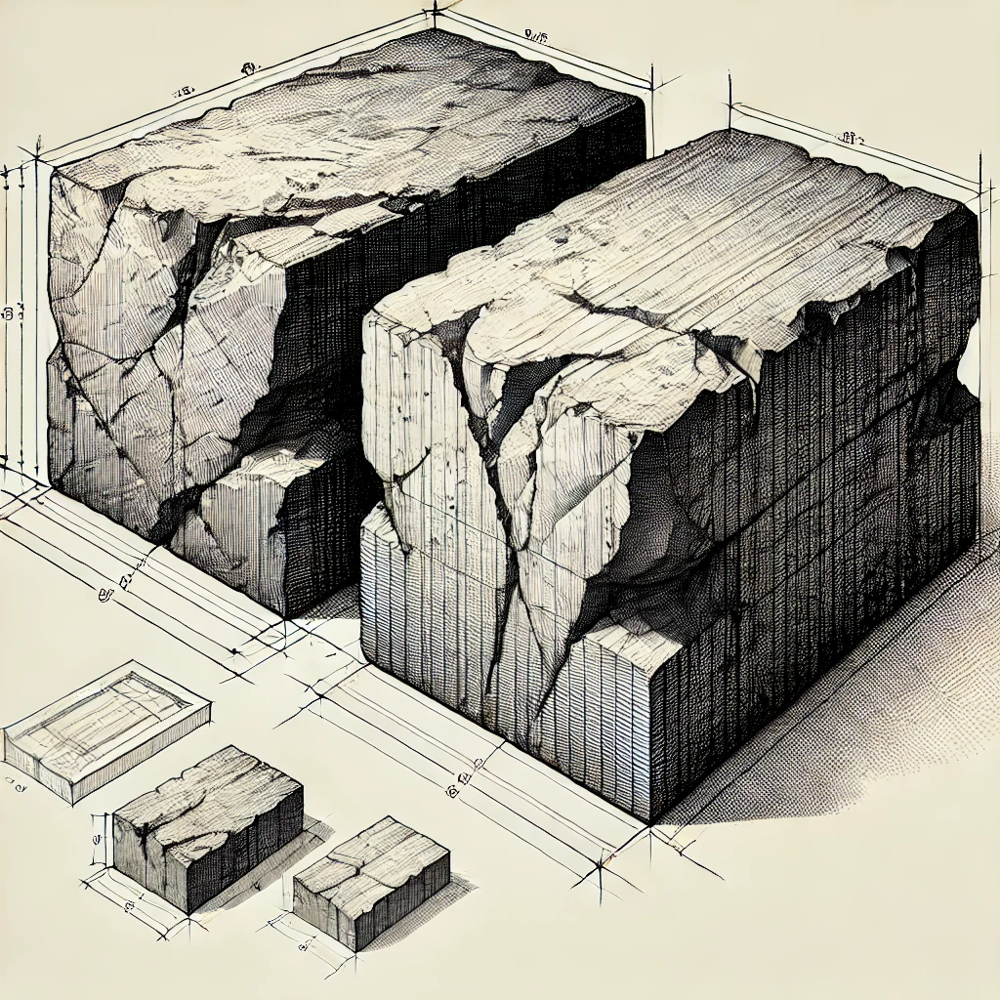
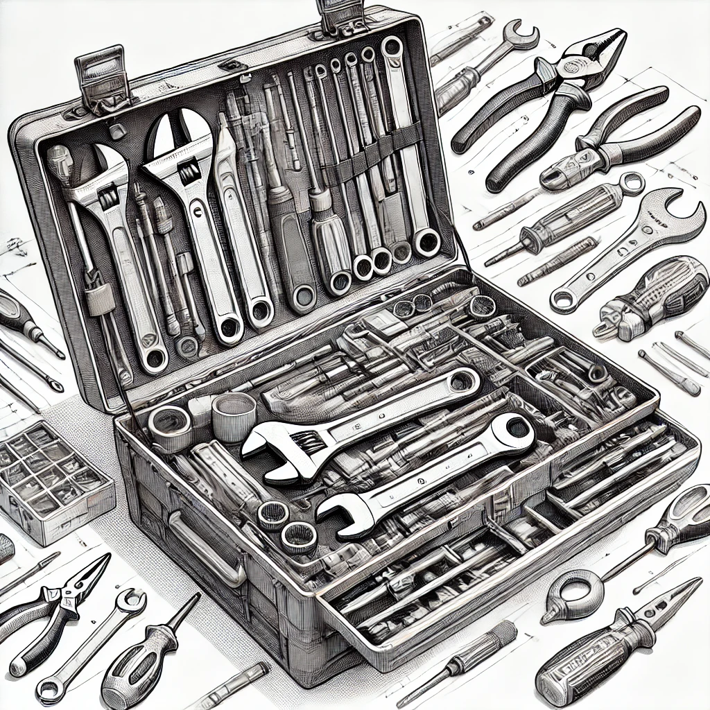
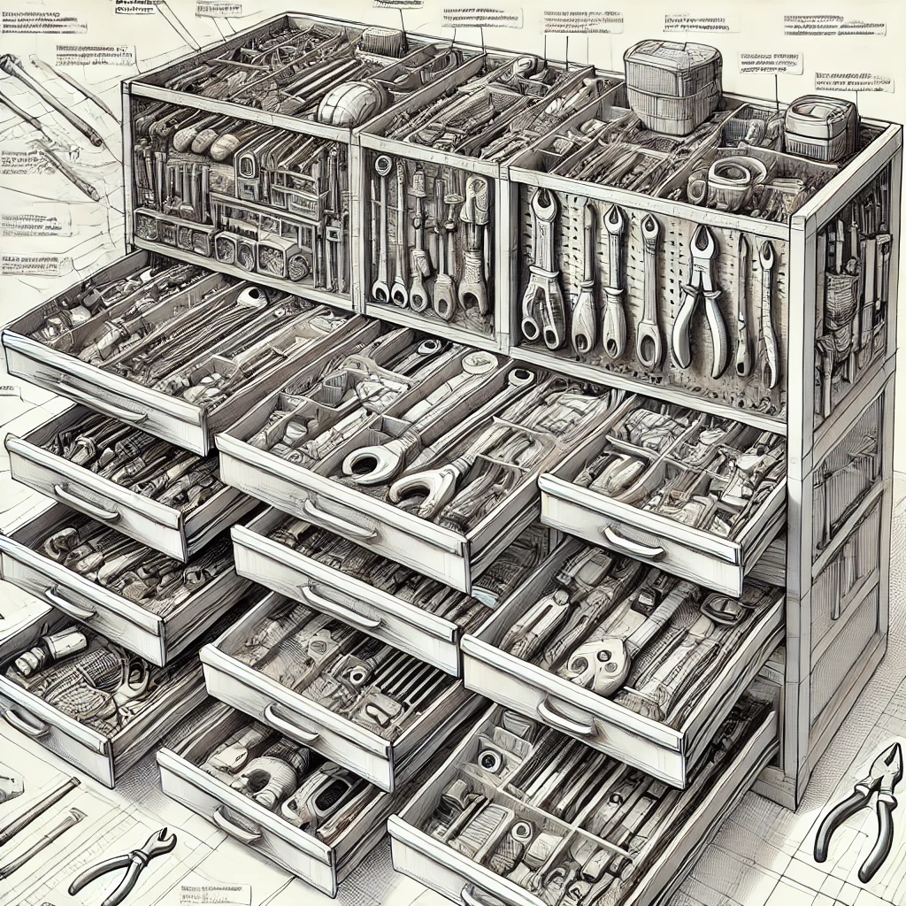
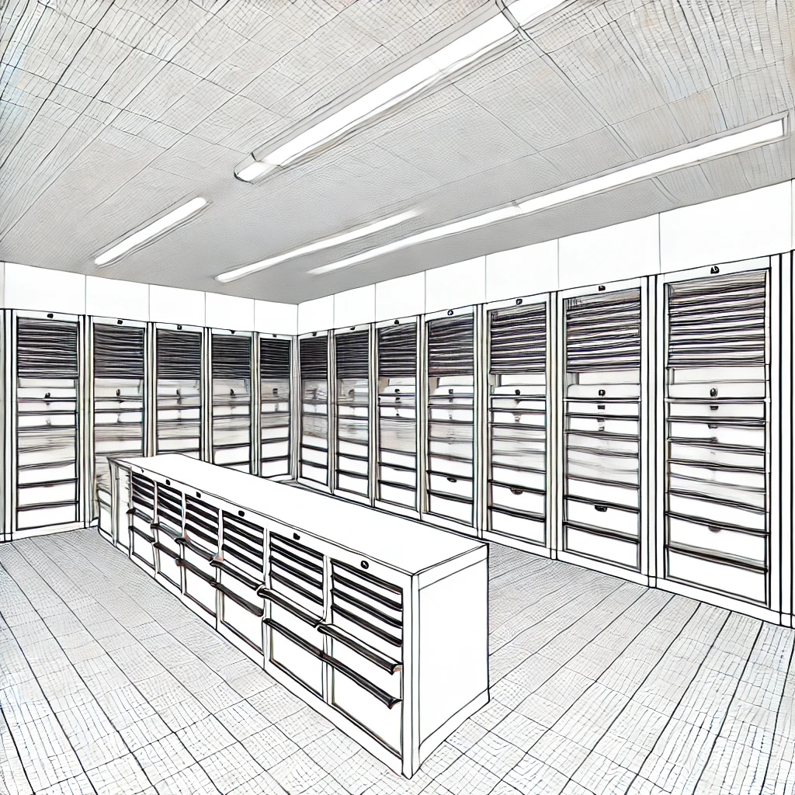
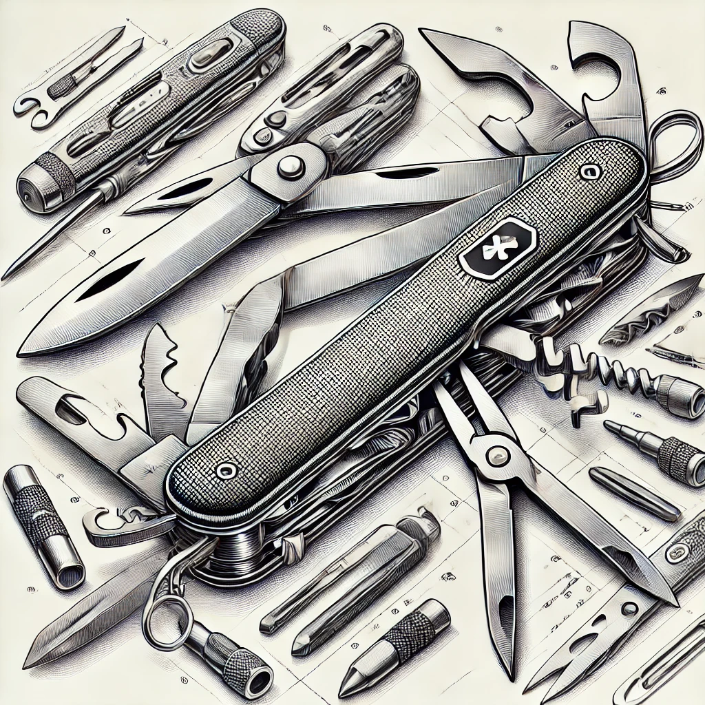
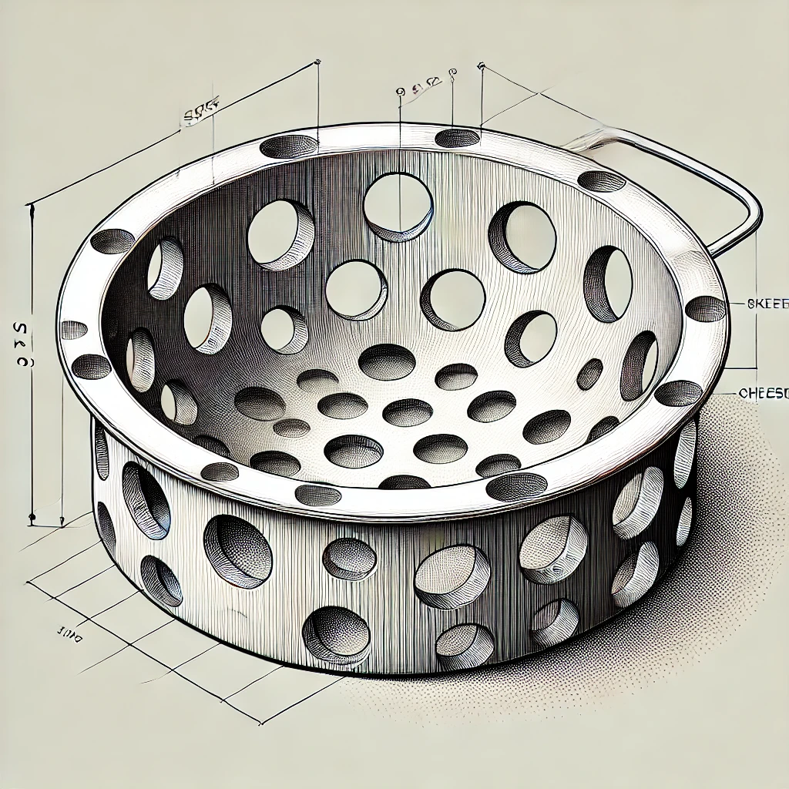
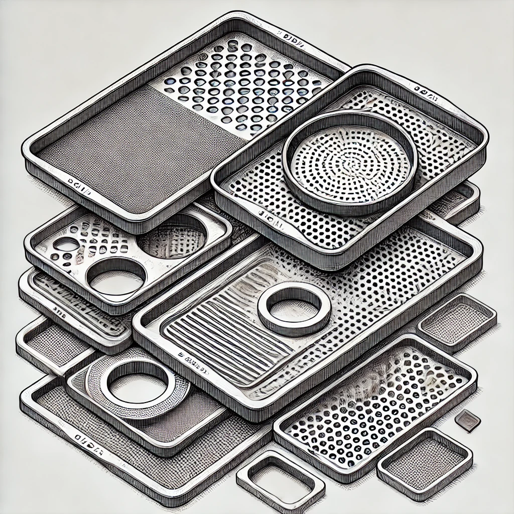
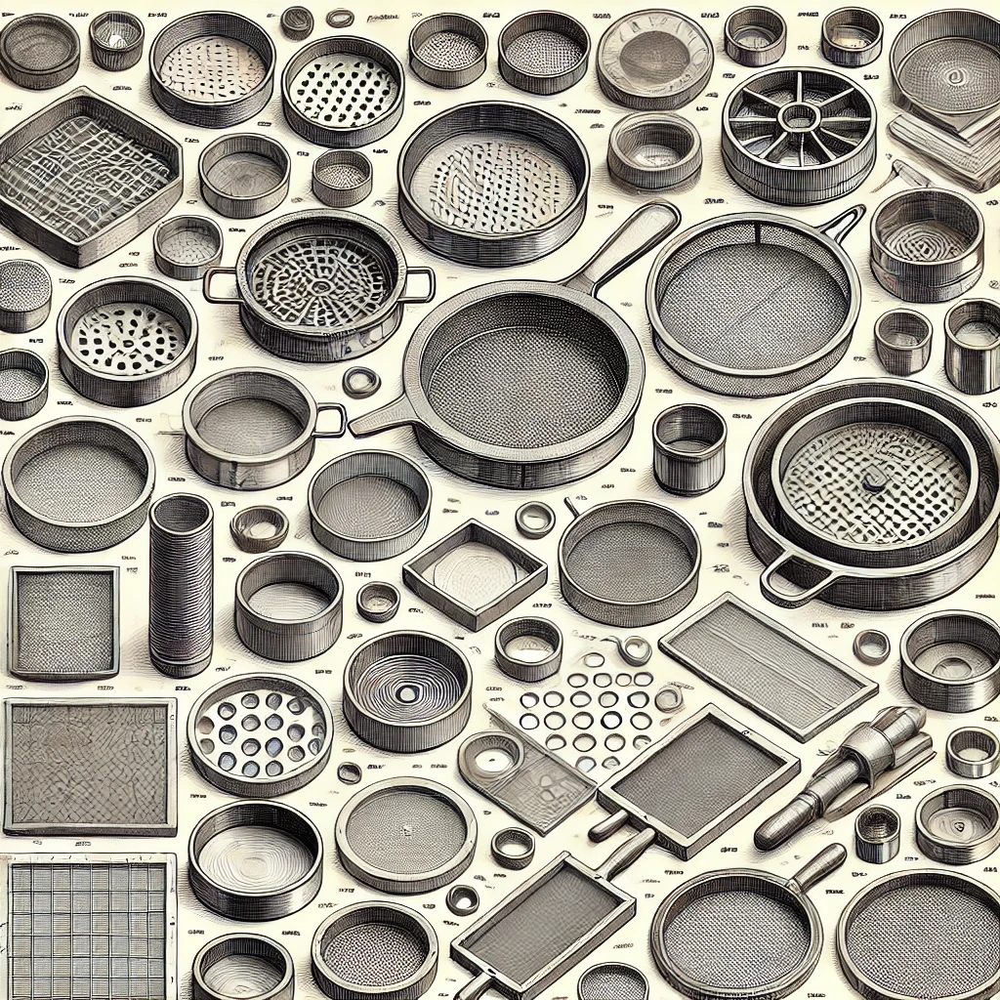

# 【生命⋅修行】芒格智慧中的关键基石

上次说道，芒格智慧中，最最核心的关键是——

## 认清自己的无知，是一切的起点

这就好像是《道德经》中所说，由道生一的那最初、最关键一步。然而，从混沌无知——不知道自己不知道的状态，走到这起点——知道自己不知道的「一」之后。在芒格体系中，由这「一」所生的「二」是什么呢？

其实，在我的修行体系中，继续前进有两个方向。尤其是前几天重读《观呼吸》之后，我更加清晰了其中的方向之一，大致上是借由身体、精神直接的修行与体验，也就是「观」，来接触、打开、获取那本就存在于「心」中的智慧。

而芒格先生指出的是另一个方向——用理性思维来解决人生问题的方向。在芒格的经验里，他那一套理性思维框架虽然不能解决所有问题，但能解决很多问题，并且足够带给你一个幸福的人生。

我们接下来要说的，就是在这个方向上的两块关键基石：

## 首先，要为学日益以及如何日益

芒格相关的原话其实有三句：

> 1. 尽可能从你们自身的经验获得知识，尽量别从其他人成功或失败的经验中广泛地吸取教训，不管他们是古人还是今人。
> 2. 尽可能地减少客观性。
> 3. **你必须在头脑中拥有一些思维模型。你必须依靠这些模型组成的框架来安排你的经验，包括间接的和直接的。**
>

前两句是反话，是所谓「成功拥有不幸生活的秘籍」。讲的都是要尽可能广泛、客观地学习经验教训。虽然我们无知，而且将来我们也不可能穷尽一切知识。但我们必须要向着「求知」的方向前进。

不由得我不想起《道德经》中的那句话：

### 为学日益

然而，**为学日益**这句话只强调了方向，以及日拱一卒的态度与决心。芒格还给出了如何更高效「日益」的方法：

### 必须在头脑中拥有一些思维模型，必须依靠这些模型组成的框架来安排所有的经验

什么叫模型？什么叫这些模型组成的框架？如何依靠这框架来安排所有的经验？我想尝试着举个例子，来说明我自己关于这三个连环问题的理解。

#### 什么是思维模型

想象一下，你想要更好的面对并解决这个现实世界的问题，你需要准备很多工具。并且，你不需要从磨石头开始，自己打造所有的工具，人类已经创造了很多有用的工具，你只需要把他们拿来，装进你的工具箱里，以备不时之需。比如锤子，螺丝刀，钳子，锯子，尺子，等等。

再举个例子，数学的加减法就是其中工具之一，它帮助你处理和理解数字。它能让你明白因为好朋友X要来家里和我们共进晚餐，所以餐后的水果要多准备一份。就像需要拧开螺丝时，我们要用螺丝刀一样。

每当需要修理东西时，我们就要打开工具箱，从里面挑选最合适的工具来使用。思维模型就像这些工具，每个工具（思维模型）都有它自己的用途。

**这就是思维模型。**

#### 什么是思维框架（栅格）

想象一下，现在把你有的那许多工具进行分类。把每一类工具放到一个贴好标签的，有有很多格子的工具柜里，每个格子里都有一种工具。这样，你就有了很多个贴好标签的工具柜。

想象一下，你现在拥有的，不是一个工具箱。而是一个整齐的工具间，里面有很多高大的工具柜，每个柜子有很多格子，每个格子有一种工具。

当你拥有了一种新工具时，你不再是把它简单的扔进工具箱中。而是迅速找到合适的柜子，合适的格子把它放起来。甚至还有可能，他和你原有的工具完全同样的用途，只是更好，你留下更好的那个就可以了。

使用时也一样，你不再需要在工具箱里一件一件掏出来，堆了一地只为寻找其中一件可用的工具。而是步入工具间，一个柜子一个柜子地走过去，把所有需要的工具依次拿出来，依次使用就好。

注意，这里有一点很关键：你的工具柜之间不是独立的，他们之间有着有机的联系，并且组合起来，可能发挥1+1>2的妙用（所谓的lollapalooza 效应）。

**这就是思维框架（栅格）。**

## 其次，为道日损

对不起，我再次忍不住引用《道德经》里面的话作为芒格智慧基石的注脚。芒格的原话如此：

> 对待问题，不仅要深入思考，也要逆向思考。
>
> 凡事往简单处想，往认真处行。
>
> 乡下人的故事。曾经有个乡下人说：“要是知道我会死在哪里就好啦，那我将永远不去那个地方。” 

这里，芒格相当于诠释了「为道日损」在两个角度的实际应用。

### 1. 模型及框架本身尽可能简化

爱因斯坦曾经说过，「一切应尽可能简单，但不能过于简单」。

这有点像马斯克在强调「第一性原理」时说的一样，能用最简单的原理直接推导，绝不直接使用更复杂的原理来解释。

但又不止于此，简化绝不能盲目，为了简单而简单。尽可能的底线是——要解决问题。

这就是为什么芒格的说他应付这个世界的模型有80、90个，其中最重要的有几个。而且他一直在强调，要多学科、多模型综合起来使用！

### 2. 应用实践中需要常常从逆向角度思考，也就是「不做什么」

我又想起道德经中的一句话：

> 反者，道之动也！

这句话有很多种解释。我引用这句话，是想强调芒格的观点：在应用这整套思维框架时，不仅仅深入思考达到目标要做什么，怎么做。通常更有效的方法是，如果要避免出问题，不应该做什么。特别是，考虑到人类非理性的决策常见的误区有哪些，别踩坑了。

方法很简单，把这些模型转换成一系列的检查清单。

我们可以把之前的工具房与工具柜的比喻再调整一下，这么想象思维框架（格栅）与模型的应用：

每一个模型，就好像是具有某种形状孔洞的筛子。具体而言，这可能是我们检查清单上的一条检查事项。—— 比如不要吸毒。

大小一致的筛子叠在一起，形成一套筛子。具体而言，这就是某一方面的完整检查清单。—— 比如不要吸毒，不要酒驾等基本安全注意事项。

而我们，我们有好几组不同大小的筛子。具体而言，这就是我们有基于好几个学科模型建立的几套检查清单。——比如除了安全，还有数学、物理、财务、心理学方面各项检查清单。

那么具体到一件生活中的实际问题，要不要做。我们只管拿起这一套筛子，一一筛过去，无法通过的，就不要做了！

> 损之又损，以至于无为。

虽然我们不需要走到「无为」这么高的境界，但去掉许多不必做的事情，筛掉许多会带来麻烦的行为，生活不就变得简单又幸福了吗？

----

以上，就是芒格智慧体系中的二：为学日益、为道日损——建立多学科思维模型与框架，并学会反向应用！