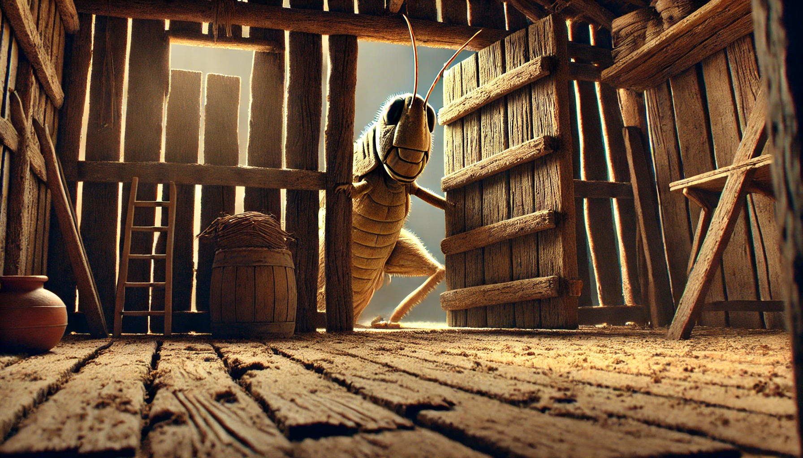

# 【随笔】关于游戏的哲学

时间与文字真是很奇妙的事情，两年前，和菜头写了一篇推荐文章《[留一扇门：一本关于游戏的书](https://mp.weixin.qq.com/s/ZsEXarlcUebwYt60V9Q1Wg)》，因为他的文字，以及「游戏」这两个字，我在Kindle上买了一本，给自己留了一扇门，然后一放就是两年，再也未曾触碰过那门把手。

据说和菜头写这篇推荐就犹豫了两年，如此说来，四年已经过去了。四年，其实是很短，很快的。然而，我想，对于萌萌哒的大鱼来说，四年可是比他整个一生都要长的，难以想象的漫长岁月。就好比今天，我看到7月4日这个日期时，想起的是几十年前，我16、7岁读高中时，学校组织去看的那场美国反战电影——《生逢7月4日》。主角在墨西哥的那几个昏暗、颓废镜头，给青春年少的我们留下了难以磨灭的印象。

当然，真正难以磨灭的，其实是几十年前的青春记忆。

离题这么远，我其实有点想呼应一下《蚱蜢---游戏、生命与乌托邦》这本书的主题。昨晚本想打坐，却阴错阳差想起了这本书，然后竟然打开了，然后竟然一直读到快凌晨一点，实在困得顶不住，一看才读完50%，只好放下。

### 生命是不是一场游戏？

作者一开始就抛出了这个悬念，但我读到一半，依然没有给出这个答案。这是一篇柏拉图对话式的哲学书，和马亲王小说里的文字风格迥然不同，抓住我的不是那种文字本身的愉悦和趣味，而是那种对脑力的挑逗。忍不住就跟着作者的节奏，开始思考这一个又一个问题，在辩论中，把逻辑推演得更加完善。

然而，很可能普通的文字，应对严密地逻辑推理，真的很难。不知道维特根斯坦说的是不是这么回事儿，但翻到后半段，我越来越难以把握那满篇文字背后的意义，句与句之间的关系。文字背后，作者那缜密的思维之网，在我眼前变得越来越模糊不清。

合上Kindle，发现大脑进入一种激荡之后的疲惫，大约和运动之后的疲惫很像，是那种充满了放松与舒适的疲惫感。我起身把闹钟往后调了几个小时，回到床上，闭上了眼睛。

### 我的生命是不是一场游戏呢？

这个问题又冒了出来，准确的来说，他就没消散过。但我的答案是什么呢？

这本书虽然我还没读完，但是：

### 还是 🌟🌟🌟🌟4星 推荐你买一本！

就像和菜头说的，留一扇门放在那儿，哪天机缘巧合，打开来，必有收获。

