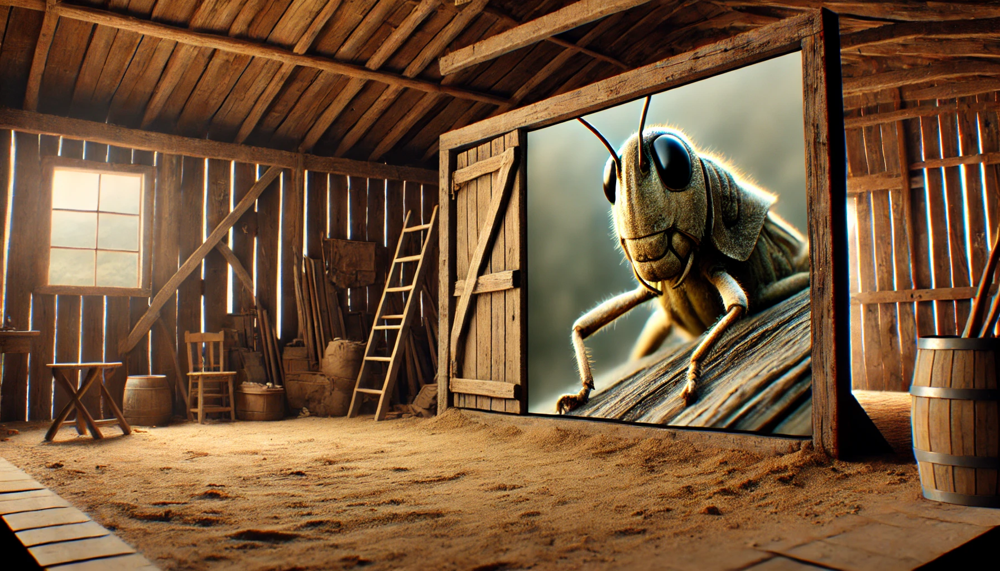
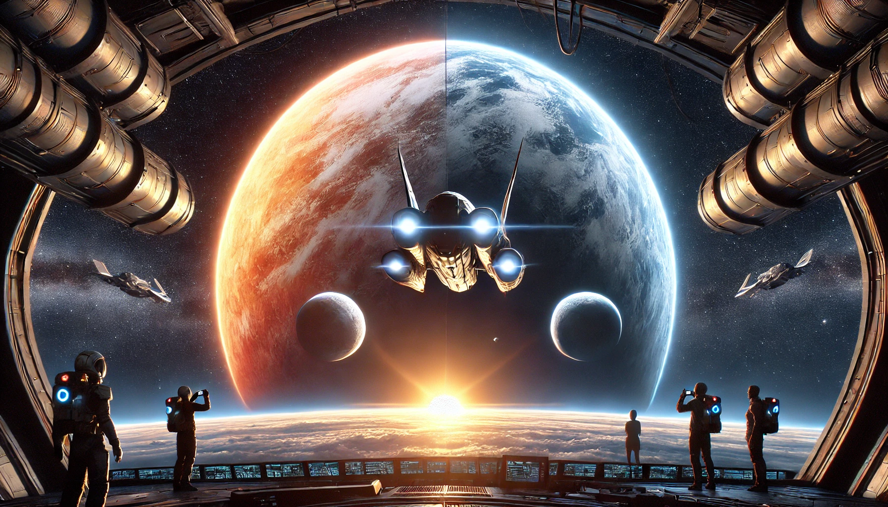

# 【随笔】再论关于游戏的哲学

昨天《蚱蜢---游戏、生命与乌托邦》这本书读完了，忍不住再写两句感悟。首先，继续推荐一下。

### 总体还是 🌟🌟🌟🌟4星，推荐你买一本！

可能是因为睡了一觉，大脑更清醒了一些，书的后半段读来并不太累。作者的思辨之网也清晰可见起来。这本书，确实需要主动耗费一些脑力，才能感受到其中的乐趣。但是，也不是那种佶屈聱牙（jí qū áo yá）的学究文字。总体而言，结合脑力激荡的乐趣，还算好看。

### 好看 🌟🌟🌟3星

这本书揭示了一个有趣的奥秘。说到这里，我都很矛盾。既忍不住想要抒发一下自己的感受，又怕剧透剥夺了还没看过这本书的朋友的乐趣。说真的，最建议读这本书的读法。就是先跳过所有导读、推荐序，等等。直接跟着作者的节奏，从前言的第一页开始读起，接住那一个个有趣的谜题，再层层剖开最是快乐。

先透露一点吧，这本书，源头来自大名鼎鼎的维特根斯坦的一句观点：

> 别说什么「必定有共同之处，要不然它们不会被称作『游戏』，而是需观察和理解是否有什么共同之处。」

然而，这个观点被作者贯彻了维特根斯坦在这句话里所推荐的态度——「去深入观察、理解」——所彻底推翻。

读这本书，我至少获得了两点启发：

1. 作者最后的感悟，与我内心的一些关于人生观、价值观的想法产生了「嗡嗡」共鸣。
2. 作者推翻维特根斯坦观点的方法，特别值得学习与借鉴。这是能真正帮你在「为学日益」的道路上前进的重要方法与套路。

所以：

### 启发 🌟🌟🌟🌟🌟5星

还是有一点忍不住想多分享一下的。读完这本书之后，有两个念头萦绕在我的脑海里，久久不去。一个是**亚瑟·查理斯·克拉克**爵士（Sir **Arthur Charles Clarke**）在《童年的终结 *Childhood's End*》这本书里留下的结尾：

> 卡列伦一抬手，图像又变了，一颗明亮的星星出现在屏幕正中：从这个距离看，谁也无法发现这颗恒星拥有好几颗行星，而且刚刚失去了其中一颗。卡列伦久久凝望着自己与太阳之间的距离越来越远，他那迷宫般深邃而广远的大脑中闪过一个个记忆的画面。这是一场宁静的告别，他向那些他所认识的人致敬，无论他们阻挠过他，还是帮助过他。
>
> 谁也不敢去打扰他，或者妨碍他继续沉思，接着，他转过身，而他背后的太阳正渐渐变小。

另一个，好像是来自《与神对话》里面的观点：

> 宇宙的真相是富足与丰裕的，匮乏只是一种假象而已。

你推开这扇门，将会看到和发现什么，一定和我不太一样吧……
