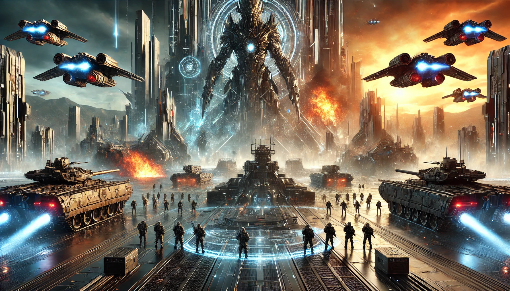

# 【生命⋅修行】重温长者的智慧——再读芒格的《穷查理年鉴》（六）

上次读完第六次演讲《领先慈善基金会的投资实践》之后，我忍不住跳出来，总结了一下我以为的芒格智慧之一、二、三之后。

接下来，我又开始继续重读《穷查理年鉴》了。这次，我一口气读完了他在2000年11月一次慈善圆桌会议上所作的第七次演讲：《慈善圆桌会议》，还有他在2000年夏天度假时写的这篇演讲稿，虚构的《2003年的大金融丑闻》。

在这几篇演讲里，芒格讲了什么呢？让我来分享一下我的收获。

### 1. 给复杂的基金支付高额管理费用是不合适的

经过各种论证，包块长期资本公司破产的反例。芒格认为，那些采用复杂策略的基金，还有增加了多层决策更加复杂的投资基金的基金都不好。为此支付高额的管理费用更不合适。芒格推荐了三种投资方法作为替代：

* 投资费用低廉的指数基金
* 效仿伯克希尔·哈撒韦，几乎完全被动地投资于少数备受推崇的国内公司
* 通过有限合伙的方式进行多样化投资，包括高科技初创公司、杠杆收购和其他复杂交易

第一种是最简单的，而第二种是芒格最推崇的，而且不需要分散化降低风险；保险策略是另外的事，不仅在投资上需要，人生中很多事都需要。至于第三种，他认为已经有点偏复杂化了，对于基金来说难以正确实施，容易跑偏。核心还是能像巴菲特那样，真正算明白风险与赔率。

他再次强调，要学习本杰明·富兰克林而不是伯尼·康菲尔德。

### 2. 我们不喜欢“febezzlement”，但它在普遍存在

加尔布雷思创造“bezzle”一词，是因为他看到每一美元未被揭露的挪用公款对消费有非常强的刺激作用。但芒格意识到，在股市中，有更强大的"febezzle"效应：

> 我将与加尔布雷思一起创造新词：首先，“febezzle”，表示功能等同于“bezzle”的东西；其次，“febezzlement”，描述创造“febezzle”的过程；第三，“febezzlers”，描述从事“febezzlement”的人。

其重要源头核心就是那些不合理、但是被合理化的基金管理费用。养老金计划这样的基金所带来的「财富效应」，被大大低估了。

更可怕的是，参考日本的例子，这样的泡沫必定会对人民的信心、实体经济造成巨大、持久的伤害和影响。

芒格提出了两点来自古老规则的建议，一条是伦理规则，另一条是谨慎规则：

* 伦理规则来自塞缪尔·约翰逊，他认为，负责任的职务持有者维护容易消除的无知是在履行道德义务时的背信行为。
* 谨慎规则是基于Warner & Swasey旧广告中的一句话：「需要新机床但还没买的人已经在为此付出代价。」如果你没有正确的思维工具，你和你试图帮助的人已经在因你容易消除的无知而受苦。

### 3. 只要开始做假和隐瞒事实，一定会付出惨重的代价

芒格虚构了一家公司开始使用不合理的会计准则和期权规则来做假的故事，揭示了这个事实，再一次强调了在第六次和第七次演讲中所提出的观点。甚至我觉得，这简直是预言了真实世界的「安然事件」以及后来的「两房事件」。

我特别同意芒格的价值观。

**简单、真实、透明是非常非常重要的！**

### 4. 需要深入理解世界经济机器的运转过程

芒格的这几篇演讲，让我再一次意识到，理解这个世界经济机器运转的底层规律，是非常重要的事情。好在，达利欧为这个概念，专门制作了非常棒的教学视频。改天我要再看一次，这算是第三次还是第四次呢？

* 原则的官网：https://www.economicprinciples.org/
* 这世界的经济机器是如何运行的：https://youtu.be/PHe0bXAIuk0
* 世界秩序是怎么演进变化的：https://youtu.be/xguam0TKMw8

以上两个视频，我曾经试过分享我的学习笔记，但涉及经济与世界秩序，里面敏感词颇多，基本很难把完整内容在微信公众号发出来。不如大家可以去B站找找资源自己看，将来我若再整理这两个视频的学习笔记，可能直接放到自己的个人网站上去吧。
