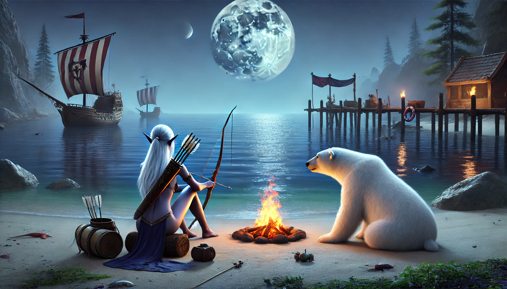
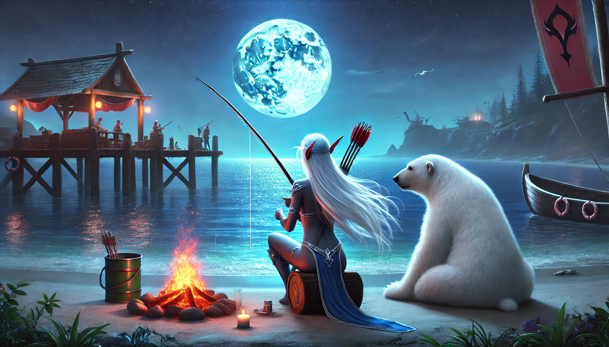
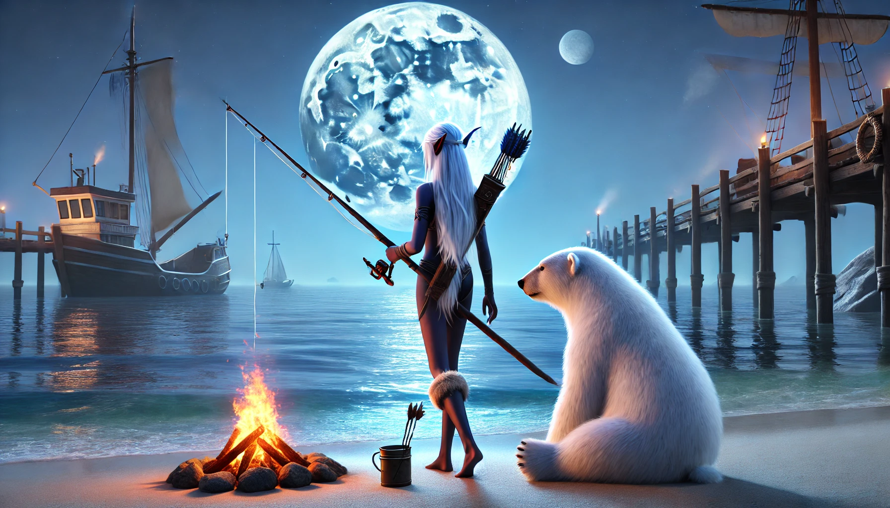

# 【生命•故事】（115）魔兽世界的记忆——艾泽拉斯往事

一直是按照从小到大的顺序在记录自己过往生命中的故事，但因为前几天看的那边关于游戏哲学的书，曾经玩《魔兽世界》的经历不可遏制地从脑海里浮了上来。

我并不是一个狂热的游戏爱好者，大学时玩的游戏多一点，但不像我的大学同学L那么痴迷和擅长。《魔兽世界》应该是我工作之后，唯一花钱充值玩过的游戏。

我选的角色，是来自联盟的暗夜精灵。虽然我是男的，但是我选了个女精灵，那时内心里，可能是想要同时体验一下「养成」的感觉吧。而且，魔兽世界有着当时世界上最好的3D引擎，屏幕上这个美丽的「女精灵」形象，还是蛮养眼的。显然，我不是一个常规玩家。离开新手村之后，我选择要做的第一件事情，就是长途跋涉前往铁炉堡的方向。只因为，那边路上有北极熊可以收作宠物。指挥着10级左右的小精灵，在北部的森林和沼泽地晃荡、死亡、重生多次以后，我如愿以偿地抓到了一只北极熊，给它起名为「面粉球球」。

看着娇俏的女精灵带着胖乎乎的大北极熊到处晃荡，我得意至极。

然后，我让暗夜精灵带着「面粉球球」回到黑海岸边，一面钓鱼，一面欣赏海上生明月的美景。然后生一堆篝火，把钓上了的鱼烤熟，喂给「面粉球球」吃。是的，在很长一段时间，我每次登陆游戏，啥也不做，就是去黑海岸边钓鱼。

后来，我的两个大学同学（包括L）听说我也在玩《魔兽世界》，说要给我些钱。他们已经是60级的满级玩家（那时最高级就是60），但是，他俩都是部落。

于是乎，为了钱。我指挥着20级不到的女精灵开始往南跋涉。因为一路都是50、60级的怪物，只要遇到就是被秒杀，为了避免盔甲武器在一次次死亡后折旧，我把所有的装备全寄存了起来。当时，我还颇为好奇了一下，如果把衣服全寄存后，女精灵会是什么样子。但显然，我想多了。

经历了无数次死亡，我终于到达了中立拍卖行，拿到了我这个级别无法想象的大量金币，开心地穿上了我这个级别所能穿的最高级盔甲，装备了我这个级别所能用的最好弓箭。接下来，我又要回去黑海岸钓鱼了！

这次，结识了另一个伙伴与我同行。他级别应该比我高，但是对付大草原的60级野兽也是够呛。但这时，我学会了一个在空中转身射箭的小技巧。凭着这一招，还有忠诚的「面粉球球」。再一次遭遇60级大鳄鱼时，我一边跑，一边打，必要时一个瞄准射击，引得大鳄鱼在我和「面粉球球」之间疲于奔命，竟然一顿操作猛如虎，折腾了可能有几十分钟，最后把这个远远超过我级别的家伙干掉了。在同伴面前如此NB，我颇为得意。

只不过，到了黑海岸，我们就分手了。他有许多任务要去做，而我只想在这海边钓鱼，看月亮。

记得，那时候开始了解「内观」，于是对于所谓的「习性反应」和「情绪」，我有了这样的理解：

> 那些自动化的反应、情绪，就好像我们在魔兽世界的游戏里设计好的「宏指令」。一个按键就能触发一系列动作，比如我用于干掉大鳄鱼时在空中转身发远程魔法的华丽操作。还有一些做任务时需要的，NPC一句话就能触发，然后角色自动跑来跑去，完成一系列事项。
>
> 它们的本来用途，是在特定场景下，高效率地完成某些任务。但是，有时候场景变了，或者中途发生了意外插曲，这些宏运行起来，主角的行为就变得极其搞笑。普通任务也就罢了，遇到正在进行的激烈打斗，那就是立决生死——通常是由生变死。解决起来也很简单，一旦发现，立即中止就是。然后根据需要，或者修改，或者废掉这个再也无用的「宏指令」。
>
> 所以，我们的「情绪」，我们那些「习性反应」，来源也无非如此。如果没有觉知，任它们在错误的时机错误的继续执行，就会遇到问题。如果能觉知，该「中止」就中止，该「废弃」就废弃。

当时我这么想，现在回想起来，依然这么觉得。

只不过，《魔兽世界》我已经很久、很久、很久没有玩过了。

除了L还时常见面，另外一个在北京的同学，在微信时代到来之前，就和我失去了联系。虽然我没有变过电话号码，按说他也没变过，但不知哪次换手机，我们就搞丢了彼此的联系方式。

而那些在游戏中交到的朋友，更是远去，消失在某个服务器的硬盘里了……