# 【随笔】再探世界经济机器运转的奥秘

因为读芒格的《穷查理年鉴》，又看了一遍达利欧的科普视频——经济这台机器是怎么运行的。

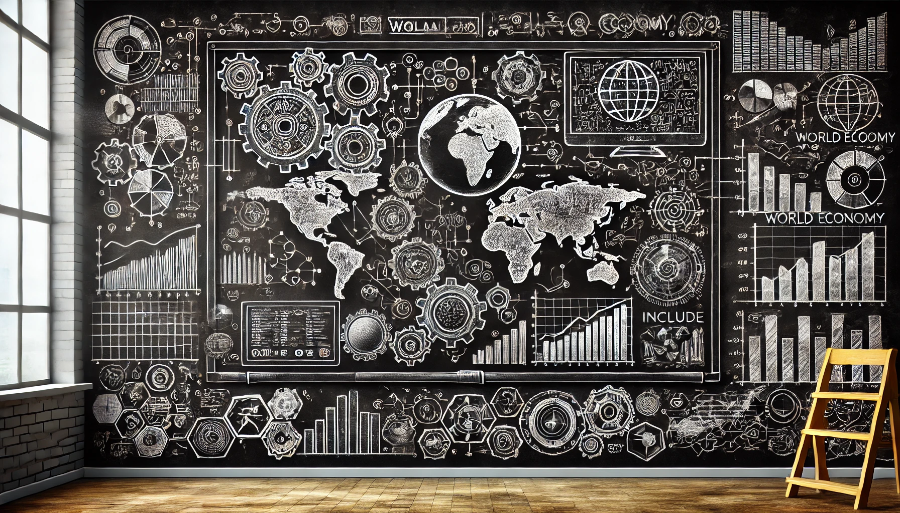

* 原则的官网：*https://www.economicprinciples.org/*
* How The Economic Machine Works by Ray Dalio：*https://youtu.be/PHe0bXAIuk0*
* 中文版的「经济这台机器是怎么运行的」: *https://www.youtube.com/watch?v=-ZbeYejg9Pk&t=0s*

以上是官方链接，B站上应该也很容易搜到对应的版本。2022年3月8日，我上一次重看这个视频时还写了篇简短的笔记，主要是对于达利欧最后的三条建议颇有感悟。今天重看，梳理了那些基本概念的同时，我又有一些新的想法，也在这里分享一下。

先跑一句题，真的越来越爱上这个想法：

### 真正经典的东西，值得一再重读

这个视频也一样。大部分的评论都说，这里荟萃了大学本科经济学基础课程的全部精华。

## 经济机器到底怎么运转？

借用豆瓣网友李九弟Jody的一句短评，视频里讲的东西非常简单：

> 非常清楚： 
>
> 3条线：生产率线+5-8年的短信贷周期+75年的长信贷周期。 
>
> 2个中介：政府及央行，通过合作熨平经济周期波动。信贷过多时央行提高利率，造成短周期；由于人们总是倾向于多借钱，所以长周期无法避免。 
>
> 4个去杠杆方式：少花钱（别人少收入）+债务消失或重组+转移支付（三种方式都很痛苦会造成通货紧缩）+印钱（通货膨胀，过多造成恶性膨胀）。 
>
> 3条准则：收入增速要超过债务增速+收入增速不要超过生产率+努力提高生产率。

三条线怎么来的呢？首先我们需要明白几个最基础的核心经济活动。

### 什么是交易

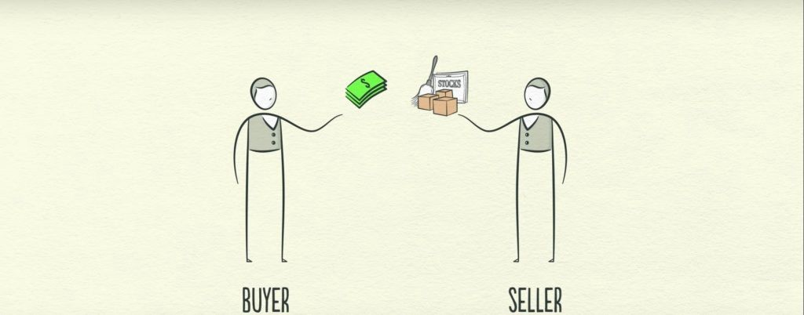

很简单，有买家，有卖家。买家花钱，卖家提供商品或服务。买家得到商品和服务，卖家赚钱。各种交易形成了各种市场，而这各种个样的市场就构成了整个经济。

然而，除了钱货两清的交易模式，还有一种很常见的，基于信用的交易。这就引入一个新概念：

### 什么是信用

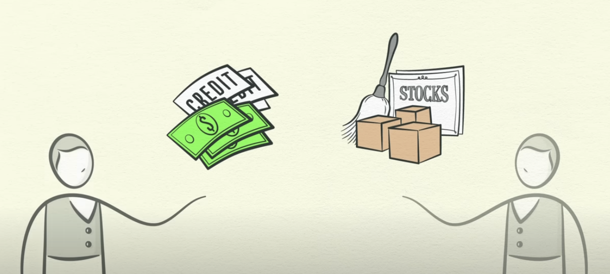

任何两个人（公司、机构）之间，只要他们互相同意钱可以晚点再付，信用就被凭空创造了出来。信用和钱同样可以拿来购买商品或服务，所以说买家的消费，换句话说，卖家的总收入是信用 + 现金两者的总和。

于是乎，就有了专门借钱的人和机构，并且借以赚取借钱的利息收入。

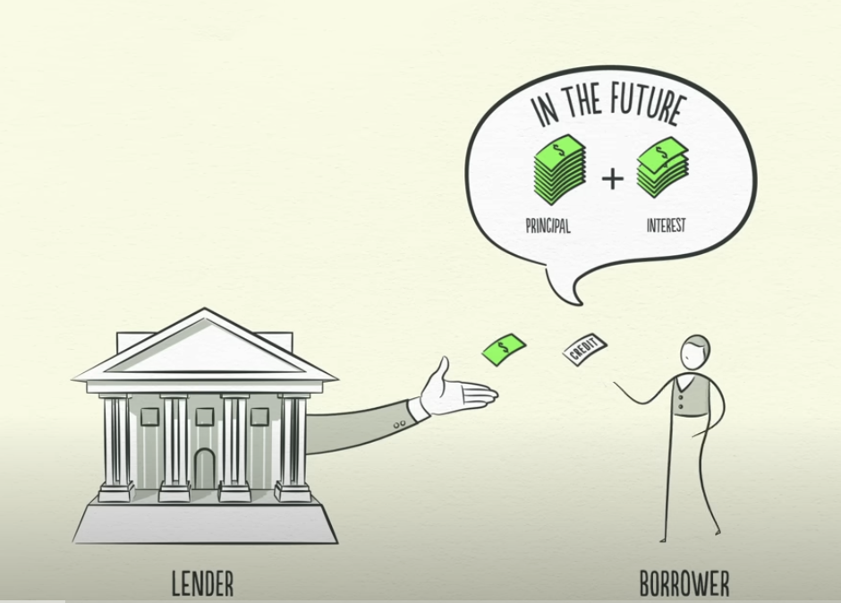

信用是一体两面的东西。信用一旦被凭空创建，债务也就出现了。

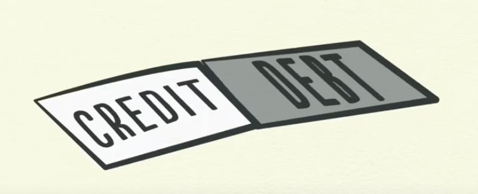

债务是出借人的资产，同时也是借款人的负债。债务是要偿还的，这就造成了波动。本质上来说，信用和债务是钱的时空腾挪。有了这些基本概念，我们就可以理解那驱动经济机器运转（包块变动）的那三条线了。

### 经济机器的三条驱动线

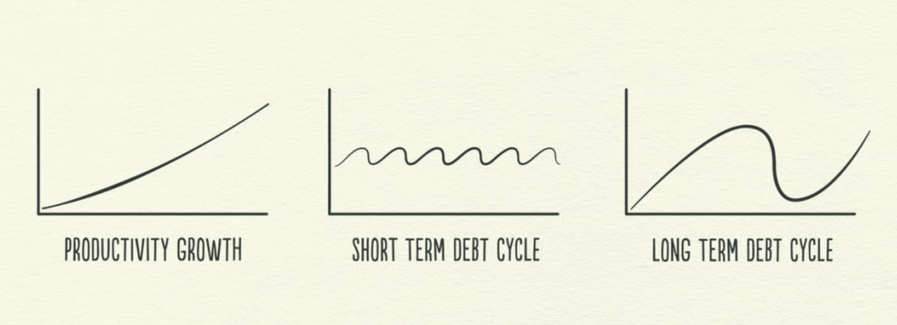

首先，生产力的持续增长是很好理解的。虽然它不会是一条直线，但也不会特别波动，而造成世界经济机器变动的主要力量，就来自另两条了。我们先来看看第一条，短期信贷周期。

#### 信贷是波动的根本原因

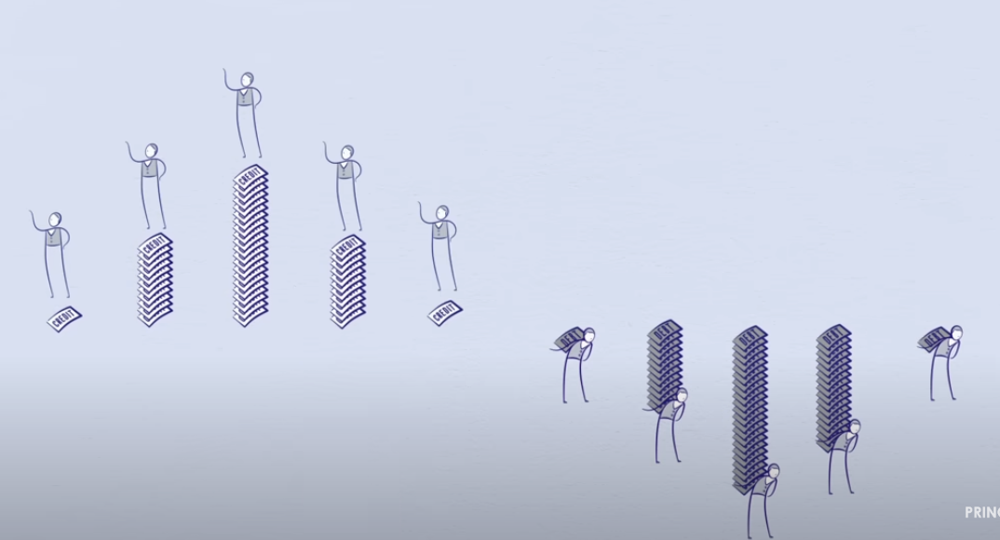

放到个体身上，今天借的钱，将来要还。今天多花了，将来就必然少花。而推广到整体。消费者花的钱就生产者的收入，这个波动就会传递出去。并且由于人性使然，这个波动必然会被放大，最终造成短期信贷周期的波动效应。

#### 信贷刺激消费，最终造成通胀

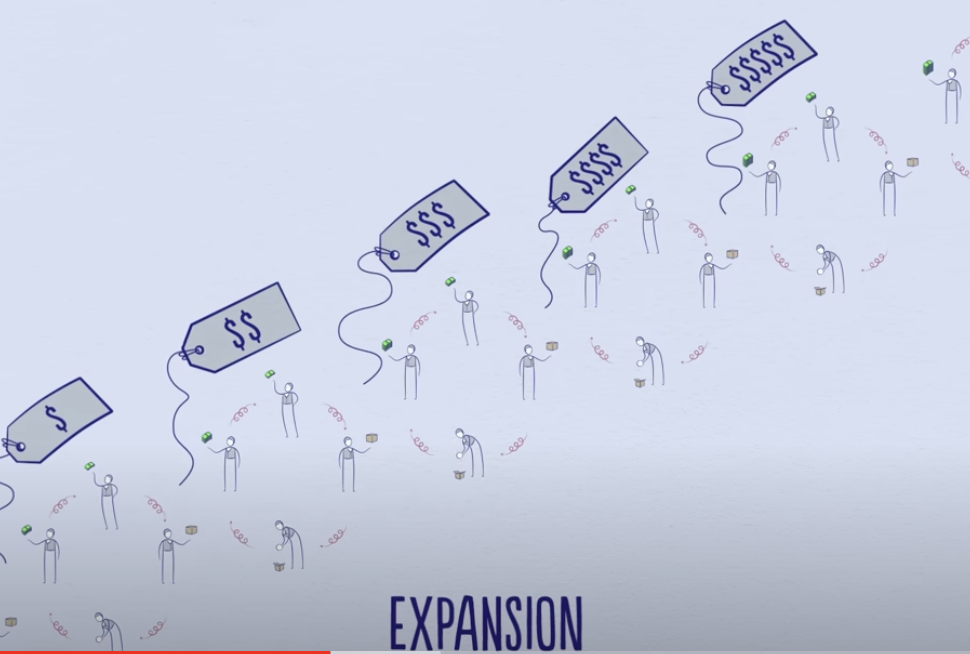

既然是波动，那么有涨就有跌。当消费总量（钱和信用加一起）一直扩张，最终超过了生产总量时，商品服务价格就会上涨，也就是所谓通货膨胀。

但为什么有两种长短周期的波动呢？我认为，这其实是人为干预的结果。这里，要先介绍现实世界中的两大调节机构之一。

### 央行（美联储）在干啥——调节利率

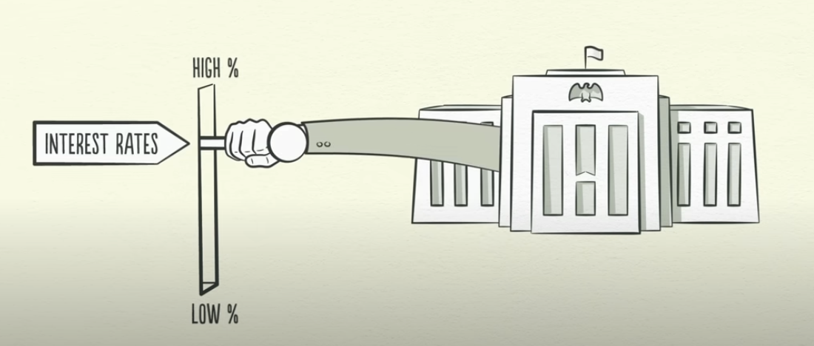

通胀太厉害是不好的，于是央行会动用自己的权利之一：调节利率。把利率调高，自然借贷的就少了。于是乎，Credit减少，消费也减少，收入也减少，这个循环就走到下行周期了。

同样的，下降太多，央行还可以把利率调低，刺激借贷，从而刺激消费。把循环从下行周期调整到上行周期。

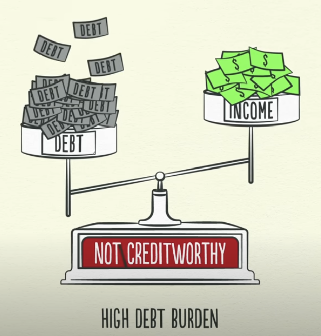

然而，当个人的债务太多，多到怎么也还不上时。不管利率多低，他也不敢借钱。当然也没人敢借给他了。放到整个经济环境中。这就是大周期走向下降通道的时刻，利率已经降到0%了，借贷和消费还是起不来。怎么办？这时，我们需要介绍现实世界中的第二大调节机构。

### 调节利率不管用时怎么办

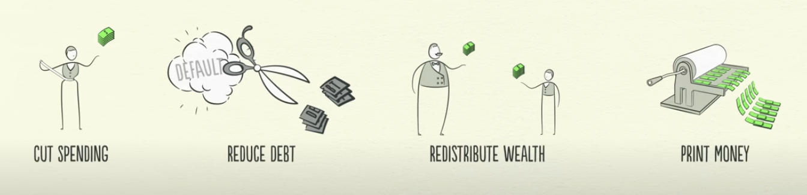

四条路：

**减少消费，减少债务，财富重新分配，印钱**

这里，需要第二大调节机构参与配合的是最后一条路。因为央行印的钱只能买金融资产，这没办法把钱给到需要钱的老百姓手里。于是，央行印钱购买政府债务，政府借债购买产品与服务，并补助失业人群。

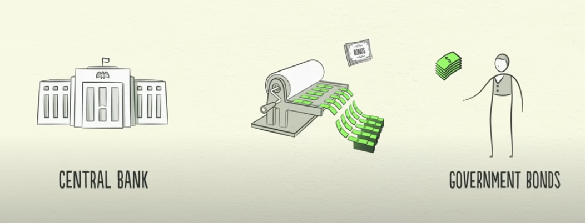

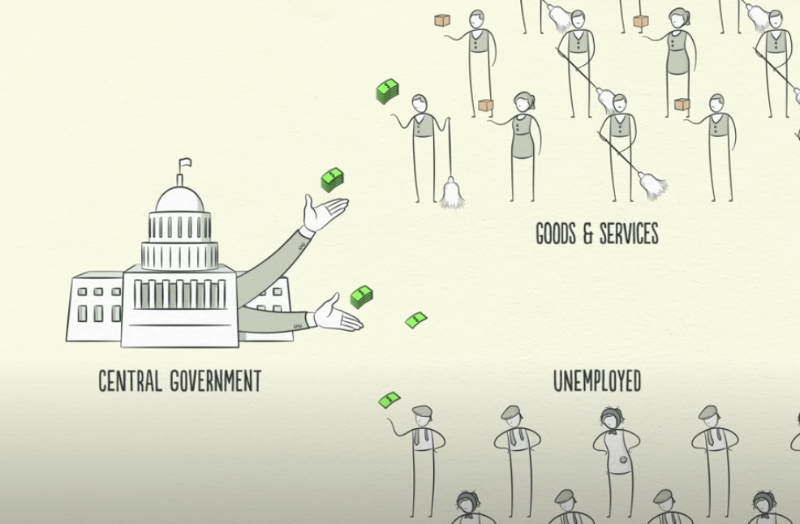

因为这个过程会增加社会的整体债务，所以政策执行时需要特别小心，以便维护一个微妙的平衡。

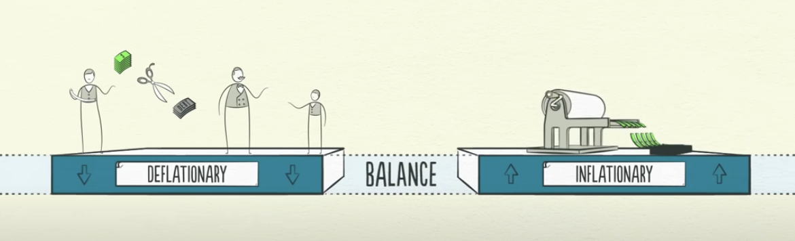

大周期的上涨阶段，通常持续50年，而下跌则需要2-3年，最后修复还得7-10年。这就是所谓「失去的XX年」说法的由来。

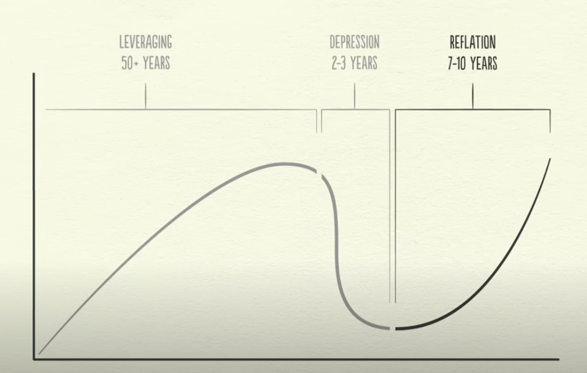

### 总结与建议

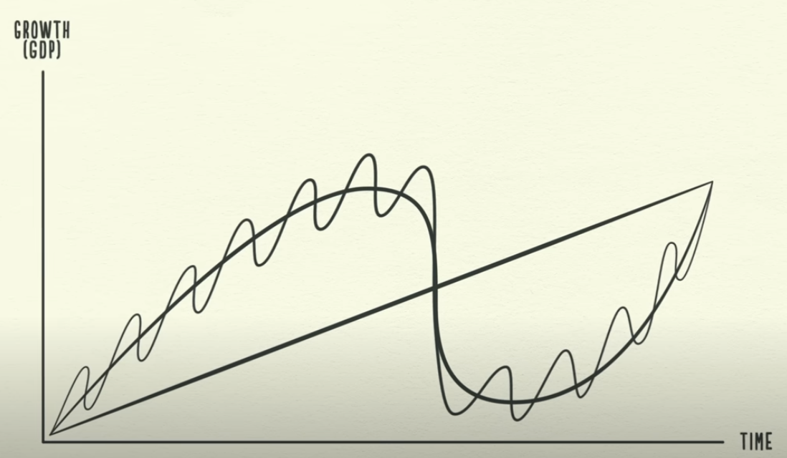

基于这样一个三条线模型，达利欧给出的三条建议就显而易见了：

> #### Rule One 第一条法则
>
> Don't have debt rise faster than income. 不要让负债的增长超过收入的增长。
>
> #### Rule Two 第二条法则
>
> Don't have income rise faster than productivity. 不要让收入的增长超过生产力的增长。
>
> #### Rule Three 第三条法则
>
> Do all that you can to raise your productivity. 尽一切可能，提升你的生产力。

----

以上，就是视频所讲的内容。但这次重看，我冒出了两个疑问：

## 问题与思考

1. 站在个体角度，如果借贷是为了提升生产力，那么还会造成波动吗？
2. 如果像日本那样，印钞、降利率都不管用了，说明什么呢？

经过一番思考，我暂时得出了我的答案。如果你有不同想法和意见，欢迎讨论。

### 问题一：站在个体角度，如果借贷是为了提升生产力，那么还会造成波动吗？

首先，借贷一定会产生波动。

其次，借贷提升生产力，意味着让生产率提升的那条线变得更陡峭，这其实会对冲掉那下跌的波动。

第三，站在整个社会的角度，通货膨胀是因为总体收入超过总体生产。所以个体波动汇聚成社会经济波动的核心原因贡献者，是变成消费的那部分借贷，而不是用于提升生产力的那部分。

所以，理想状况下，如果借贷只用于提升生产力，那么曲线可能是下面这样（而不是像达利欧画的那样会一再跑到生产力直线，或长周期曲线下方）：

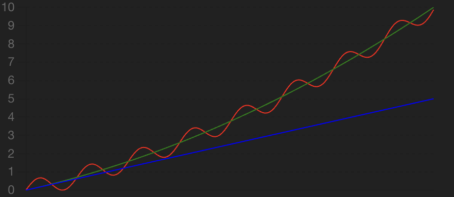

### 问题二：如果像日本那样，印钞、降利率都不管用了，说明什么呢？

正如芒格所考虑的，金融泡沫的破灭，实质上破坏了整个社会的「信心」。达利欧所说的去杠杆四招，本质上就是两件事：

1. 多生产、少消费
2. 财富重分配

站在全球角度，当年日本整体上是被财富重新分配的那位「富人」。所以，他自己使出万般招数，也没有什么鸟用。

思考过这两个问题。站在个人角度，我觉得达利欧三条法则的重要性，需要重新排序：

* 首先，尽一切可能，提升你的生产力。
* 其次，不要让收入增长超过生产力的增长（本质上是多生产、少消费）。
* 第三，不要让负债增长超过收入增长。绝不借钱消费，同时维持好负债与收入的平衡，以远离崩盘的风险，远离被别人重新分配财富的风险。

古话所说：

> **耕读传家久，诗书继世长**

可不就是一边铆住最基本的生产，同时不忘持续提升生产力么！

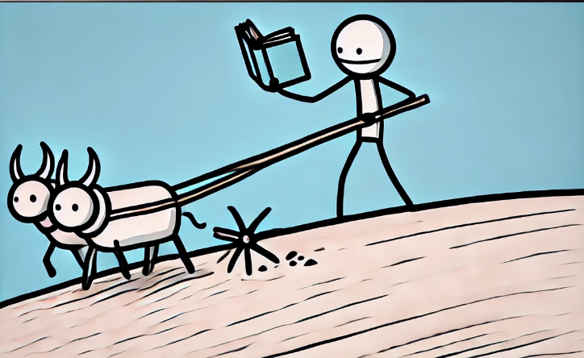