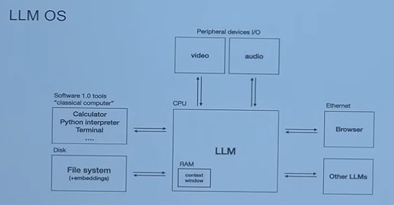
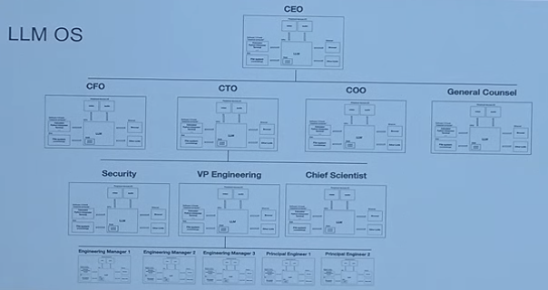
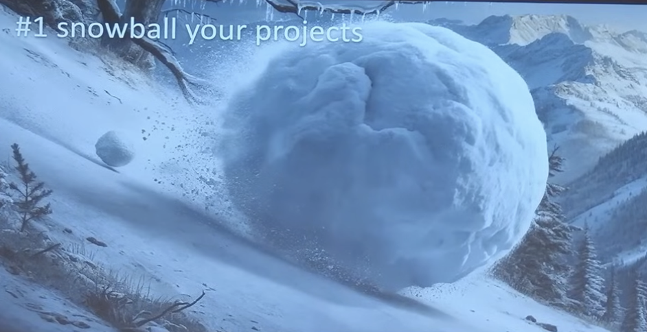
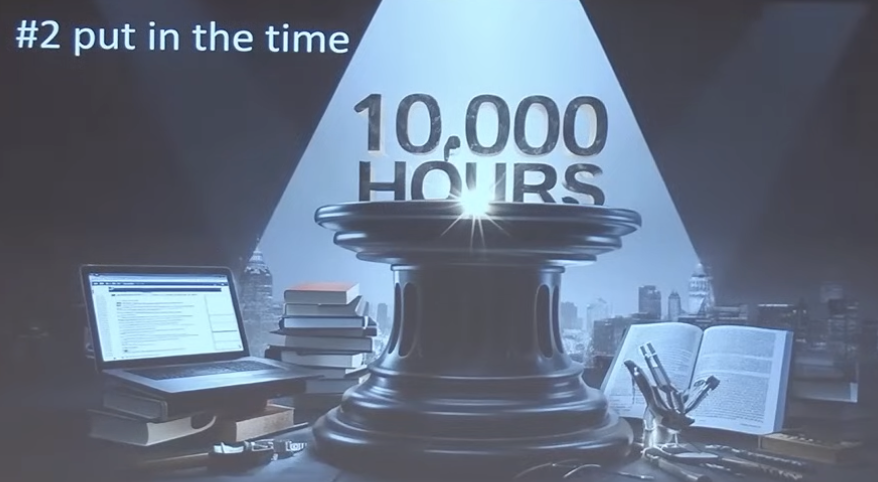
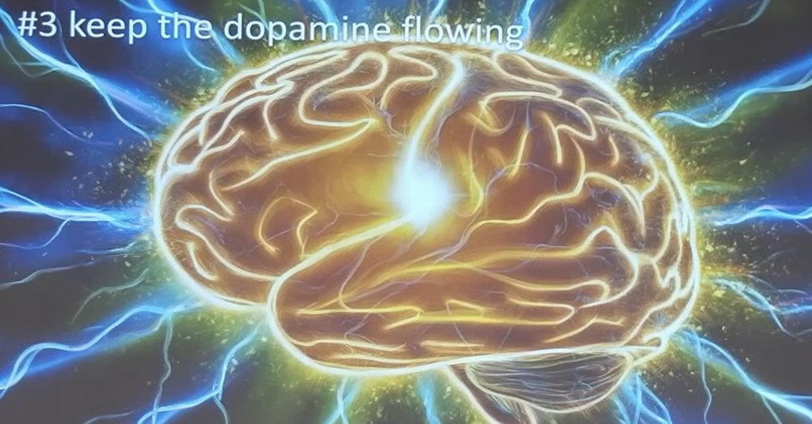
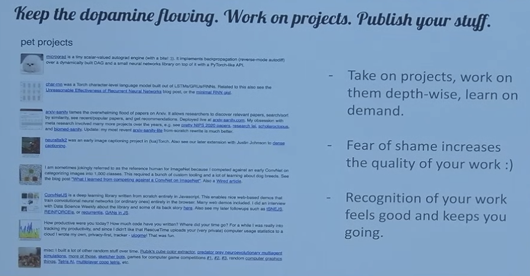

# 【生命⋅修行】滚雪球与1万小时定律

> 安德烈·卡帕斯（Andrej Karpathy），1986年出生在捷克斯洛伐克（如今的斯洛伐克），15岁时移民加拿大，在斯坦福大学师从李飞飞研究自然语言处理和计算机视觉。
>
> 他曾是OpenAI的创始人之一，曾任特斯拉人工智能和自动驾驶视觉总监。
>
> 他是斯坦福大学第一门深度学习课程《CS 231n：用于视觉识别的卷积神经网络》的作者和主要讲师。这门课成了斯坦福大学最大的课程之一。
>
> —— 摘自[维基百科 安德烈·卡帕斯](https://zh.wikipedia.org/wiki/%E5%AE%89%E5%BE%B7%E7%83%88%C2%B7%E5%8D%A1%E5%B8%95%E6%96%AF)

最近，大神安德烈·卡帕斯（网上不少人这么称呼他，他在人工智能的社区里声望颇高）在**伯克利黑客马拉松**上做了一次20分钟左右的发言。他不仅仅提到了自己关于人工智能现状和前景的看法，他还提到了滚雪球、1万小时定律、做项目这好几个关键词。我赶紧在[YouTube上找到了这段演讲视频](https://www.youtube.com/watch?v=tsTeEkzO9xc)，他的语速实在太快了，我不得不来回听了两三遍。不过，评论区有人说：

> I love Andrej's mind. He is the only speaker for who I don't have to increase the playback speed.
>
> 我喜欢安德烈的想法。他是唯一不需要我调快回放速度的演讲者。

演讲很精彩，网上也很容易找到演讲的全文。这里，我想分享的是，那些对我而言特别重要的观点与建议。

### 我们似乎正在进入一个新的计算范式 - LLMOS

就好像80年代的PC机，2000年的互联网，现在我们使用计算机不再是执行二进制代码的CPU，而是处理Token的大语言模型。这些模型，连同上下文窗口，存储设备等等，形成了一种新型的计算价格。安德烈称之为 LLM OS。

这个概念非常清晰有效，和王建硕提到的 NL GUI类似（他是从人机界面的角度作出的这个论断），我们和计算机之间的关系，与以往不再一样，正在跑步进入一个全新的时代。不仅人机界面会变化，AI还会嵌入当前人类社会的组织与分工之中，AI与AI之间的关系，人类与AI之间的关系，人类自己的组织与社会可能都会随之变化。

### 改变世界的大举措，都是从一个不起眼的小雪球开始的

他举了OpenAI的例子，自己魔法教程的例子。许多有巨大影响力的项目，都是从微不足道、不起眼、看起来不重要的小项目开始的。

道德经里不也是这么说嘛：

> 合抱之木，生于毫末；九层之台，起于累土；千里之行，始于足下。

我想，关键的关键在于，得像巴菲特说的那样：

> 找到一个厚雪长坡！

### 1万小时定律真香

安德烈以他的个人经历证明，1万小时定律是真的有效。你在一件事情上持续投入，花了比别人多得多的时间，你就会变得比别人更专业。

他也劝我们不要被10000这个数字吓到了。假如每天投入6小时，也就是5年左右而已。正好是读一个博士生所需要的时间。想必这也是为什么完成一个博士学位，通常需要这么多时间的原因吧。

他自己进入特斯拉从无到有建立了机器视觉部分的核心架构，看起来很难。但原因在于，之前的博士研究期间，5、6年来，他一直在做这方面的事情。

甚至哪怕那个周末完成的小网站，他之所以能周末迅速完成，无非是因为类似的事情，他已经做过20次以上罢了——无他，唯手熟尔。

### 一定要做项目

人脑是按照奖励机制运转的，最有效、自动化利用人脑这个奖励机制的办法，就是做项目。

* 不论项目大小，深入一个项目工作，从头到尾把它完成，可以在真实的需求中学到真正需要的东西。
* 公开发布这个项目，担心丢面子会让你工作更努力，把它完成得更好。
* 人们的反馈、分享会让你感觉更好

简而言之，公开做项目，在项目中学习是最有效的办法。

不必担心项目小（参考滚雪球原理），不必担心项目失败（参考10000小时原理，每一分钟都不会白费）。

### AI领域就是下一个厚雪长坡，快开始滚你的小雪球吧！

是啊，我的小雪球是什么呢？我得赶紧开始搓一个才是！先从每天30分钟开始，到每天3小时，再到每天6小时，踏踏实实地开始自己的下一个10年（或者8年）……