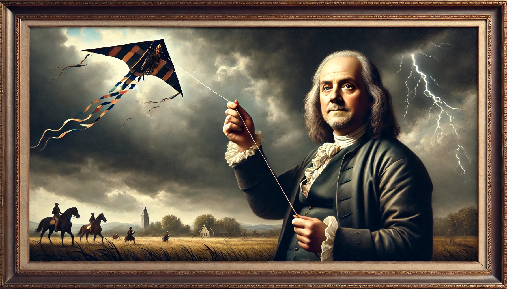

# 【随笔】幸福生活的秘诀

> That vicious actions are note hurtful because they are forbidden, but forbidden because they are hurtful, the nature of man alone considered; that it was, therefore, every one's interest to be virtuous who wish'd to be happy even in this world;
>
> 如果仅考虑人的本性，那么恶性不因其遭到禁止所以带来伤害，而是因为带来伤害才遭到禁止，因此，只要他希望在此世界获得幸福，那么谨守道德对于每个人都是有利的。
>
> ——《[Benjamin Franklin 本杰明·富兰克林](https://zh.wikipedia.org/wiki/%E6%9C%AC%E5%82%91%E6%98%8E%C2%B7%E5%AF%8C%E8%98%AD%E5%85%8B%E6%9E%97)》

这几天开始重读《[本杰明·富兰克林自传](https://weread.qq.com/web/reader/d2b328107278e674d2b38e5kc81322c012c81e728d9d180)》，才意识到这位智慧的老人，早就把经过他一生验证的幸福秘诀写在了他的书里。回想起来，第一次读这本书，或者是从其它书上看到富兰克林介绍的培养道德的方法时，大约应该是上初中的时候。我还记得，那时自己的书桌在家里阁楼上，当时紧挨着栏杆和楼梯口，就在那片明亮的亮瓦正下方。

我在一张纸片上写了「勤、专、恒、勇」四个字，作为座右铭贴在书桌前的栏杆上。这是效仿鲁迅、还有我当时一直钦佩的那位好友H。当时我在一个本子上，也画下了13条横线，写上了富兰克林所推荐的美德，再画上一周的日期格子，决心效仿他每周聚焦培养一个美德，一年循环上四次：

1. 节制。食不过饱，饮不过量。
2. 沉默。不说对人对己毫无益处的话，不参与闲谈。
3. 有序。一切物品都应规整有序，每件事都应安排时间完成。
4. 意志坚定。下决心去完成该做的事，下决心之后就定要完成。
5. 节俭。所费钱财必须于人或于己有利，不浪费一分一厘。
6. 勤奋。不浪费时间，每一分钟都做有用的事，摒弃一切不必要的行为。
7. 真诚。不欺骗伤害他人，思想要纯洁公正，说话要实事求是。
8. 正直。不冤枉伤害他人，不忽略自己能造福他人的责任。
9. 中庸。避免趋于极端。如果受到应得伤害，不要恼怒。
10. 清洁。保持身体、衣服和住所始终干净整洁。
11. 平静。不受琐事及普通或难以避免的事故纷扰。
12. 贞洁。少行房事，除非为了健康或生养后代起见，以免使大脑迟钝，使身体虚弱，或是破坏自己或他人的安宁和名声。
13. 谦逊。效仿基督和苏格拉底。

显然，这个「宏伟」的计划一如很多我曾经定下过的其它计划，在我的成长岁月中不知不觉地不了了之。虽然它一再以不同的机缘和形式重新出现，但只能算是断断续续地在「操练」着。

这次重读，忽然明白自己年轻时对这些美德的理解，实在是不可避免的有些肤浅。我只知道，「伟大」的富兰克林建议培养这些美德。但我并不是真正的明白，为什么他会有这样的建议。直到我再一次看到富兰克林在自传中所记录的成长故事，他身边的朋友所发生的事情，这些种种，终于总结成这13条经验和教训。

就像芒格所给出的不幸生活指南一样，那是在许多显而易见的「危险之地」入口处所设立的警示牌。少去，最好别去，你就不会受到伤害。

### 总体 🌟🌟🌟🌟🌟5星，强烈推荐

只看这10几条美德，以及学着画个表格每天反省打点是不够的。当然，只是当作故事看也是不够的。强烈建议从头到尾地反复读几遍，这是一个有智慧、俘获了幸福的伟人用一生经验亲自总结的幸福生活秘诀。

花再多时间在这本书上，都是值得的。

### 好看 🌟🌟🌟🌟4星，

大部分和讲故事一样，讲道理时也是娓娓道来。中文翻译得大多不错，基本可以一口气读完。即便是英文版，熟悉了少数几个富兰克林那个年代常用，现在略略不常见的表达之后，读起来也不是太吃力。

实在不懂，还可以祭出GPT帮忙。

### 启发 🌟🌟🌟🌟🌟5星，不用多说了。老人家一生的智慧尽在于此！

