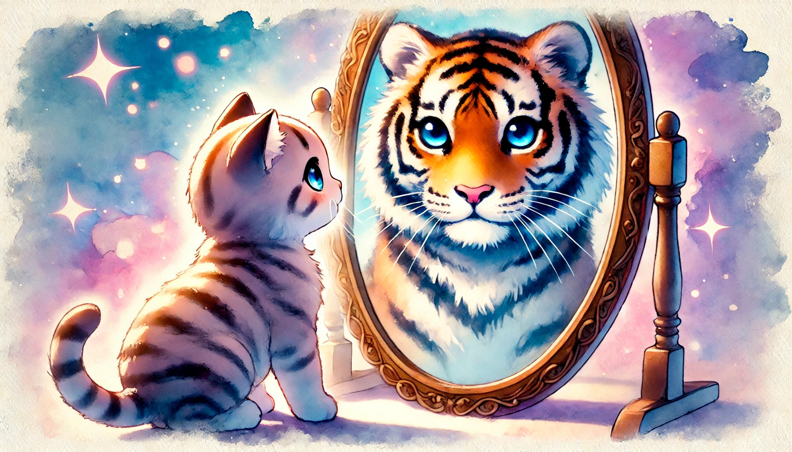

# 【生命⋅修行】看清真相的智慧

> God, 主啊，
>
> Grant me the SERENITY, to accept the things I cannot change, 请赐予我平静，让我接受我不能改变的一切，
>
> COURAGE to change the things I can, 
>
> 请赐予我勇气，让我去改变那些我能够改变的事情，
>
> and the WISDOM to know the difference. 请赐予我智慧，让我能分辨这两者的区别。
>
> ……
>
> Amen. 阿门！
>
> Reinhold Niebuhr 雷茵霍尔德·尼布尔

前两天看到一段克里希那穆提的采访，主持人问他关于成瘾性要怎么克服的问题。他说的很直接：

> 一开始我抽烟，然后我知道了抽烟会引起癌症，我就不会再抽了。

主持人很困惑，显然没有得到答案。我明白主持人一定想追问，如果你有烟瘾，你要怎么克服。可克里希那穆提的回答却好像是，对不起，我没有这个问题：

> 是的，一开始抽烟让我快乐。然后医生让我知道，抽烟会引起癌症。这就结束了！

说实话，我和主持人一样也依旧困惑。虽然我不抽烟，但我会刷手机、会熬夜，一直也未能克服这个问题。我没办法像JT那样，坦然地抽烟、熬夜刷剧；甚至也无法像大宝那样，明确清醒地知道自己在刷剧、看小说，知道自己这就是想暂时放松一下。更无法像克氏那样，知道即做到。

是的，我想要戒除掉这个我觉得不好的行为，但不知怎样做到。

但我却感觉，克氏的回答，有点王阳明先生「知行合一」的意味。他是在说：因为我知道了（抽烟会引起癌症），所以我就能做到（我选择不要癌症）。他没说的是：你做不到，因为你不知道。

说实话，我会羡慕克里希那穆提所表现出来的那种犀利——清清楚楚、明明白白的犀利。但是，像我这样的凡人，似乎总是在面对「难以抉择」的煎熬。这或许是为什么林世儒老师所教的「是与否的挣扎」练习给我颇多触动，而日常静坐在「疼痛」袭来时，自己也会有更多「感觉」的原因。

于我而言，面对这样的「挣扎」是一种常态。在那个时刻，就是一种不清楚的状态：

* 不清楚真实的现状
* 不清楚自己想要什么，不想要什么
* 不清楚自己可能的行动与结果间的关系

然而，这种挣扎的状态，既是事实，同时也是心所制作出来的一种假象。因为这个挣扎，会在心念一转的某个瞬间，立刻消失。

当然，可能就是因为心念一转，又看到了更多，于是一切清楚明了，再也没什么好挣扎的了。就好像我昨天看的「老明读书」关于道德经的一段视频。他说，道德经里有一句话：

> 天下万物生于有，有生于无。

那些「瘾」破除不掉，只是因为那些背后看不见的结构、模式没有被看见、没有被改变。所以会不停地生出能看见的「瘾」这样的现象。我的「瘾」还在，一样是因为有些看不见的东西（不管是结构、模式，还是我想要的东西，抑或是某些被忽略的现实）还没被看见罢了。一旦看见，则一切清明。

但我知道，即便是这清明的状态，其实和挣扎的状态一样，既是事实，同时也是因心所造的又一景象而已。这种感觉，自己曾经在许多梦中和随后清醒后的反思中有过多次验证。然而昨晚睡前，我却在醒着时经历了一番。

那时已经很晚，我连续读了好几篇关于价值投资、讲芒格、巴菲特、段永平的文章，其中有一再提到茅台的清晰商业模式。我忽然意识到，一个还在增长的生意，但哪怕是出现意外无法增长，也是10年就能回本，这就是确定无疑的好生意。于是，我查看了一下茅台在近10年的股价，以及他近10年左右的分红。我发现，2016年它是300左右，分红是60元左右。如今它是1500元左右，分红是300多元。

天呐！我掏出计算器。发现，不论增长，这竟然就有20%的收益！

为什么我2016年就没有想明白这一点最最简单的投资本质？为什么我当时看不到这个明显的投资机会。

那一瞬间，我有一种彻悟的感觉！当年关于投资，我怎么会学得那么不明白、不透彻？那真是，既觉得自己当年傻，又觉得此刻醍醐灌顶，拔尖四顾心茫然。

但是，遗憾的是，过了不到半小时。我赫然看明白，原来中国股市分红数据的惯例是每10股分XX元。也就是说，茅台的股息率不是20%，而是2%！！！

就这样，我又从云端回到陆地。当然，茅台此时或许依旧值得投资，但已经没有之前那么显而易见，老妇稚子亦可为之了。

是的，挣扎也好，清明也好。一切都是唯心所造！

然而，在这之上，应该还有更高一层的智慧吧？我们终究能够觉知、观照、了了分明地看着这两者彼此相生，阴阳转换。一步又一步地走近这一层能够看清真正真相的智慧，或许就是此生的目标了吧。

这既是我生命的目标，也是渡过我这一生的方法。

