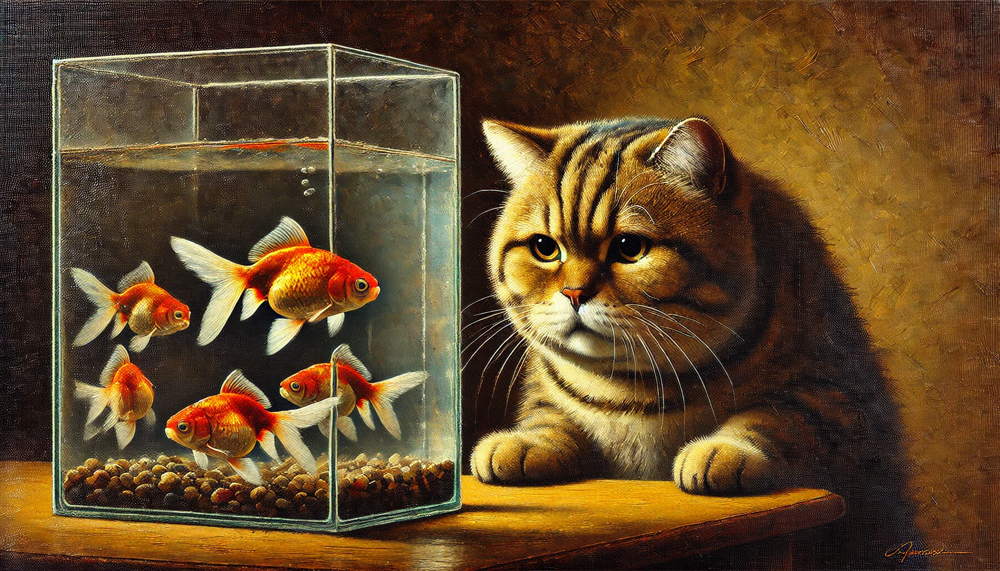

# 【生命⋅修行】差一点没忍住

写下了这个标题之后，我忽然意识到中文的博大精深——这句话最后，到底我忍住了还是没忍住呢？仔细想想，好像都可以！

好吧，不卖关子，直接揭开谜底：我的意思是。我最后忍住了，但是差一点变成「没忍住」。

我说的是关于Timeboxing。前两天不是曾经决定，要把每天的待办事项控制在250个Box以内吗？这过完周末之后的第一个工作日，我才拿起笔记本简单划拉了一阵子，待办事项就堆满了整整一页。意识到不对，赶紧拿出计算器加了一下，才算了约莫不到2/3呢，耗时已经超过250个Box了。

几乎是下意识地，我继续开始做加法，想要知道算上剩下的那些事情，到底需要多少时间。然后我可以把最重要的事情标出来，从最重要的做起。刚刚这么想完，我猛然意识到，那这和之前又有什么区别呢？才几天过去，又打算把自己压爆吗？

难道说，本质上，我其实是懒得（或者害怕）去判断，哪些才是「今天」最重要的事情吗？

于是，我默默地停止了之前想要继续计算总时间的企图。转而把这一天最最需要做的事情做上标记，重新计算了一下总时长。很遗憾，还没加完，又是260多个Box。我仔细想想，再次去掉了一项，然后把其中某几项的预期时间也做了一点调整。呼呼～终于，这次成功的把总数控制在了250。

等到这一天快过完，还是有两项原计划各需要一个小时的事情未能开始。然而，已经开始头痛了。嗯嗯，不管怎么说，也绝对不能影响睡觉这件最最重要的事情。

呃，竟然还有原计划需要花45分钟左右的晚饭，也被我忘记到了九霄云外。

但是，这次能够觉察到自己无意识继续施压的行为并及时「忍住」，已经非常成功了。

究其本质，这其实和我在买东西时，常常左右为难是一回事儿。

大宝不会遇到我这样的困扰，她只会先干了再说。我则需要时刻牢记孔夫子教训季文子说的话：

> 再，斯可矣！

解决自己这个三思、甚至常常十思而不能决断的问题，其实早有一些方法可用。

一个是林世儒老师教的正坐法——以身调心，增加决断力与行动力。

另一个其实就是再坚持内观，正如这一次的「觉察」，就将我从没忍住的边缘拉了回来。

第三，还可以试试所谓实施意图理论（Implementation Intention Theory）所建议的方法，为这种犹豫场景制定具体的应对计划和详细步骤，如下：

* 进一步明确做TimeBoxing计划的步骤：
  1. 在晚上洗澡后拿出钢笔和本子；
  2. 翻看一眼每天、每周、每月例行事项；
  3. 默默提醒自己要聚焦最重要的人，最重要的事；
  4. 以睡觉为第一，按优先级把最重要的事情和预计时间写上。
  5. 检查前一天/几天未完成的事项，是否需要加到这一天的计划。
  6. 加总预计的时间。
* 只要出现超过250个Box的计划，就：
  1. 回顾自己的价值观；
  2. 把最最重要的事情打上标记；
  3. 重新加总最最重要事情的耗时；
  4. 删掉多余的其他计划；
  5. 还不行就调整留给最重要事情的计划时间；
* 此外，只要遇到犹豫不决的事情，就：
  1. 立即评估出必须作出选择的截止时间；
  2. 立即评估做错可能付出的代价；
  3. 如果不是马上需要决策，根据做错可能付出的代价，规划一个评估时间；
  4. 列出Top3的选项；没有3，Top2也行。
  5. 默念凡人都会犯错，没关系；
  6. 随便选一个；

就像这样吧！