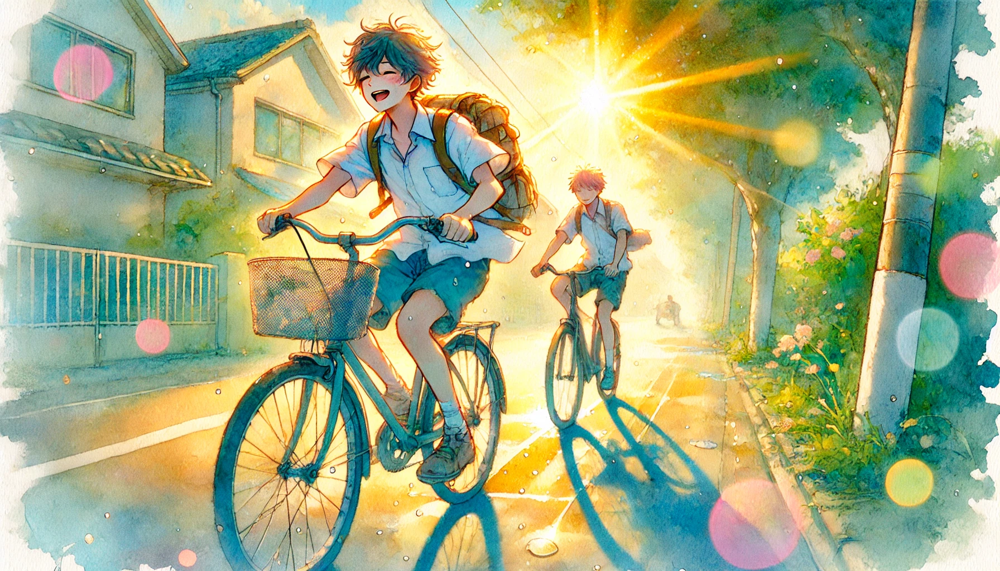

# 【生命•故事】（116）夏花灿烂

那天好像是看到老喻发的一篇文章，一下子把我的思绪拉回了30年前。

1994年江城的夏天特别热。高考的考场设在我们自己的高中，但那时候可没有什么全体人民给高考考生让路的传统。好像是因为横渡长江的纪念活动，我们离着学校3、4站路就被赶下公共汽车。徒步到一半时，遇到骑着自行车的好朋友L，把我捎到了学校。我坐在教室的前面几排，上午9点的阳光从左侧的窗户直射进来，照在我的额头上，到了下午阳光则是右边的门口照进教室。为了给考生降温，几大桶冰放在教室里，其中一桶正好放在我的右手边。就这样连续三天，7月7日、8日、9日，我在这冰火两重天的夹击下，连续炙烤五场。

那时候填写志愿都是在考前，考完就考完了，不用费神猜测自己考得如何，只管等着谜题揭开就是。记得分数出来后，小C给我打电话问我的分数，我一门一门报给她。听完后她脱口而出一句话让我郁闷许久：

> 每门都不高啊，怎么加起来有589？

她考得比我好，590多分在重点线之上，足够上她的第一志愿华中理工大学，这最后一次在班上的排名她可是大踏步向前了。而我就惨了，590分是我们那一年的重点线，我差一分！虽然复旦大学因为我过去的物理竞赛成绩，给了我一个优录名额。但前提是，我的分数得超过重点线，档案才有可能送到他们手里。但我最拿手的物理也只考到139分。怎么着，都是差一分。我颇有些郁闷，甚至埋怨这一年的物理题太简单了，随便谁都可以考到130多分。要是像前一年那样，几乎学校所有人都难以考到100分的卷子，我能轻松考到120分，自己在物理这科的优势就能成为真正的优势了。

可是话又说回来，谁让自己学得不够扎实呢？这一年化学也不难，但班上化学最好的同学之一，张XX就依然能稳稳地考到140多近乎满分的成绩。在物理这门考试上，我终究没能做到像人家的化学这么稳稳当当。

甘心也好、不不甘心也好，终究还是要接受现实。我告别了去复旦大学读生物物理，做个科学家的梦想。听着小虎队的《星光依旧灿烂》，开始了高中最后一个没有作业的美好暑假。

冠生园食品厂每年都会招收暑期临时工，因为需要为一年一度的中秋节准备月饼。于是乎，我和初中的好友ZK，还有另外几个朋友一起在这里开始了暑期的打工生涯。

我们的师傅是一位胖乎乎、咋咋呼呼的阿姨。她说自己在汉正街开店，要不是这个月饼旺季，厂里需要熟手来帮忙，她才不来这里挣这么点钱呢。她熟门熟路地在做蛋黄月饼时，从家里带来几个巨大的雪碧瓶子，先把鸡蛋清全装在瓶子里，然后才把剩下的鸡蛋黄拿去继续加工。还告诉我们，这鸡蛋清拿回去，可以炒这个、炒那个，味道好极了。但她只是说说，鸡蛋清全都自己拿走了，并没有分给我们的意思。

工作是三班倒，常常要通宵加班。但通宵加班往往是最快乐的时候，老师傅们会在后半夜开始张罗着用烤月饼的大烤箱，制作出各种美食，然后拿出来大家一起大快朵颐，他们还会弄些酒。当然，酒是不会给我们喝的。同时加班的，有农业大学的一帮集体来实习的大学生。有个老哥一边喝着酒，一边看着那帮学生中的几对儿打情骂俏的小情侣，一边调侃我：

> 你的马子呢？

我则开始目光游离，默默念想那时候自己心目中的女神小C，后悔自己为什么没有邀请她一起来打这份暑期工。

有时候夜里加完班，我们就不回家了，直接猫在汉口的一位同学家打游戏，然后又是一个通宵继续去食品厂做月饼。连轴转这么几十个小时后，人就晕了。一天早上下夜班，我坐着公共汽车回家，竟然站在那里就睡着了，吓得一位老大爷连忙蹦起来给我让了个座。我太困了，都没想着要客气一下，坐下就接着一路睡到终点。

那个夏日眨眼就过去了，或许是最后一次肆无忌惮地快乐吧，但也有着一丝遗憾。因为后来告诉小C我的暑期打工经历时，她怪我为什么不告诉她，她一个暑假无聊得要死……而我则一面假装得意地告诉她暑期打工的各种趣事，一面心里后悔得要死。

如果回到30年前的那个夏天，我会对自己说些什么呢？

> 不要嫌自己学校差，未来30年，中国有泼天的机会等着你。
>
> 在学校里顺着自己的兴趣爱好，好好学好计算机。
>
> 早点学会上网。
>
> 不要炒股票，要学价值投资。
>
> 去网易或者腾讯，多余的收入，除了买房子，就买自己公司的股票。
>
> 专注点，持续构筑自己的优势。

但如果不能透露这些来自未来的信息，我又能说些什么呢？

> 好好享受你这个暑假吧。
>
> 对了，有什么想说又不敢说的话，想做又不敢做的事情，大胆地去说，大胆地去做。
>
> 这个夏天只有一次，青春转瞬既逝！

但如果什么都不能说，什么也不能做，只能回到30年前的自己身上，还不能干涉当时我的任何言行呢？

> 我会贪婪地享受那最酷热的夏天，此后再也没有18岁的身体可以感受这一切；
>
> 我会贪婪地投入和每一个老师、同学交谈的瞬间，大部分人一别之后，再也不会相见，有些人日后此生只会再见一两面，能三十年后还继续在身边的朋友，只会有一两人而已；
>
> 我会贪婪地注视那时还算年轻的父母，不然那个夏天，他们做了什么，说了什么，会完全地遗忘和消失在脑海间……

……

可如果，是30年后的我，回到此时此刻我的身上呢？

世界依旧风云变化地酝酿着下一个三十年的巨浪，我爱的人正爱着我，也正期待着我的爱、我的支持与陪伴；那几个朋友经过了几十年风雨，依然还互相保持着联系；父母虽老，却还算健康，依然对我充满了期待与关爱；还有我心爱的孩子们，正在不同的年龄里展开属于他们自己的冒险旅程……

窗外阳光明媚，夏花灿烂。刹那间，我泪流满面！