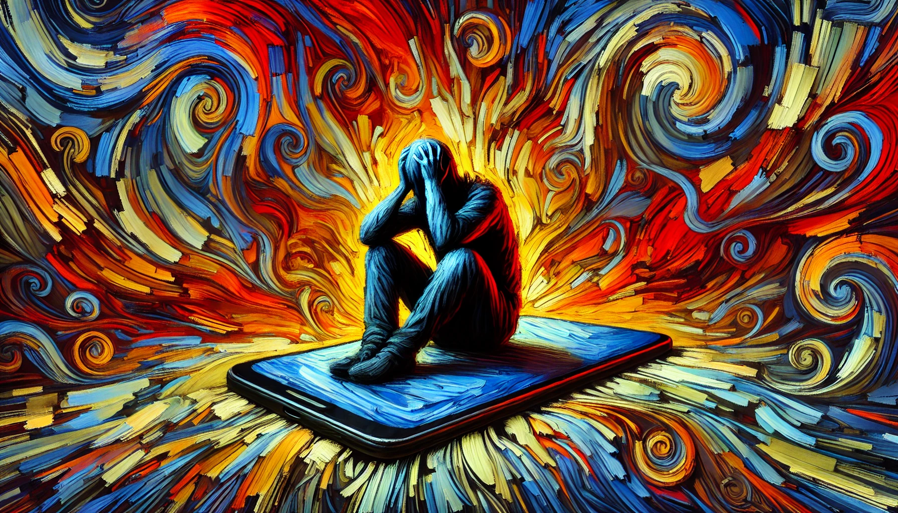

# 【随笔】莫名地颓废

这几天大鱼发烧反反复复，大宝在老家照顾着他，又累又担心。我远远地也帮不上什么忙，只能在聊天时安慰她一下，有时看着大鱼退烧了，摇摇晃晃地体力没恢复就想去玩，又觉得他可爱，又觉得他心疼。

看到伯克希尔股东大会上，有个小孩问巴菲特，如果还能和芒格再渡过一天，巴菲特会选择和芒格做什么？老人家瞬间伤感起来，回忆了一下和芒格常常一起做的事情。提到芒格一再说的那句话：

> 如果能知道我会死在哪里，我就坚决不去那里。

巴菲特说，还是像这样比较好，不知道哪一天是最后一天。如果有一个人，你想要和他一起渡过生命的最后一天，你应该从现在开始，就尽可能多地和他在一起。

想到这里，我有些伤感起来。那些我最想要陪伴的人，远在万里之外，而且短期内似乎没有特别好的办法回答他们的身边。

也不知是因为这个原因，还是对生病的大鱼，累坏了的大宝感同身受。我完全丧失了对自己的控制力。结束和他们的视频，我就拿起手机，怎么也放不下来。没什么可看的文章，我就点开了短视频，短视频刷起来没意思，我就打开了游戏。从昨晚到今天，整整一天，我就让自己完全沉沦在手机屏幕里。

中间曾经还想了一下，应该「积极地休息」，而不是这样「消极地休息」。但是，我就是放不下手机……任自己弄到头重脚轻，心脏难受。

真的是有些莫名其妙！

