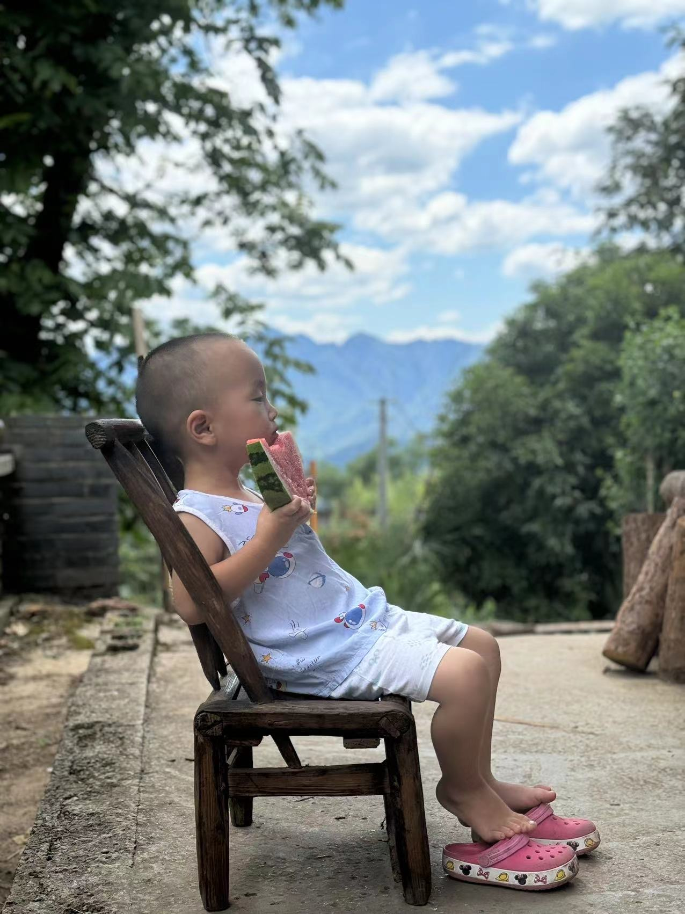
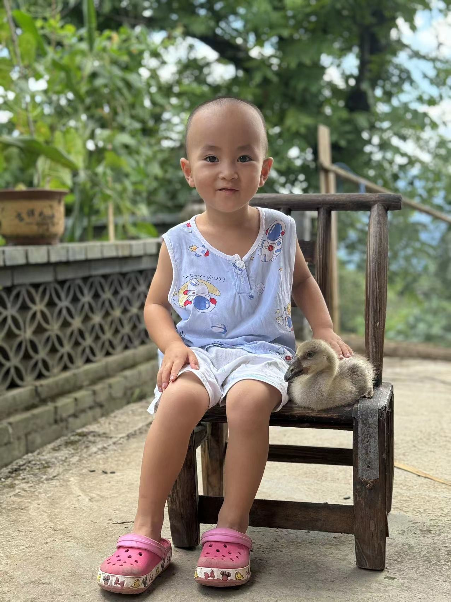
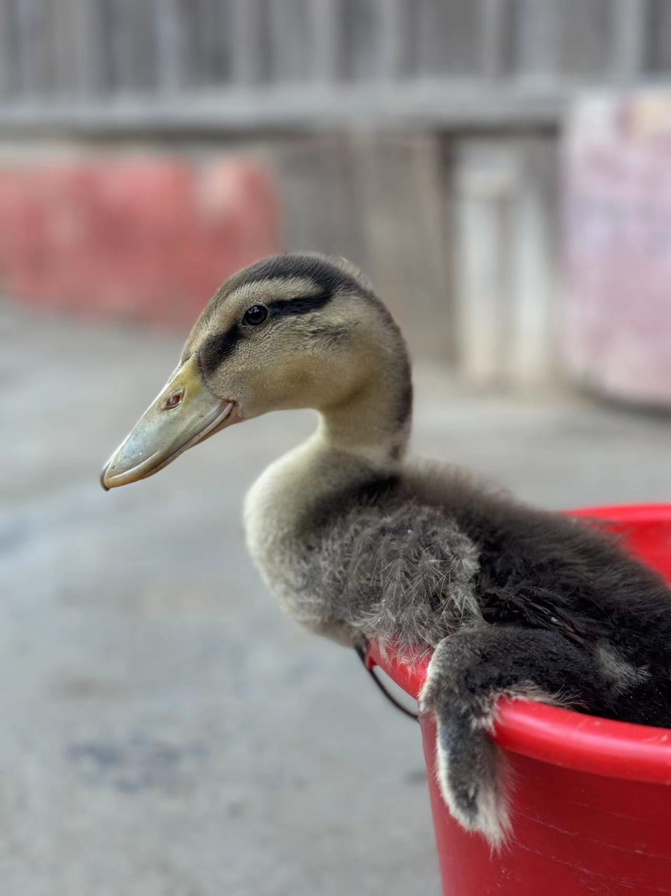

# 【随笔】回村的快乐

早上一觉睡到快10点，发现电脑昨晚忘记插电，已经关机了。好在，大宝应该也没有什么急事找过我，因为我看到了她微信的留言：

> 亲爱的，弟弟好了
>
> 谢谢我老公，负面情绪都发给你了，现在全都收回来。😁

感谢老天爷，让这个小小的难关和风波就这样过去，一切又回到之前的「正轨」。大宝给我发来了几张照片，大鱼坐在院子里抱着大西瓜摆拍，还有抱着鸭子一脸开心的样子，看得我心都要化了。

之前阿宝在深圳时，就想着要养小鸭子。这次回到村里，大宝给她买了一大群小鸭子，还有两只小鹅。阿宝开心坏了，每天扛着小锄头在院子里给小家伙们挖蚯蚓，还一只一只抱着它们亲热，宠溺得不行。有一只小鸭特别亲人，不像其它小家伙喜欢唧唧叫着到处乱跑，每次阿宝抱它，它就乖乖地待在阿宝身边。

我好奇地问大宝：

> 小鸭子都长这么大了？

大宝哈哈大笑地回答我：

> 那是小鹅！

她又打开视频，给我详细指点小鸭和小鹅的区别：

> 你看嘴巴，你看那神态。这小鹅个头虽然大，但是年龄比鸭子小呢。

不多时，她又发了几张照片过来。我仔细看过，说：

> 这么睿智的小眼神，一定是小鹅🦢吧？

大宝无奈地回了一句：

> 这只是鸭子🦆！

……

好吧，我这个四体不勤、五谷不分的家伙。

但是，看着孩子们在山村里，在大自然里，真的很快乐啊！真想和他们在一起，快乐地渡过这一天又一天！