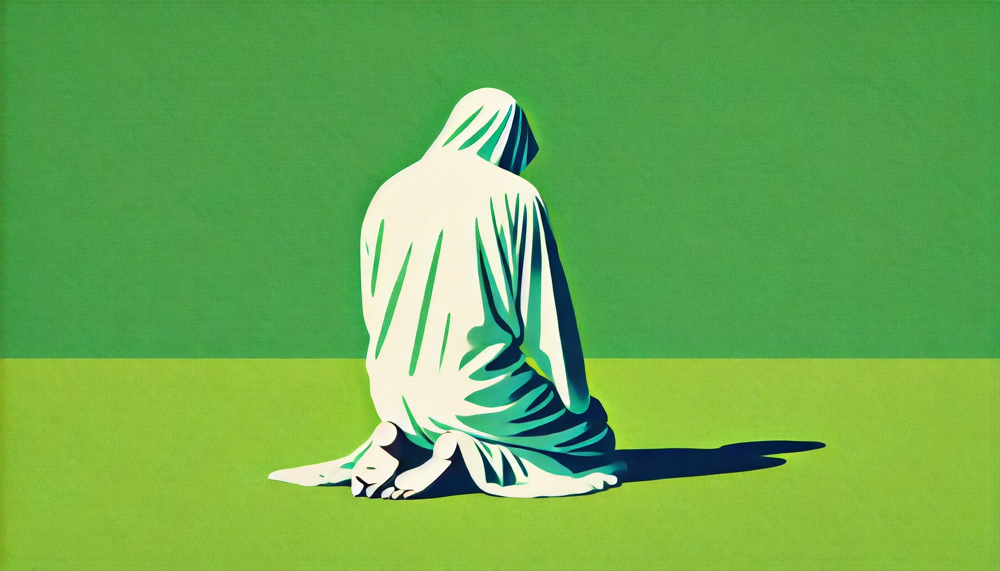

# 【生命⋅修行】臣服什么

昨天看到和菜头写的《[小管](https://mp.weixin.qq.com/s/RLQ4LV_rcNmlfyPxOUFHQw)》，竟然有了一种看《食南之徒》的感觉。不禁在想，哪一天回到深圳，带着大宝和全家人一起去往海边，或许可以去寻找一下这间卖小管的小馆。那时候，或许会聊起看到和菜头这篇文章的夏天。大宝带着孩子们在湘西老家，十万大山之中，而我在万里之遥的中东，黄沙与海湾之间。虽然相距万里，却是同样的酷热难耐，同样的思念对方。

昨天和父亲通话，他怎么也打不开摄像头。我听到他有些恼怒和沮丧，说上次「我还打开了来着」。听到他说「我耳朵听不清」，而这句话，之前总是从大宝的爷爷那里听到。我很有些伤感……

大宝说我怎么还不能接受现实？爸爸就是已经老糊涂了！可我发现，自己就是很难接受，爸爸现在的样子。大宝一再提醒我，需要和爸爸多聊天，他想我，特别的想我。可是，等我留意到这一点，却发现此时此刻，上次和父亲说过的话，这次又需要一遍一遍地重复。

或许，儿子总是羞于表达自己对父母的爱，也总是不知道用什么方式来表达。对父亲尤其如此。

甚至，还会一直陷在「怨恨父母」、「反抗父母」的斗争情结中，久久不能出来。

然而，时间从不会因此减缓自己的步伐，他们以肉眼可见的速度老去了……

再次想起那段《宁静祷文》

> God, 主啊，
>
> Grant me the SERENITY, to accept the things I cannot change, 请赐予我平静，让我接受我不能改变的一切，
>
> COURAGE to change the things I can, 
>
> 请赐予我勇气，让我去改变那些我能够改变的事情，
>
> and the WISDOM to know the difference. 请赐予我智慧，让我能分辨这两者的区别。
>
> ……
>
> Amen. 阿门！
>
> Reinhold Niebuhr 雷茵霍尔德·尼布尔

其实，有一个明显得不能再明显的事实，假如时间不是幻觉。那么一切过去，现在发生的事情；包括此时此刻的自己，此时此刻的家人，都属于那不能改变的一切。

有任何一丝一点的不能接受，不能彻底地臣服于这当下，就注定要品味或多或少的痛苦滋味。而在这玩味痛苦的瞬间，现在又成为了过去，新的，不能改变的现实再次訇然而至……

首先，臣服在这当下吧。

> 接受自己真实的样子，包括自己的纠结、冲突与痛苦。与自己的缺失和平共处，包容自己的弱点，善待并宽恕当下的自己。
>
> 接受此时此刻自己所面对的真实现状，接受此时此刻心爱家人的真实样子。包容、善待他们真实的一切……

