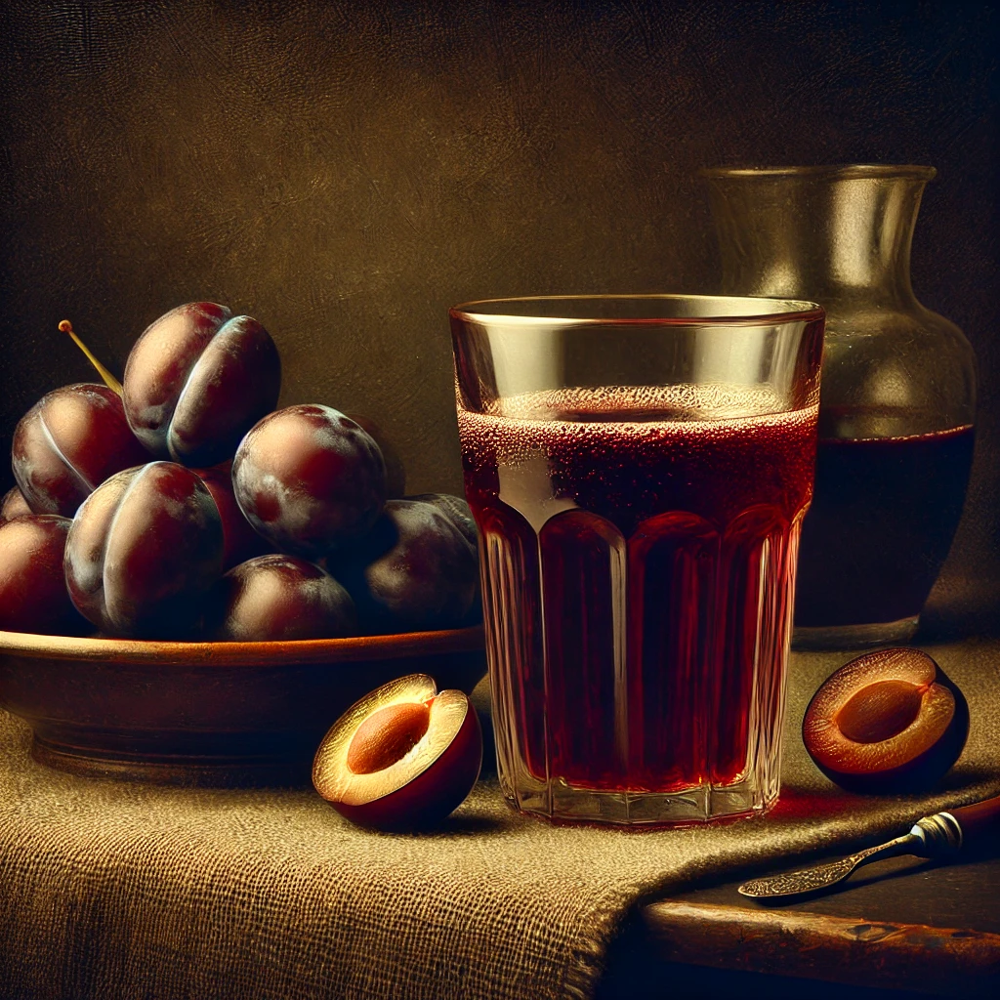

# 【生命•故事】（117）少年时关于父亲的一些片段

全家人一定要一起吃饭，是我们家的传统。除了过早，中饭晚饭大都是在家吃，总是要一家三口全都上桌了，才允许开始动筷子。爸爸喜欢喝酒，每次吃饭他都是先拿倒一杯酒，慢慢喝酒，慢慢吃菜。然后我也养成了习惯，慢慢吃饭，慢慢吃菜，然后一面聊着天。常常会太慢了，直到爸爸喝完了酒。他就会一分钟之内把饭吃完，剩下我端着半碗饭在那里干瞪眼。

有些故事爸爸给我讲过多次，有些讲得不多但我记忆深刻：包括他小时候被英勇无畏的大爹从疯狗口中救下一命的经过；包括被爷爷暴怒下，不小心摔死的年幼的大姑；包括边哭边拿着勺子在红薯粥的锅里捞米粒的四爹；也包括他在部队吃过的两大碗红烧肉；支左时驾着机枪对峙造反派火箭炮的惊心动魄；当警察时在街头抓捕斗殴的流氓，后肩上被砍了两刀，衣服砍烂却只留下两条红印的威武；第一次开枪追捕逃犯；还有借了辆板车送妈妈去医院迎接我的出生……

再后来他常聊的事情，大多是我经历过的。他一直念念不忘自己曾经在江城酷热的夏天，推着酸梅汤当街叫卖。那是一个巨大的保温桶，兑好冰酸梅汤放在我们家的小店里，到了特别热的正中午、下午时分，就把这保温桶放到三轮车上，哪里热、哪里干活的人多就推去哪里，于是那些在太阳下干着体力活、挥汗如雨的人们，花上几分钱就可以买一杯冰爽酸甜可口的酸梅汤解暑。

暑假时我也偶尔会陪着爸爸推三轮车出去，但更多的时候是和小孩子们在太阳下疯玩，直到热坏了就去街上找到爸爸，讨一杯酸梅汤来喝。

有一年，爸爸妈妈去汉口进货。给我带回来一个礼物——中华学习机。后来我才知道，和后来的叫做小霸王学习机的游戏机不同，这其实是一台真正的电脑，相当于是湖北无线电二厂山寨出来的苹果II兼容机，并且增加了两个对于当年的中国人来说绝对实用的功能：1. 可以用电视机当显示器；2. 可以用录音机当外部存储。于是乎，只保留一台主机，这台「学习机」价格降到了1000元人民币，父亲咬牙拿出了当时家里全部的储备现金，买下了这台「学习机」给我当作礼物。

每当回想到这里，都特别感激爸爸，他真的是全力地支持着我的兴趣和爱好。这个恰到好处的礼物，让我进一步迷上了电脑和编程，以至于从那时起，直到今天，我还依然走在这条当初我自己选择的道路上。

还记得有一次下午，好像是路过爸爸卖酸梅汤的三轮车附近，一群人正围在一起，中间是爸爸，和另一个大个子的男人在争执。那个男人至少比我爸高一个头，壮出一个数量级来。我还没挤进人群，他们就从吵架变成了打架，我见爸爸一猫腰，捞了一下他的腿，那个男人就扑通一声摔倒在灰尘里。等他再爬起来，周围劝架的人也反应了过来，纷纷上前把他们分开。

晚些时候，听见有人和我爸聊天：

> 那个人比你高那么多，打起来你肯定打不过。

爸爸表示不服：

> 那不一定，我随便一个擒拿，他就摔倒了呢！

也不知道爸爸如今是否还记得，这个唯一被我看到过的一次打架场面。

闭上眼睛，还能回想起那时候我们住的平房，客厅一角放着冰箱，旁边靠墙摆放的圆桌，那是全家一起吃饭的地方。中间的窗台上放着一座小小的假山，放假山的盆子里还着好几块水晶石，那是爸爸去九宫山休假时，在山上捡来，给我带回来的礼物。

卧室的窗户打开翻出去，可以再翻过厂区宿舍的院墙，直接到街边，那是我们家小店的位置。

自从开店，爸爸就很少晚上睡好觉。不时会有人撬开小店的门偷东西，虽然现金和最值钱的烟、酒都会拿回家里，但还是免不了被盗。于是常常在夜里，会听见爸爸从睡梦中惊醒，一声怒吼，打开后窗，一跃而出，去赶走正在商店撬门的小偷。

然而，在鲜有客人光顾的寒冬深夜，一家人坐在商店柜台下避风处，煮着火锅吃饭聊天，尤其是可以煮很多我喜欢的香菇吃，又成了那时候颇为难忘的温馨记忆。