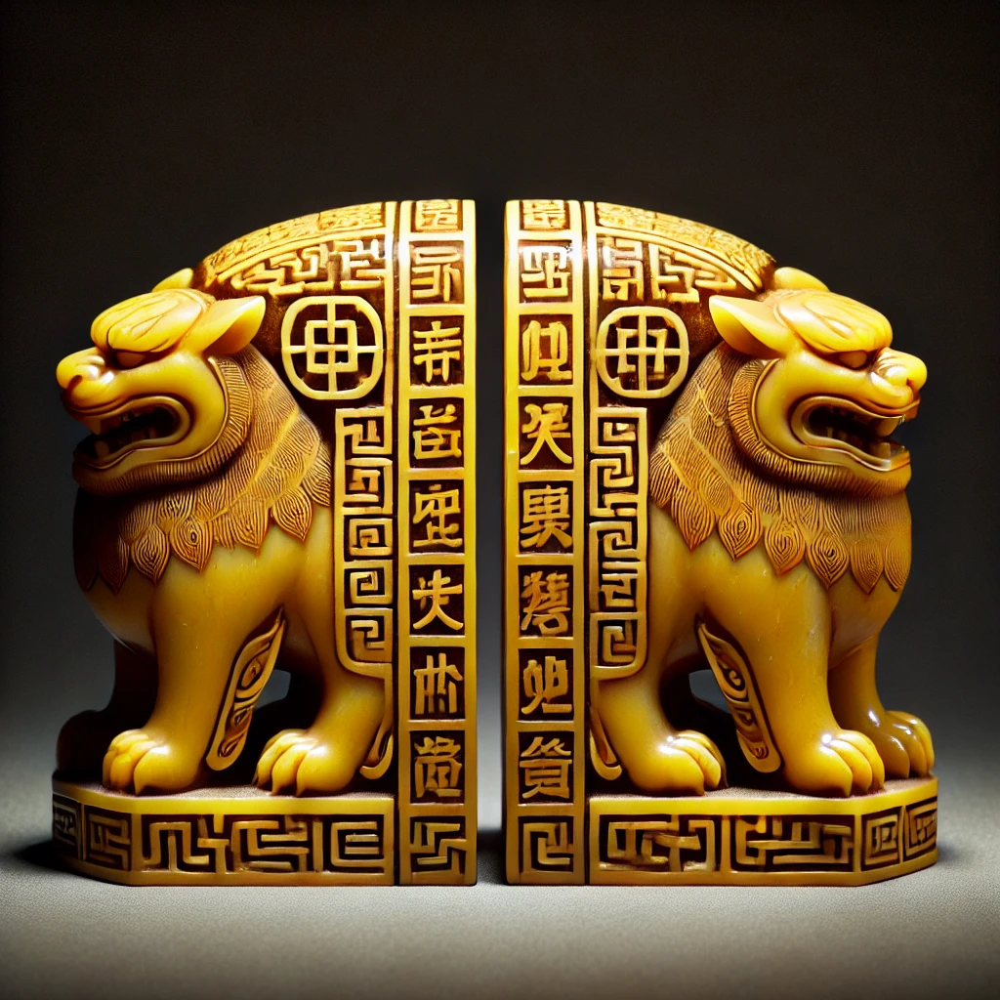
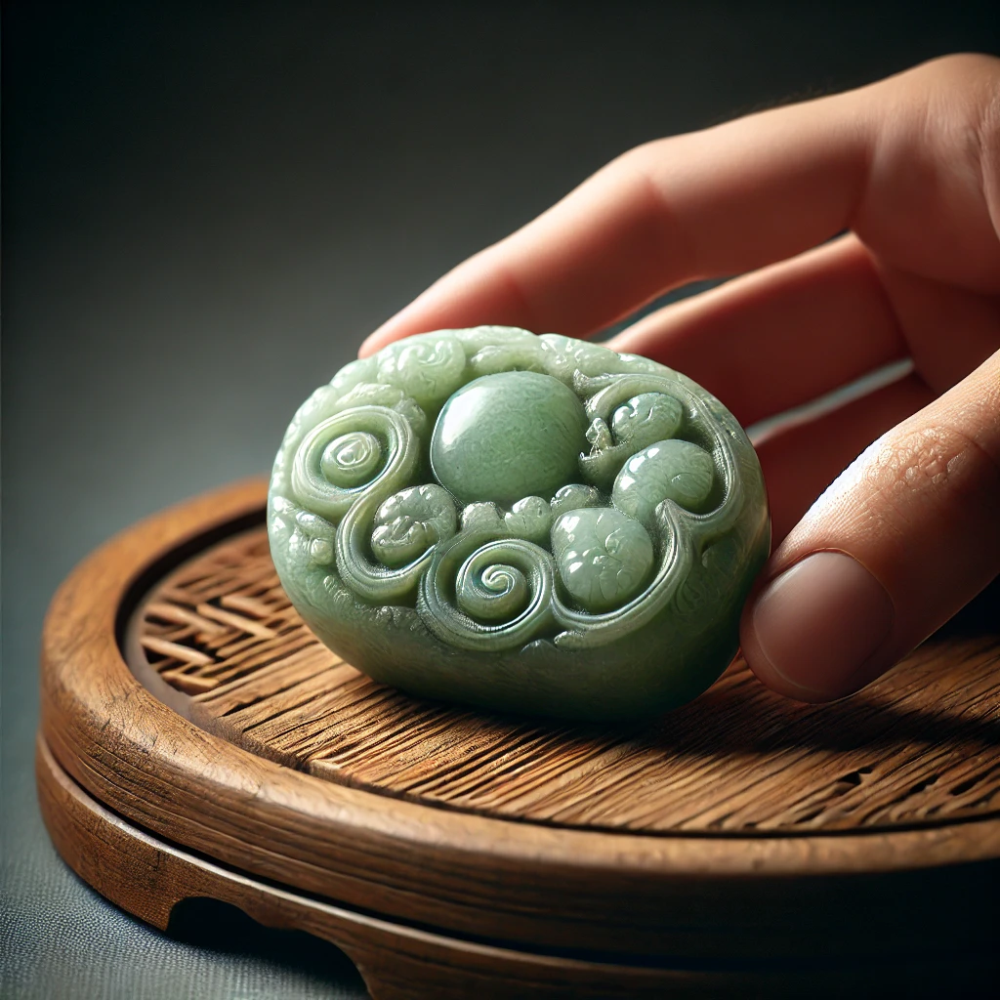
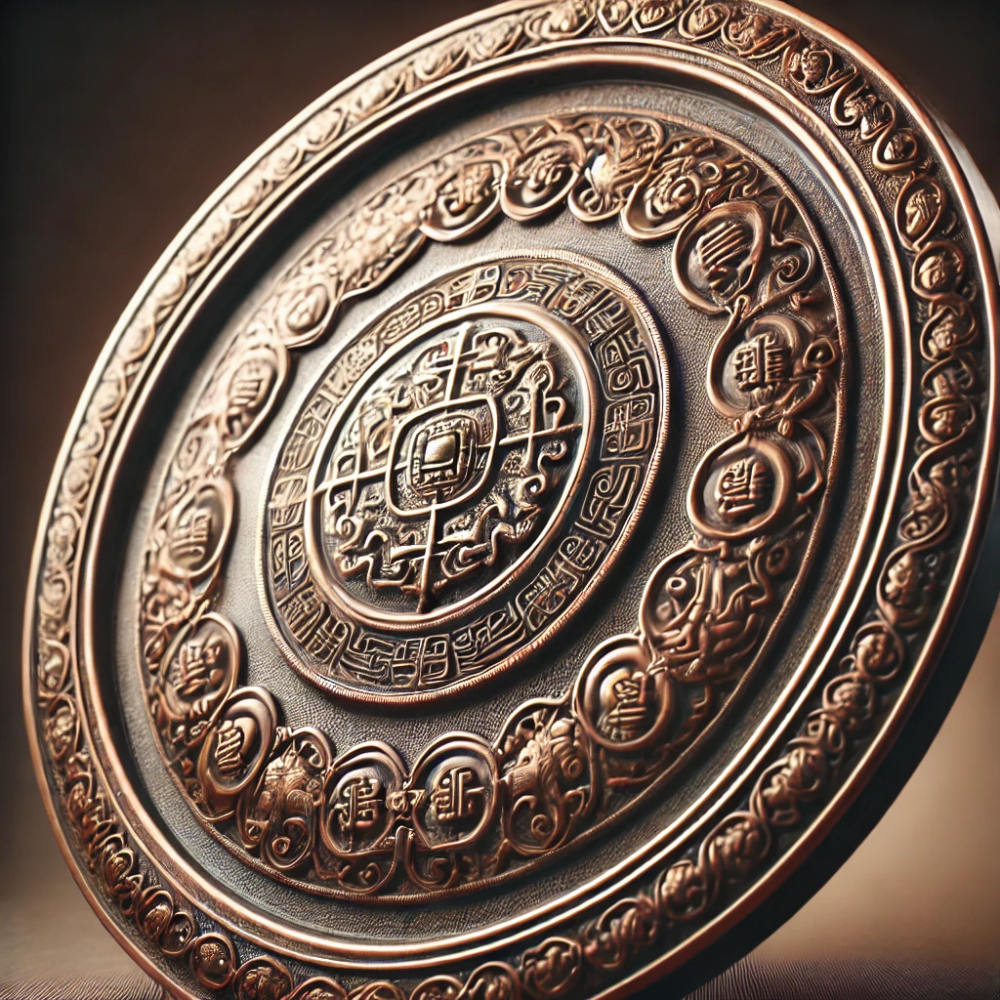
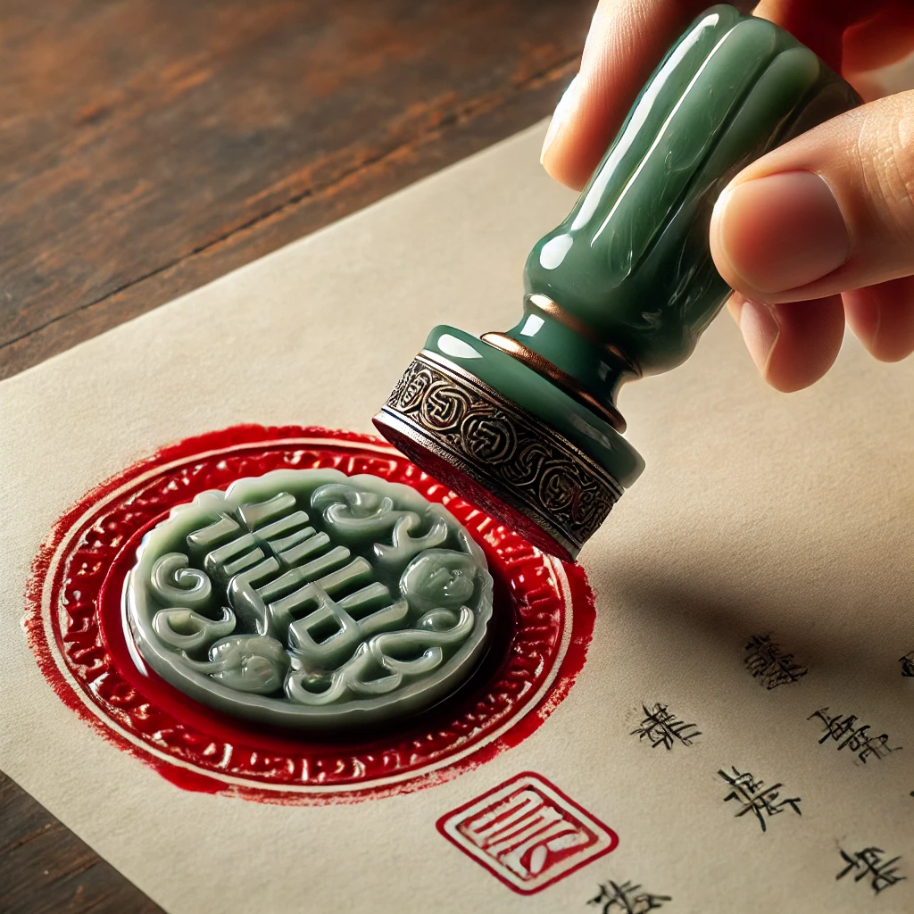

# 【随笔】信任之难

前两天上床略早，又翻起《资治通鉴》来，正好读到巫蠱之祸这一段，不胜唏嘘！

> 初，上年二十九乃生戾太子，甚愛之。及長，性仁恕溫謹，上嫌其材能少，不類己；

汉武帝二十九刚刚快三十生下太子戾，特别宠爱。直到他长大了，发现太子性情温良，常常会有些嫌弃他不太像自己。那时候卫青还在，汉武帝也知道太子虽然不像自己，却正是最好的接班人。皇后和太子担心时，汉武帝还嘱咐卫青安慰他们。太子总是忍不住跳出来反对汉武帝四处征伐，汉武帝还笑着说：

> **吾當其勞，以逸遺汝，不亦可乎！**

这些麻烦事儿，爸爸帮你干完，等你当皇帝时，就轻松了，不好吗？互相信任，虽然不同会拌嘴，但都是真心在为对方着想、颇为温馨的父子之情。可是随着汉武帝越来越老，竟然被身边的小人找到了折腾的机会。

> 太子曰：「吾人子，安得擅誅！不如歸謝，幸得無罪。」太子將往之甘泉，而江充持太子甚急；太子計不知所出，遂從石德計。秋，七月，壬午，太子使客詐為使者，收捕充等。按道侯說疑使者有詐，不肯受詔，客格殺說。太子自臨斬充，罵曰：「趙虜！前亂乃國王父子不足邪！乃復亂吾父子也！」又炙胡巫上林中。
>
> 太子使舍人無且持節夜入未央宮殿長秋門，因長御倚華具白皇后，發中廄車載射士，出武庫兵，發長樂宮衛卒。長安擾亂，言太子反。蘇文迸走，得亡歸甘泉，說太子無狀。上曰：「**太子必懼，又忿充等，故有此變。**」乃使使召太子。使者不敢進，歸報云：「太子反已成，欲斬臣，臣逃歸。」上大怒。

一想到这样相爱、也能够相互理解的父子，竟然还是被环绕身边的小人一而再、再而三地整了这么一出惨剧。尤其是在苏文跑来告黑状时，汉武帝还坚信自己的儿子只是害怕加上怨恨江充这些人而已。但这最后一丝信任，被自己送去的「使者」蒙蔽而撕碎。我合上书，替汉武帝和太子悲哀了好一会儿。

走到这一步，他们再也无法重建曾经有过的信任了。在那个年代的技术条件下，汉武帝怕太子造反要了自己的命，太子怕父亲已死，身边人作乱，自己重蹈扶苏的覆辙。他们之间又没有能够预先建立一个值得双方同时信赖、并且可靠的沟通渠道。太子完全没有除了面见父亲之外的任何有效沟通渠道，而汉武帝所信任的沟通渠道，却一而再、再而三地欺骗了他！

真是一个太让人伤感的故事！事后，汉武帝没能及时公开宣布赦免太子，太子终于自杀。汉武帝族灭相干人等，建了思子宫。但曾经「甚爱之」的儿子，「仁恕溫謹」想要传国于他的太子却再也回不来了。

如果太子还在，汉武帝又哪里需要赐死鉤弋夫人，酿出另一出不得已的惨剧呢。

信任真是太难了。大宝听冯唐讲《资治通鉴》，讲到廉颇蔺相如《将相和》的故事，讲到「二人同心、其利断金」时，忍不住和我感慨：

> 我们俩之间历经这几年风雨所建立的这信任，是多么的难得和珍贵啊！

我也是这么觉得。

重读「巫蠱之祸」的故事之后，更是这么觉得！

如此珍贵的东西，是真的要悉心呵护啊！

