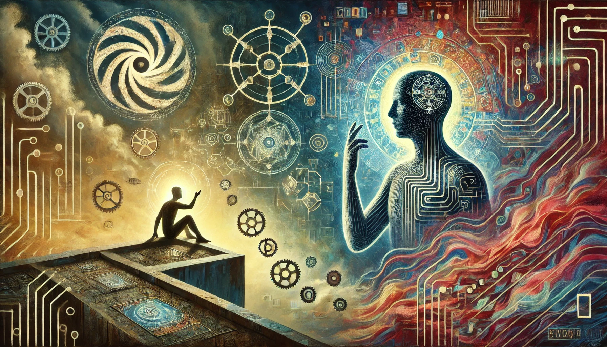

# 【生命⋅修行】人与AI有区别吗

自从GPT帮我出招时，提及了人类大脑的奖励机制之后，我再也没办法停下关于「奖励机制」的思考——我一面瞎操心着AI的奥秘，一面无法自拔地对着自己的大脑深挖。

据说，GPT目前无法从它所拥有的知识里，直接给出我想要的答案，只是因为「没有人告诉它要这么做」！

GPT是这么解释它自己的工作原理的：

> ### 大语言模型的工作原理
>
> 1. **训练数据**：大语言模型通过大量的文本数据进行训练。这些数据可能来自书籍、文章、网站等各种来源。模型通过读取这些文本数据来学习语言的结构和使用方式。
>
> 2. **神经网络**：模型的核心是一个非常复杂的神经网络，它由许多层（通常称为“层”或“神经元”）组成。每一层都会处理输入的数据，并将结果传递到下一层。
>
> 3. **词嵌入（Word Embedding）**：文本数据在输入模型之前，会被转换成数字表示。这些数字表示称为“词嵌入”，它们捕捉了词语的语义关系。例如，“猫”和“狗”可能会有相似的词嵌入，因为它们都是动物。
>
> 4. **上下文理解**：模型通过上下文来理解每个词语的意义。这意味着它不仅看一个词语本身，还会看它前后出现的词语来理解其含义。
>
> 5. **预测下一个词**：模型的一个主要任务是根据已知的文本来预测下一个词。例如，给定一个句子“我喜欢吃苹果和”，模型会预测下一个词可能是“香蕉”或“橙子”等。
>
> ### 奖励机制
>
> 在训练过程中，模型使用一种称为“监督学习”的方法，其中的奖励机制包括：
>
> 1. **损失函数（Loss Function）**：模型的预测结果与实际结果之间的差异通过损失函数来计算。损失函数的值越小，说明模型的预测越准确。
>
> 2. **反向传播（Backpropagation）**：模型通过反向传播算法来调整神经网络的权重和偏置，以最小化损失函数的值。这个过程可以理解为模型不断调整自己，以便在下次预测时更加准确。
>
> 3. **优化算法（Optimization Algorithm）**：常用的优化算法有梯度下降（Gradient Descent）及其变种（如Adam）。这些算法帮助模型找到损失函数的最小值，即找到最优的参数设置。
>
> 在训练过程中，模型通过不断调整参数来改进自己，以达到更高的准确性。这种改进过程就是模型“学习”的过程，而损失函数和优化算法就是其中的奖励机制。
>

它在数字系统中，模拟人类大脑搭建起来一个神经网络系统，而这个神经网络始终围绕着一个核心目标在运作——那就是掌握语言。而它掌握语言的方法，不是先思维，再说话；而是像小孩子牙牙学语那样，直接试着在场景中学会应该说什么。最直接的，就是根据上下文，预测下一个词最应该是什么！

它为什么现在是这样，原因就是训练它时，人类所使用的奖励机制。

然后，再加上一点点随机数，让它变得更有更像人类，更有「温度」。—— 是的，只要适当地引入一点随机，它就更像人类了！

而我，这个人类中最最普通的一员，却时常陷入一些重复的困境无法自拔，手机之瘾只是其中之一。我意识到，在这些一再触发、导致「痛苦」的事件背后，都有着某种被固化的模式，影响这些模式的，还有在模式之上的层层认知，某些固化的观念，以及与之相关的情绪、感受，驱动大脑神经元工作的整个奖惩机制。

深究下去，我发现自己似乎处在一个完全被操控的锁链之中，根本动惮不得。而所谓的自由意志，层层解剖下去，却都还是被某些奖惩机制所操控的神经回路而已。一想到这里，似乎有一种完全被网住的绝望感和真实的生理上的头疼——不知道这是不是所谓的躯体化反应。

或许，在最深层，触及「受」与「想」之间的链接时，我们会看到一点「自由意志」存在的空间。但又或许，这就是为了「温度」，被引入系统的那个「随机数」？

那么问题来了，在这个最根本的地方：

### 人类和AI有区别吗？

