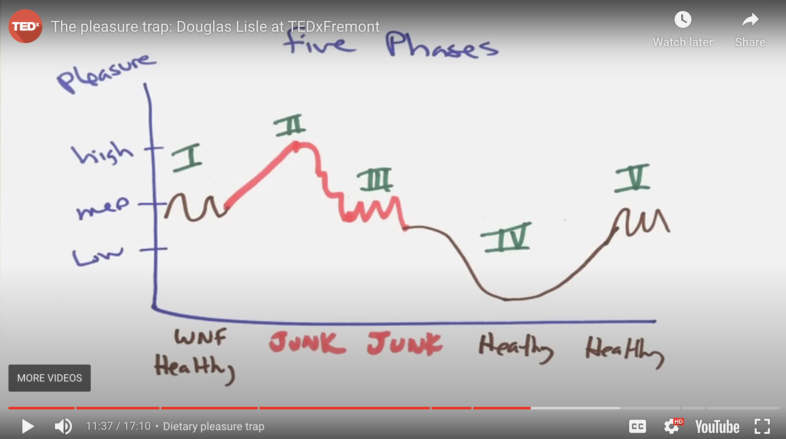
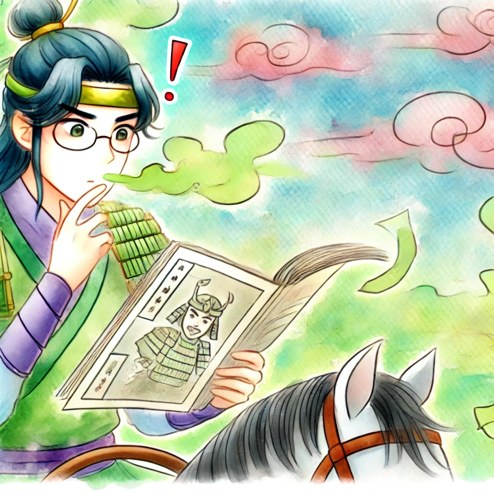
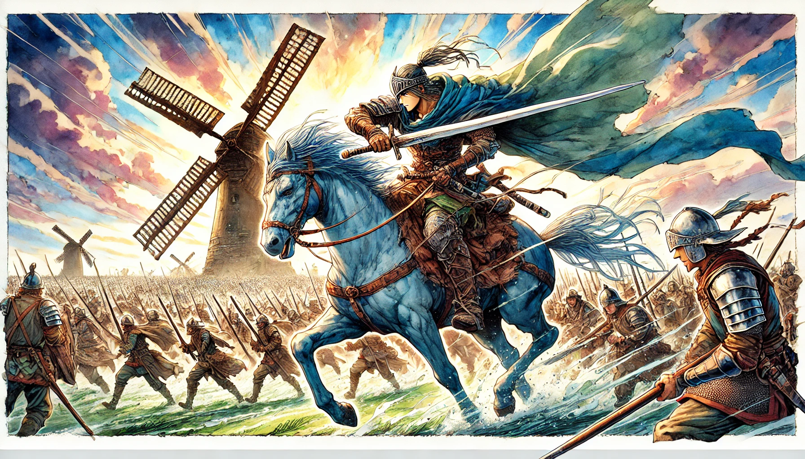

# 【生命⋅修行】需要勇气来渡过这难捱的关卡

昨天——把微信时间控制在3小时48分以内的小目标失败了！我知道，这背后或因为有另一个触发自己极大心理压力的事件出现。

不仅这个小目标失败，早睡早起的小目标也收到了影响。完成给同事的承诺之后，已经到了10点半，给自己承诺的事情显然只好放弃了。但这「挫败感」加上其它压力，变成了一种让我透不过气来的心理枷锁，我开始下意识地四处去寻找「解释」与「方法」。

Douglas Lisle 在TEDx上做个一个演讲，谈及“饮食愉悦陷阱”（The Dietary Pleasure Trap）。它从大脑的机制上，解释了为什么为什么明明知道是对的事情，我们却没法行动的原因。那就是从阶段III 到 阶段IV的这个愉悦感低谷。

虽然我们是在做正确的事情——恢复正常的饮食，但是在大脑的奖励机制看来，我们却正走在错误的道路上。于是乎，所以然。

Douglas 说有一个技巧，那就是完全禁食一天，实验证明这样可以把这些感知和激素反应拉回到正常水平。我赶紧问GPT，类似的技巧，是否可以应用到其它类似的「成瘾」或「拖延」行为中。它说可以，背后原理接近，都是大脑的奖励机制在起作用。但给我的具体做法，我却有点不太能相信——因为，看上去和自己过去用过无数次的，失败无数次的方法没什么两样。

上床后，我又忍不住翻开Kindle的简陋浏览器，想在白天看到的那本《阻力最小之路》的书上寻找答案。道理是能理解的——那些无法改变的行为和模式，背后一定是有一个结构性的力量。但怎么找到这个结构，怎么创造一个新的结构，把书翻完，我也没能得到答案。

但是今天早上，我起床时感觉到明显的不开心、不痛快，不是常规的那种星期一综合症，而是我不得不面对自己给自己制造的难题时，本能的连锁反应。

我意识到昨晚临睡前，自己再一次在面对困难时，回到了那熟悉的模式之中：

1. 或者寻找更多能够让自己头脑信服的「解释」。
2. 或者寻找更多能够让自己头脑相信的「方法」。

这些，只是我这个「头脑」惯性的需要，并非面对问题，解决问题真正的需要。

我慢慢地挣扎起身，脑袋蒙蒙的。窗外已经快日上三竿，我必须再快一点，才能在太阳变得毒辣无比之前，到户外完成金刚功的练习。

这时，脑海里浮现出王阳明和九川的对话：

九川曰：

> 直是难鏖。虽知，丢他不去。

先生曰：

> 须是勇。用功久，自有勇，故曰「是集义所生者」。胜得容易，便是大贤。

勇气，是解决这所有问题的核心助力。而勇气，来源于一次又一次毫不退缩的战斗。战斗吧，老小伙子！

