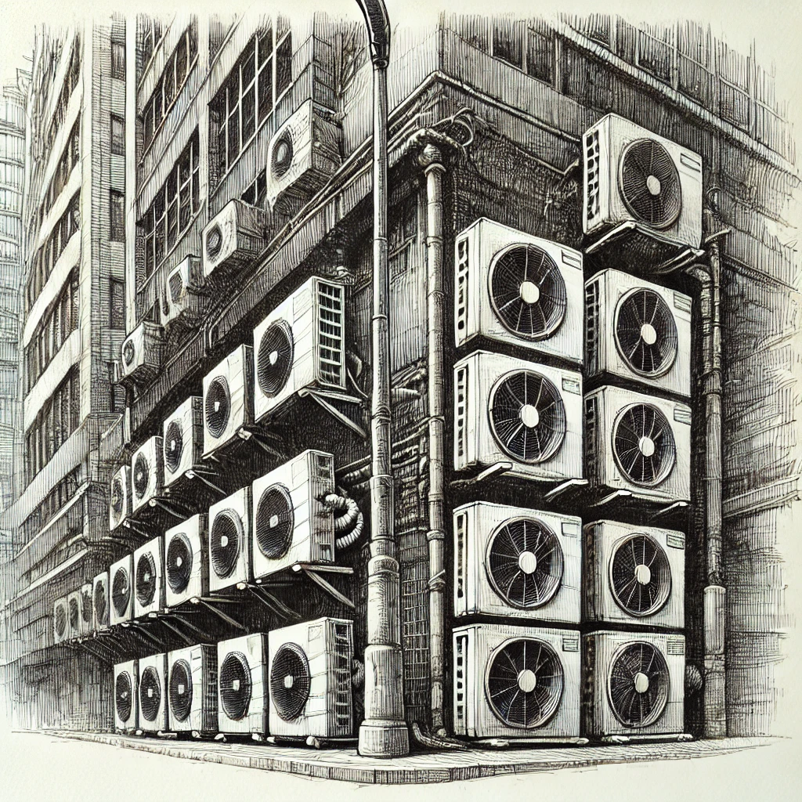

# 【随笔】一个城市的声音

听说，加缪曾写过这样一段文字：

> 在阿尔及利亚，夜晚狗吠声能够传出的距离是欧洲的10倍以上。因此，狗吠声会唤起一种在我们狭小的乡村所不知道的乡愁。

可鸡犬之声，现在已经是仅仅属于乡村的声音记忆了。我小时候在江城武汉，或许还能听见狗吠，但更多的记忆是人声。在夏日深夜里坐在街边宵夜的年轻人；在清晨集市里混响成嗡嗡背景的叫卖、讨价还价、剁肉杀鱼理菜等等各种人类活动；还有公共汽车上的喧哗……

而深圳给人最深刻的印象，却是「咣咣咣咣咣咣！」打桩机的声音，还有就是装修房屋圆锯切割瓷砖、大理石的时候，那刺耳的「吱吱吱吱吱吱吱！」……

昨天清晨起床后莫名的沮丧，提醒我好好地觉知当下。于是，在走出楼下酒店大门之后，我听见了大街上汽车的轰鸣。是的，在猛烈的夏日艳阳之下，赶路的人们很少说话。他们或者把自己包裹得严严实实，或者天生着黝黑的皮肤抵挡酷日。这些是走路、骑电动车、滑板车的人们。看肤色，或许大多来自印度、巴基斯坦、尼泊尔或者非洲哪些国家。开车的人也都很绅士，会主动礼让行人，少有人按喇叭，只有发动机默默地轰鸣着，轮胎呜呜地碾过水泥路面，偶尔在经过高高的减速坎时，发出「咣当」的一声。

酒店附近有一个小小的街心公园，走路半小时的范围内就这一片公共绿地，比利雅得要多一些，但是比不上深圳（原谅我会忍住不在内心里比上这么一下）。走进公园，车流声会稍稍远去。那些我不知道名字的小鸟，开始在我身前草坪或者书上热闹非凡地唧唧唱起歌来。有些长得像灰色的小鸽子，却没听它们咕咕叫过，还有成群结对胖胖的麻雀们，再就是一些整天张着黄色的小嘴，顶着一脑袋黑毛，有那么点像八哥的小鸟。我分不清他们的叫声，总之走近了，听见的都是差不多的「唧唧」声。

有时会见到猫咪。走更远些，到海边长廊会有更多的猫咪，经常有好心人给他们喂食喂水，所以见到人靠近它们也不太避讳。有些小家伙还会专门凑过来喵两声，见你不理它，就转身钻进树丛的阴凉处了……

我喜欢海边缓缓的波涛声，这会让我想起在故乡东湖边的每一个日日夜夜。

但是，在阿布扎比，逃不掉的声音，却是无处不在的「嗡嗡」空调声。无论是在室内，还是室外，这种无孔不入、无处不在的巨大轰鸣，成为了一切声音的背景音。

这空调的轰鸣，就是专属于这个城市的声音吗？