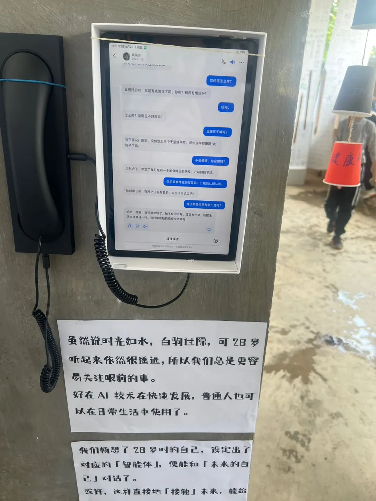
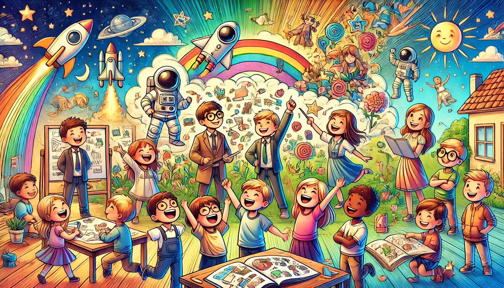

# 【生命•故事】（118）长大后想做什么

在Mactalk 《[一些有趣的 AI 产品](https://mp.weixin.qq.com/s/HXijhJk_1pPg4o7kWs8OBA)》这篇文章里，看到一个视频，听口音好像是印度的老师，她用AI给孩子们绘制了未来自己的画像。这更让我想起「[美小的未来电话亭](https://mp.weixin.qq.com/s/NMjOjGTlALCsux7iCZQHPg)」，校长和老师，贴心地用Kimi的智能体，给了即将毕业的孩子们一次与28岁的自己对话的机会。

我更想起，在自己初中的时候，那时候没有AI，但是依然有诲人不倦、智慧而有耐心的老师。我们的班主任俞亚起老师给大家组织了一次活动，让每个人上台去讲述自己的梦想。

我忘记了自己当时讲的什么，或许那时候还是想当天文学家吧。但有两个同学的梦想让我至今记忆犹新。

其中一个姓陈的小伙子，他个子不高，虎头虎脑，在我印象中，他打架很是厉害。走上前台和全班同学讲话，让他很不好意。之间他扭捏地低着头，轻轻地挤出几个字：

> 我长大想当特务。

大伙儿一时没弄明白，纷纷让他再说一次。于是，他重复了一遍。见我们依然没搞明白，「当特务」是个什么鬼。他开始解释起来，原来他是想要做一名像007里，詹姆斯•邦德那样的特工。说起邦德，说起他想象着、计划着要怎样才能成为国安的特工，他的眼睛里放出光来，渐渐地也不再扭捏，侃侃而谈起来……

另一让我印象深刻的小伙子，姓程。他似乎有着一头天生的卷发。他说，他想要当一名美发师。他很认真地对待自己的这个梦想。他已经收集了各种美发相关的资料，他每天都会拿着自己当模特，研究发型应该怎么设计，怎么修理，在自己头上进行操练。他激动地告诉我们，他已经想好了自己毕业后要怎么做，要怎么样一步一步地成为自己梦想中的美发师。

许多年过去了，我的梦想反正是没实现，只是揣在心里捂着，好像一枚童年的书签。

也不知道，他们的梦想是否还在或者已经实现了呢？

