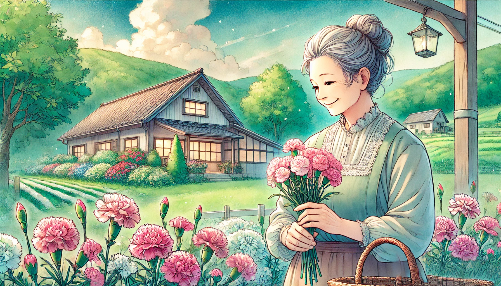

# 【随笔】生日的母亲

前几天宝贝女儿C过生日，我离得太远没法在身边为她庆祝，觉得颇为遗憾。后来问，是不是和妈妈在一起过的生日，告诉我是的。她和妈妈、外婆三人一起吃了美味的蛋糕和火锅。我默默地想，这才对！

或许我是被郑渊洁影响了，总觉得人的生日都应该和母亲在一起过。因为在出生那天，孩子就和母亲在一起。那真的是怀胎十月后，从妈妈身上掉下来的一块儿肉啊！

或者至少应该在自己生日的这一天，好好地问候母亲，和她聊聊天。自己父母的年纪越来越大，因为外婆去世了，今年妈妈的生日，是她第一次不能在生日这天和自己的妈妈在一起，也没办法给外婆打电话、发红包。她伤感地发了一条朋友圈……

人生真的是一条永不停息的大河。回首当年，C刚出生时，顶着胎毛上的血渍，皱呼呼的样子，以及一天后就变得白朦朦、软萌萌的样子，推在婴儿车里，抱在怀里，背在背上，牵在手中的样子。只要一闭上眼睛，就好像昨天才发生的事情一样，历历在目，清晰无比。可是如今，她已经是一名要独自去远方读书的成年人了。

想必，自己在母亲的记忆中也是一样。虽然自己已经是顶着一头白发，胡子拉碴，皱纹爬上额头与眼角。但回想起那个夏日，外婆让我回头看谁来了时，穿着白色花衬衣和裙子的妈妈是那么的年青和美丽。在那个瞬间，我在她的记忆中是什么样子呢？而那时，她眼中自己的妈妈、我的外婆又是什么样子的呢？

我老爸不能理解与共情，妈妈这第一个没有妈妈在的生日的伤感。也是难怪，毕竟爷爷、奶奶去世都已经二十多年，他早已习惯了。

爸爸说，老了就不要过生日了，过一个少一个。我却想，谁的生日不是过一个少一个呢？我们总不愿意提及死亡，但死亡却是生命中几乎唯一确定无疑的事情。我们不肯面对罢了！

然而，老天是仁慈的。默默地、一点一点地让我们的父母老去，让我们自己老去，让我们一点一滴地习惯，**死亡终究会来临**这个确凿无疑的事实！

