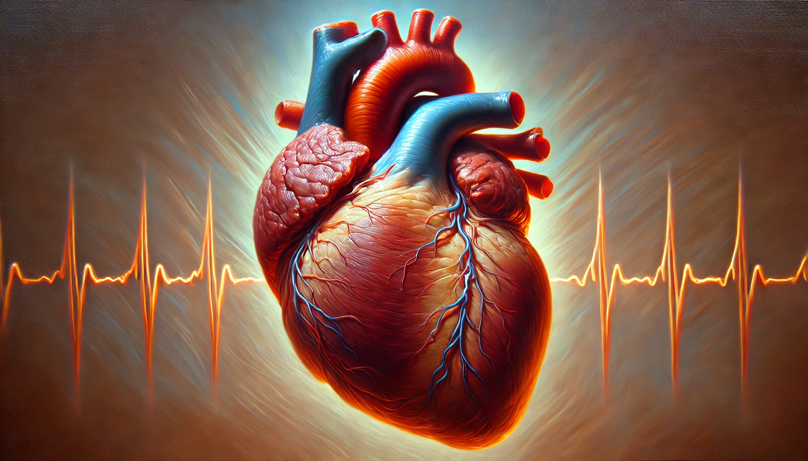

# 【生命⋅修行】经验不足

昨晚写完芒格的读后感，发现连读、带写，又过了5个多小时，顿时想起冯唐讲过几次的那个故事。

他说当年和一个带他的资深顾问，在经历一场超级烧脑的、历经两个小时的客户会议之后。他让那个资深顾问先去餐厅，点上东西，放松一下，给他半个小时，好把这会议的内容梳理、整理完。对方说，估计得要一个小时。

果然，虽然冯唐一开始自己觉得只需要半小时，但是真的整理完，就花了一个小时。

这就是经验！

我开始不停审视自己之后，才发现在很多事情上，我都不能准确预估自己需要多少时间。大致上，我能知道某些事情完成的质量如何，但是，自己需要花多少时间完成，自己常常有超乎乐观的估计。尤其是，某些巅峰状态的峰值记忆实在是太深刻，这个时间的误差经常会放大到10倍的量级。

其实，在最初学习软件工程时，各种书籍专家都会强调，程序员对时间的估计，通常偏乐观。但当我一次又一次亲眼目睹，A同事一个月干不完的事情，B同事一天就可以做出来。除非长期磨合，否则我还是只能相信程序员自己对于时间的预估——然后再放些余量。

搁到自己身上。现在我对自己略略有了一些经验，像芒格这样信息量巨大的文章，不管之前读过没有，只要想再读一遍，如果是连着英文原文一起（英文部分还不能逐字读过去，通常扫一眼，遇到迷惑处才细看原文），同时再整理一下心得笔记。那么3文字多的一篇演讲稿，读完就得再花上4个多小时到8个小时。

然而其他方面，想要真正地、如实的了解自己，似乎还有很多的迷雾需要驱散。这也算是自我修行方面的经验不足吧！

一天能做的事情，一辈子能做的事情，如果不能聚焦，不能形成飞轮效应和复利效应，那还真是屈指可数啊！

或许，归根结底最重要的就一件事。

等到临死刹那，最后一口气呼出，世间万物终不得不放手之时，自己那颗心，自己是否知道该何处安置，又是否有足够的经验妥当地安置吧。

