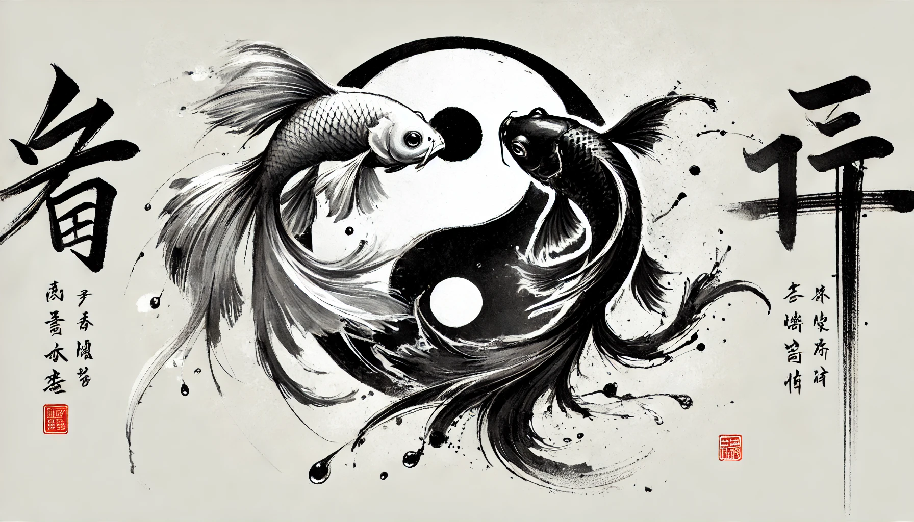
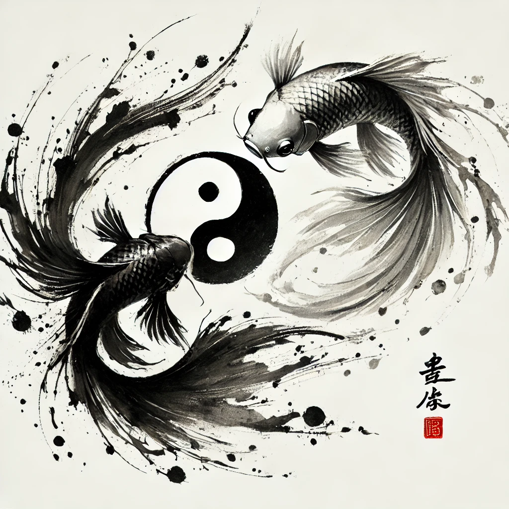

# 【生命⋅修行】调阴阳

经过一周，眼见着自己使用手机的时间得到了一定程度的控制，决定按计划犒赏一下自己。在楼下超市买了几盒做活动的冰淇淋，回到房间，打开Kindle，边吃边看起书来。

富兰克林自传只剩下了最后几页，很可惜，老爷子自己写的自传只写到了1757年，据说他去世前一年还写了最后一段在英国斡旋的经历。而后面几十年波澜壮阔的美国建国历程，竟然没有留下他自己的记录，真是遗憾！

历史成就了英雄、英雄也成就了历史。富兰克林还有点像曾国藩，克勤克俭一直遵循着自己的道德准则在生活中持续修行着。唯一不同的是背景大势，一个在旧帝国的黄昏，力挽狂澜。一个为新帝国的诞生，托举朝阳。

看完《富兰克林自传》，我又想起JT来。这位以讲《庄子》和《伤寒论》著名的台湾老师，简直就是曾国藩和富兰克林的另一个反面。他的文字里，是真的流淌着庄子那种潇洒自如的气场。于是，我把他的《五臟與情志》、《調陰陽》又翻开读了起来。

JT用「交感神经」、「副交感神经」这两个来自西医的名词来解释他心目中的「阴」与「阳」这两个符号，在人类身心上的意味。

我也不由自主地同时接受了这两种看似水火不容的理论：

1. 其中一个理论，像曾国藩、富兰克林、芒格这样的人，理性而克制。这似乎是阳的一面。
2. 而另一个理论，像老子、庄子、苏东坡，还有JT，潇洒而从容地顺应自己内心的呼唤，游刃于世间的艰难。这似乎是阴的一面。

与此同时，「内观」的方法，却似乎游走于两种理论之间。超乎理性之外，却用「戒」与「精进」将日常的一言一行，与那个「不可言说」的「彼岸目标」联系了起来。

王阳明先生的「存善去恶」之法，似乎也是这样调和了「阴」与「阳」的两面。

可能，人类就是在擅长给自己找理由吧。就好像曾经吃素一段时间的富兰克林，在重新决定吃荤时告诉自己：

> 在鱼肚子看到了其他小鱼。既然鱼也吃其他鱼，那么人类吃鱼也是正当的吧……

而我，只是一直在尝试着把自己学过的这些看似「水火不容」的理论调和起来。只希望，自己不要在这个过程中，头脑过于固化。毕竟，此时所悟，想必都是错的！

唯有事实与实践，可检验一切！