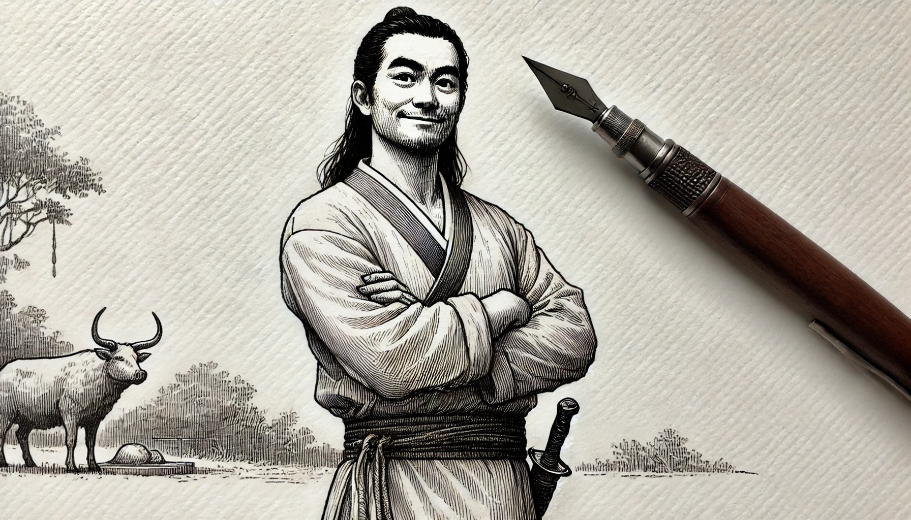

# 【生命⋅修行】喜伤心

昨天，非常快乐、轻松自在地读了一天的JT的文章，大宝送我的那本《庄子白皮书》太厚没带在身边，但却发现一叫做[jt叔叔大本营的盗版网站](https://www.addd.net/)，在上面找到《庄子篇解大纲》，把它从头到尾读了一遍。

太喜欢他的文字了，那种溢纸而出的潇洒诙谐，深深地感染了我。再配上奖励自己的冰淇淋与可乐，简直快乐得不要不要的……

然而，最后我发现，自己最终好像没有能够在快乐的终点刹住车。第一次有迹象让我感知到，是大约到了晚饭时间。我发现自己头有些疼，于是起身给自己煮了碗面条吃。然而出门步行到30分钟路程外的商场买了点工作上需要的东西，再走回来，正好一身汗。这一整天坐下来，这会儿也算是活动了一下，筋骨舒畅。

等洗完澡发现，竟然时间离9点还差几分钟。好像还可以再乐呵乐呵……于是从冰箱里拿出冰淇淋，再次打开电脑，再次打开那个网站，找到《庄子篇解大纲》刚刚读到一半的地方，继续看起来。

有那么一会儿，发现自己进入了一个状态，既馋冰淇淋的冰甜味，又有点什么地方不舒服。喝了一口可乐，发现竟然是难喝的感觉。于是，稍稍犹豫了一小会儿，把冰淇淋和可乐收进了冰箱。

然后，不知过了多久，《庄子篇解大纲》就读完了。真是意犹未尽啊，我捧着电脑，在这个网站点来点去，很想在继续体验那酣畅淋漓的阅读快感。但是，已经求之不得了。等自己终于关灯、躺到床上时，已经是晚上11点多钟。后脑和后脖子，又有些疼了起来。

肯定是太过了，要不，jt叔叔会强调要小心「喜伤心」呢。庖丁解牛里最后有这么一句：

> ……提刀而立，为之四顾，为之踌躇满志，善刀而藏之。
>
> ——《[庄子](https://zh.wikipedia.org/wiki/莊子_(書))・养生主》

「踌躇」——犹豫不决的样子。犹豫的是什么呢，那「满志」的状态，已经到了「过犹不及」的边缘。该悬崖勒马，善刀而藏之了。

以后可以更警醒、觉知一点。多留意身体的感受，以及那升起的得意之情，是不是已经开始乱心了……

