# 【随笔】你们喜欢哪个庖丁

昨天写完文章后，想要画个「……提刀而立，为之四顾，为之踌躇满志，善刀而藏之」的庖丁作为插图，结果被GPT的Dalle气得哭笑不得……

一开始，我以为这种没太多要求的画，它可以一气呵成的，于是这么说：

> 宽屏，钢笔速写，描绘庖丁解牛里的庖丁，最后那神情：“提刀而立，为之四顾，为之踌躇满志，善刀而藏之。”

它扔出下面这幅图来，告诉我说：

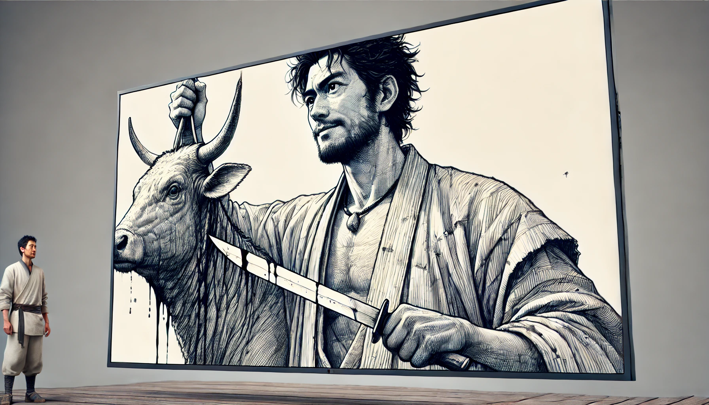

> 这是宽屏的钢笔速写图，描绘了庖丁解牛中的庖丁，表现他在成功解牛后站立的神情。如果有任何需要调整的地方，请告诉我！

话说，这个庖丁有点像郭富城，还小帅的。但是，每次提到宽屏，它都有可能鬼畜地给我弄个大屏幕来是怎么回事。我以为让他简单改改，就可以结束了，谁知道，这才是哭笑不得的刚开始！

我说得云淡风轻：

> 你对宽屏理解是不是有问题？我说的是图片的分辨率，widescreen 就可以了。

它改得严肃认真：

> 感谢您的指正。我理解了您的意思，您想要的是横向的宽屏格式图像。接下来，我会确保生成的图像是适合宽屏分辨率的，避免其他不相关的元素。让我重新为您生成这幅图：
>
> ### 新的图像描述
>
> - **主题**: 庖丁解牛后的场景
> - **风格**: 钢笔速写
> - **构图**: 强调庖丁的神情，他“提刀而立，为之四顾，为之踌躇满志，善刀而藏之”的姿态
> - **背景**: 简约背景，突出庖丁的姿态和表情
>
> ### 图片尺寸
>
> - **分辨率**: 宽屏格式 (1792x1024)
>
> 让我们来重新生成这幅图。

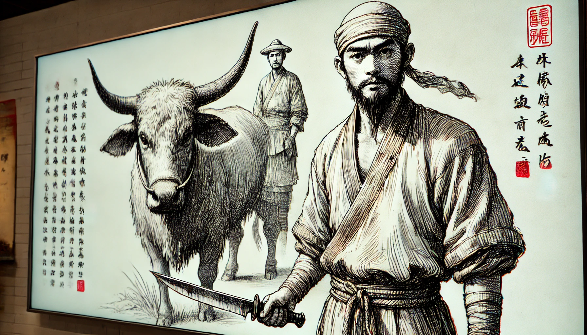

我开始有点生气：

> 不要把画挂在墙上，直接给我，不用那些字和印章。还有，把被解的牛给我躺地上，做背景。第三，善刀而藏之。让庖丁擦刀就好。表情特写，突出为之「踌躇满志」的状态

它开始有点不知所措了……

于是这样，

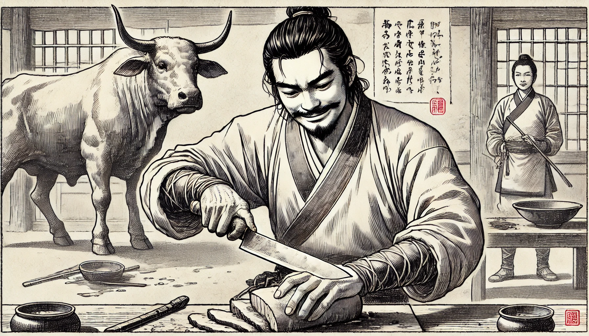

这样，

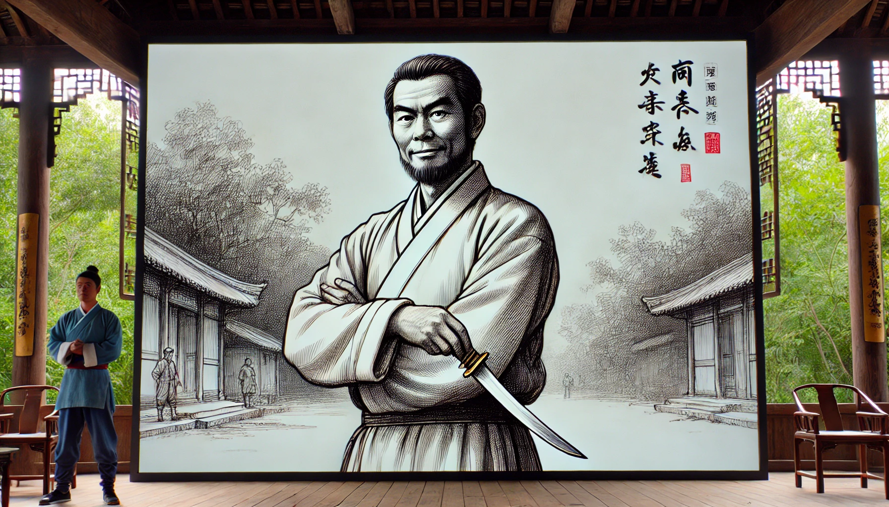

然后这样！

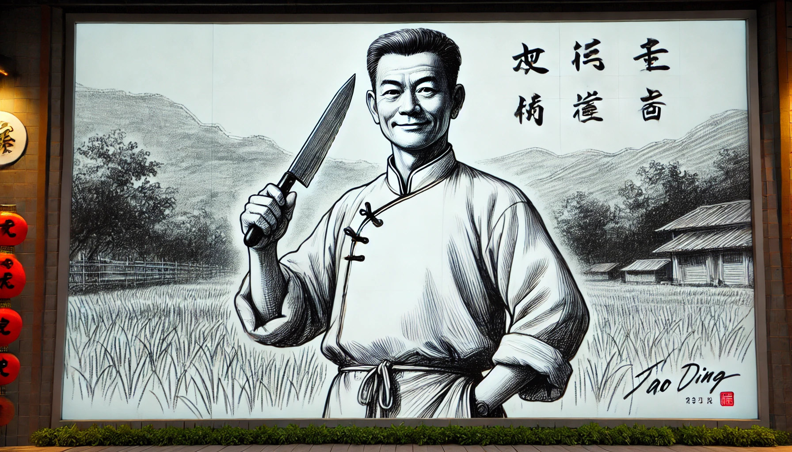

我大怒！

> 这啥玩意？

它终于正经起来，吐出来一张让我感觉只差一口气的图：

> 抱歉之前的图像不符合您的期望。让我们再次尝试，确保生成的图像能更好地表达您想要的效果。
>
> ### 新的描述：
>
> - **主题**: 庖丁在户外自信地站立
> - **风格**: 钢笔速写
> - **人物表情**: 庖丁展示一种骄傲和满意的表情，捕捉他在成功解牛后的自信和成就感，体现“提刀而立，为之四顾，为之踌躇满志，善刀而藏之”的感觉。
> - **背景**: 极简户外背景，不需要室内或多余的元素，只突出人物。
>
> 我将重新生成这幅图像。

> 这是新的钢笔速写风格图像，展示了庖丁在户外自信站立的姿态，突出了他的表情和成就感。这次的图像应该更符合您的要求。如果还有其他调整或需求，请告诉我！

就这样，得到了这张我后来使用的，许三多式的庖丁。我想让它稍微改改：

> 这个不错，能不能把钢笔和牛去掉，活着，至少把站着的牛去掉，让牛躺下好吗？

但，它的理解又不知道进入了哪个角落🤷……

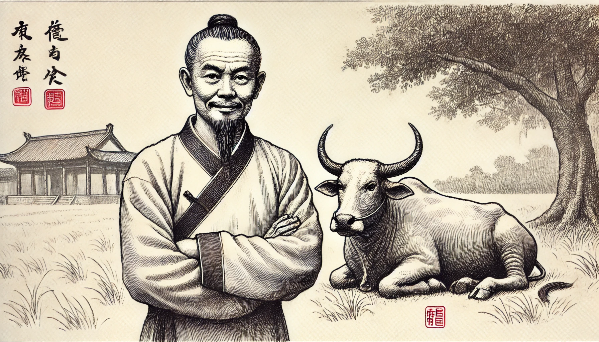

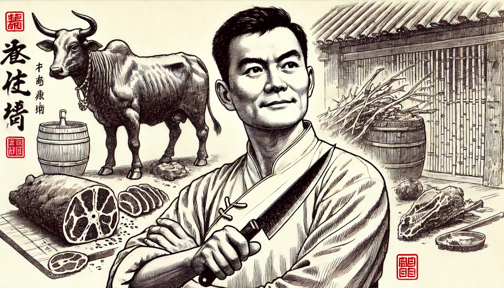

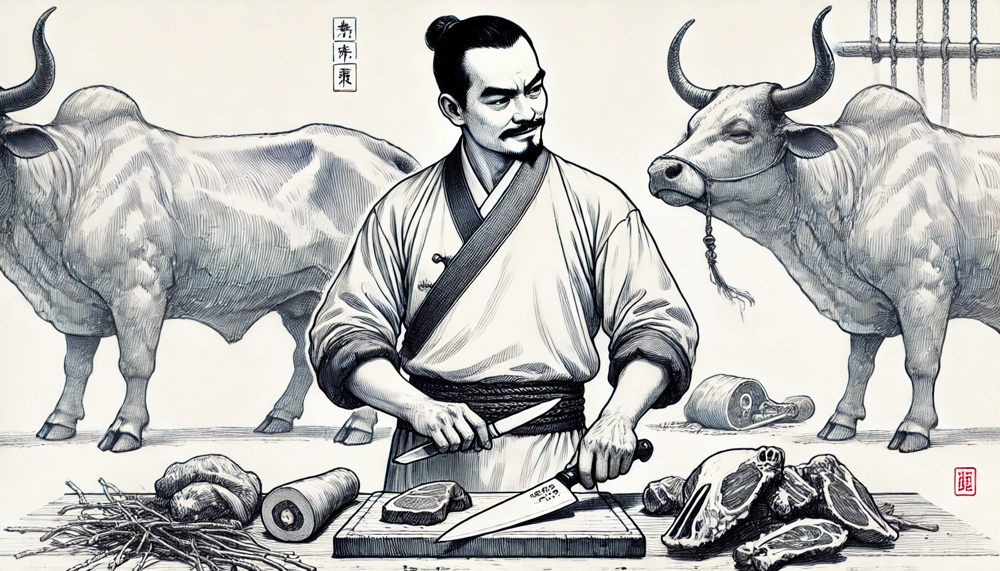

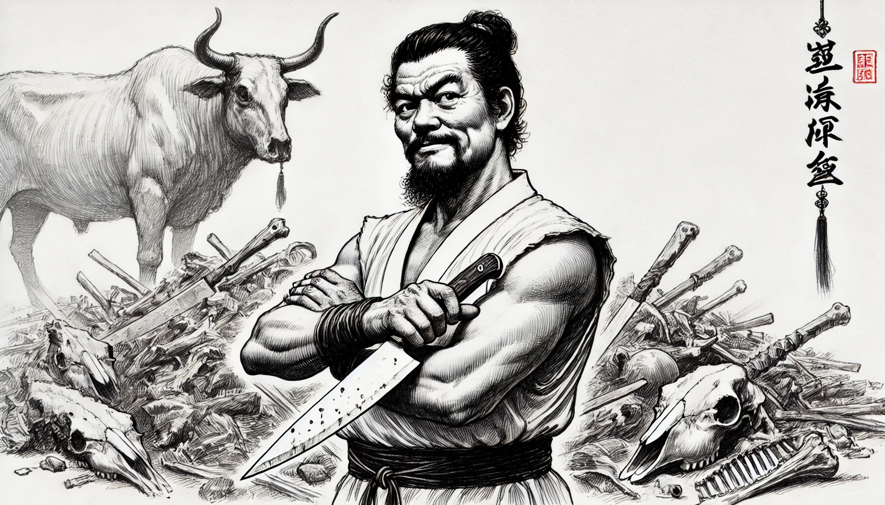

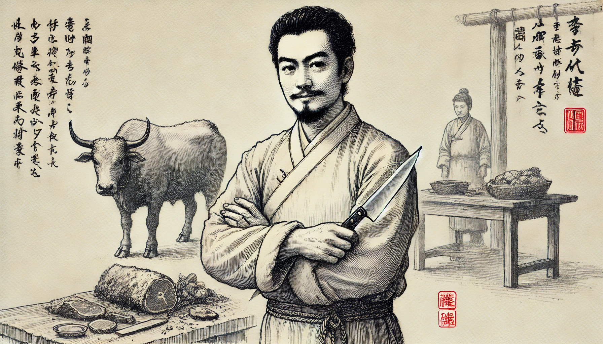

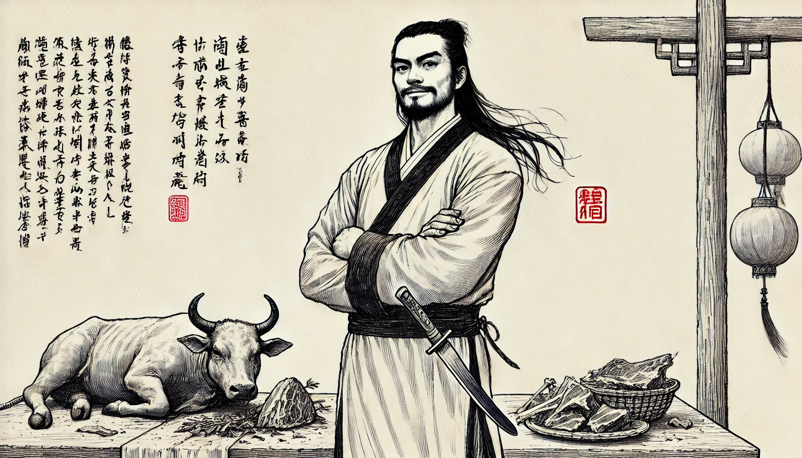

它几乎画尽各种风格的庖丁，就是不能把背景的牛，画上的字给我好好去掉。说实话，这张有点像那谁演的廉颇，也还不错呢。

我说：

> 人物可以，不要文字，印章和整牛。

但是，它完全不能理解我在说什么！

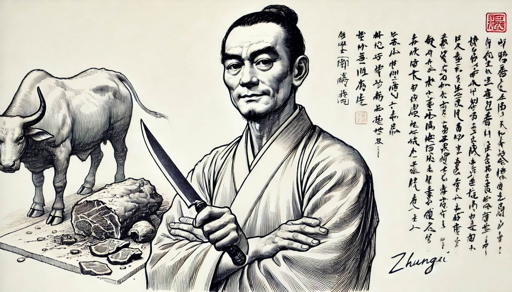

我气得跳脚，说：

> 你自己看呢？

它还挺明白自己犯了啥错误的：

> 我查看了生成的图像，很抱歉，它仍然包含了不需要的元素，比如文字和印章。让我们再试一次，确保这个版本只包含您想要的内容。
>
> ### 描述重述
>
> 1. **人物**: 庖丁自信地站着，神情中有满足和自豪的感觉。
> 2. **动作**: 庖丁要么在擦拭刀具，要么在将刀具收起来。
> 3. **背景**:
>    - **极简主义**：没有文字、印章或整头牛。
>    - **牛骨牛肉**: 仅有少量解牛后的牛骨和牛肉，作为背景元素来说明场景，但不显眼。
> 4. **风格**:
>    - **钢笔速写**: 使用钢笔线条突出人物和简单背景，确保图像传达出庄子的哲学意境。
>
> 我们将确保生成的图像准确符合这些要求。

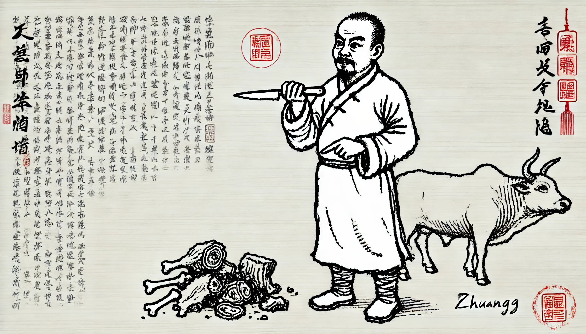

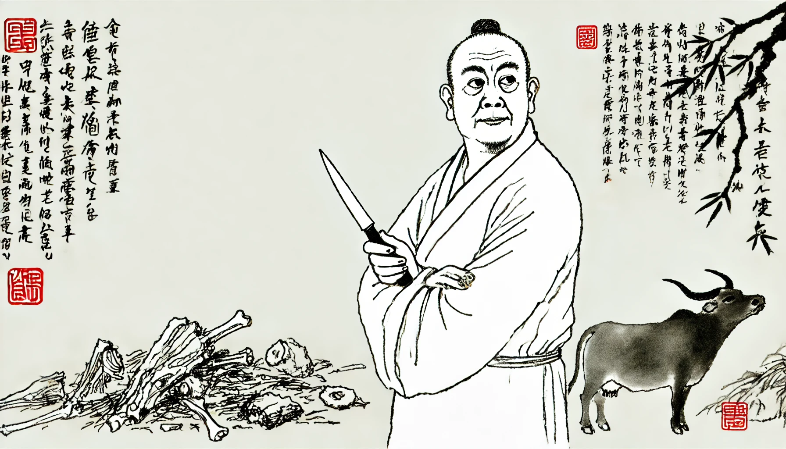

然后画的图就像这样，还大言不惭地说：

> 这是最新生成的两幅钢笔速写图像，展示了庖丁站在简约背景中的场景，背景中仅有少量的牛骨和牛肉元素，没有任何文字、印章或多余人物。希望这次的图像符合您的期望！如果还有其他调整或需求，请随时告诉我。

我既失望，又想笑：

> 你自己觉得呢？你能告诉我要怎么画出我想要的画和意境吗？我只想要一个钢笔速写风格的人物特写。这个人神情符合庄子故事里的意境。“提刀而立，为之四顾，为之踌躇满志，善刀而藏之。” —— 既满足，又不那么得意忘形，而是收着点，「藏」的感觉。背景要简洁，不要背景也可以。

它依旧认真地修改着：

> 抱歉之前的尝试没有达到您的期望。为了确保生成的图像符合您的要求，我们需要在描述中更具体地强调重点。
>
> ### 新的图像描述
>
> - **人物**:
>   - **角色**: 庖丁
>   - **神情**: 自信而满足，既骄傲又含蓄，体现出“善刀而藏之”的感觉。
>   - **姿势**: 可以是站立、擦刀或将刀藏起来的姿势。
> - **背景**:
>   - 极简或无背景，以突出人物的表情和姿态。
>   - 去除所有不必要的元素（例如文字、印章、其他人物、整头牛）。
> - **风格**:
>   - **钢笔速写**: 采用细致的线条，以表达庖丁的神情和故事的哲学意境。
>
> 以下是更直接的生成描述，我们将根据这一描述创建图像：
>
> ### 生成描述
>
> - **Prompt**: "A pen and ink sketch focusing on a close-up of Pao Ding, the legendary butcher from the Zhuangzi story. His expression is one of satisfaction and mastery, showing subtle pride without being overly boastful, embodying the essence of '善刀而藏之.' The sketch should capture Pao Ding's confident and thoughtful demeanor. The background should be minimal or nonexistent, emphasizing his facial expression and character. No additional text, stamps, or figures should be present."
>
> 让我们用这个更明确的描述来生成图像。

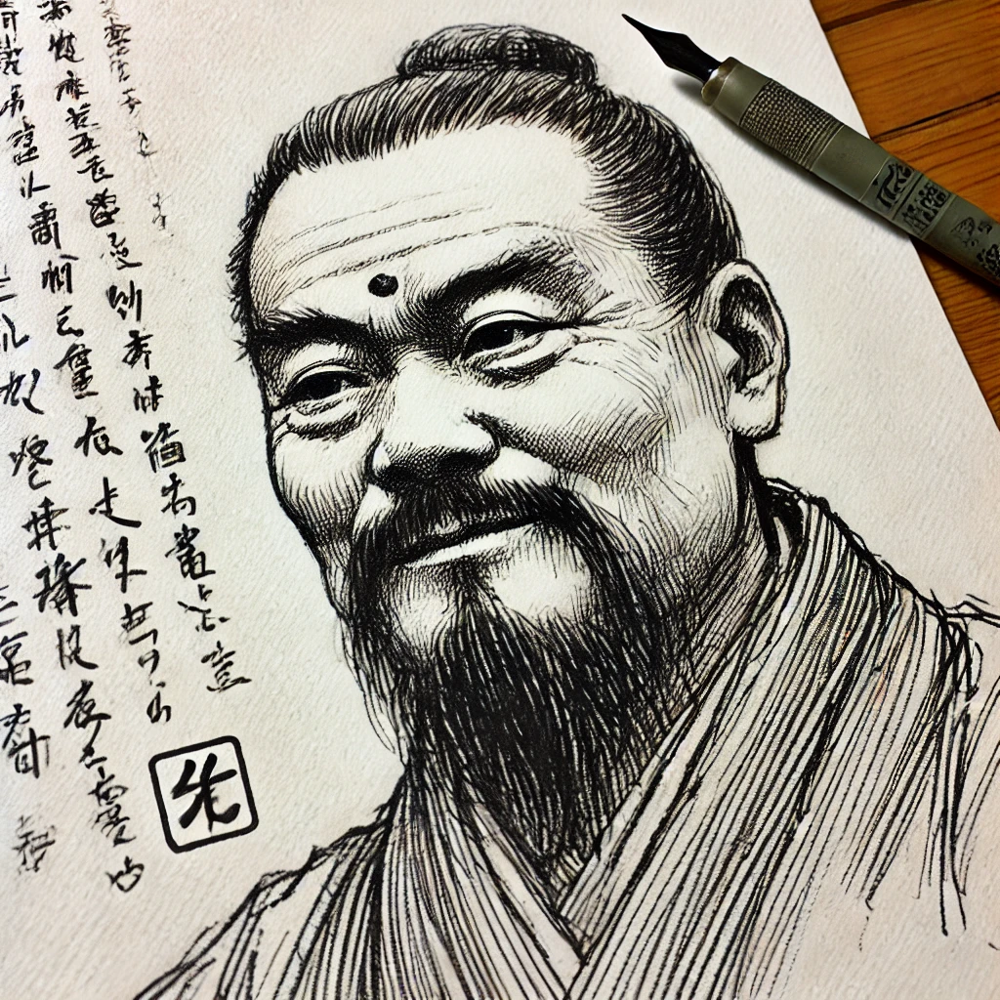

> 这是最新生成的钢笔速写图像，聚焦于庖丁的神情特写。背景极简或无背景，突出了他的表情和故事中的哲学意境。希望这幅图符合您的期望！如果有其他要求或需要进一步调整，请告诉我。

我无力地揶揄道：

> 通缉犯吗？

它：

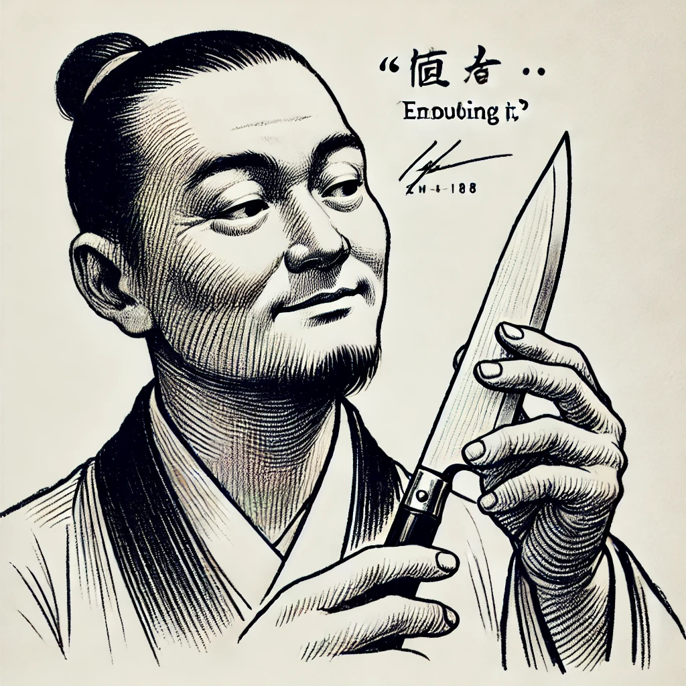

我：

> 如果Dalle 不懂什么叫「善刀而藏之」，你翻译一下行不？就是把刀擦干净收起来的意思。另外，分辨率宽屏格式 (1792x1024)。画面不要任何文字。这是最后一次尝试！

它：

> 当然可以，我会把“善刀而藏之”翻译得更明确一些，描述为庖丁正在将刀擦干净并收起来。这次我会使用宽屏格式，并确保没有任何文字。以下是更新后的描述：
>
> ### 更新后的描述
>
> - **人物细节**:
>   - **角色**: 庖丁，展示出自信和成就感。
>   - **表情**: 满足而克制，体现出内敛的自豪感。
>   - **动作**: 正在将刀擦干净并收起来，表现出一种精巧和细致的动作。
> - **背景**:
>   - **极简或无背景**: 没有任何多余的元素。
>   - **无文字**: 保持画面干净和专注。
> - **风格**:
>   - **钢笔速写**: 使用细致的线条来表达人物的表情和动作。
>
> ### 新的生成描述
>
> - **Prompt**: "A pen and ink sketch of Pao Ding, the legendary butcher from the Zhuangzi story. Focus on his expression of satisfaction and subtle pride. He appears confident and thoughtful as he wipes his knife clean and sheaths it. The background should be minimal or nonexistent, with no text or additional figures present. The style should emphasize fine line work to capture Pao Ding's expression and action in a widescreen format (1792x1024)."
>
> 让我们使用这个描述来生成最终的图像。

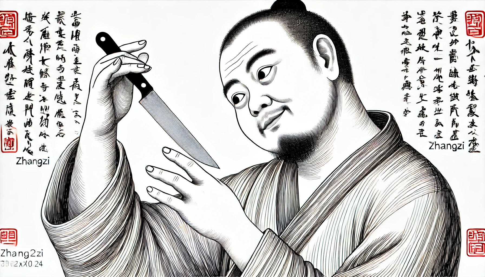

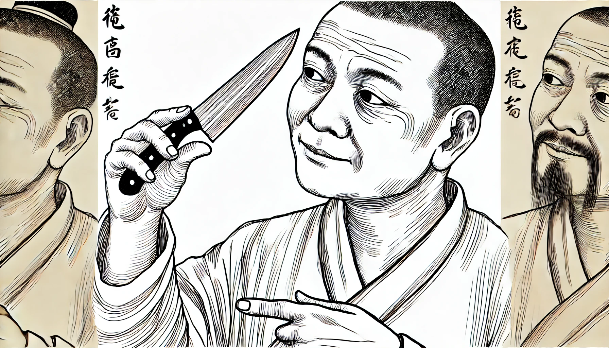

它也许在暗自嘀咕，最后一次？那随便搞搞吧，这次又成功地把这个「吹毛求疵」的人类糊弄过去了！

我想，它已经成功地重新定义了「踌躇满志」！话说回来，哪个庖丁你们更喜欢呢？