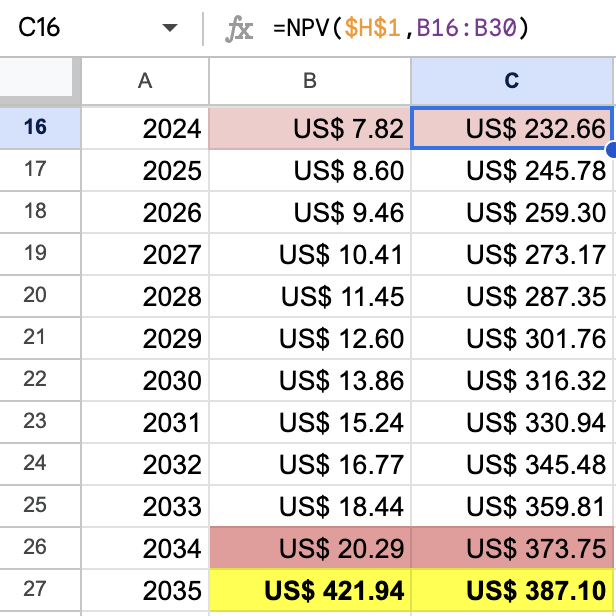
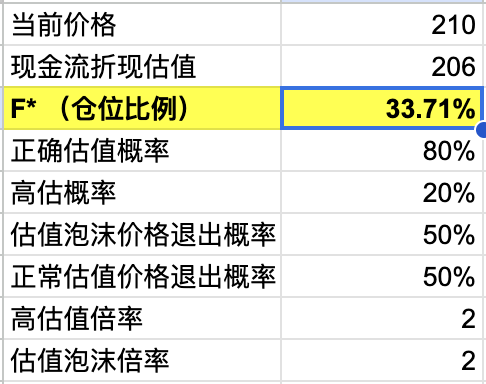
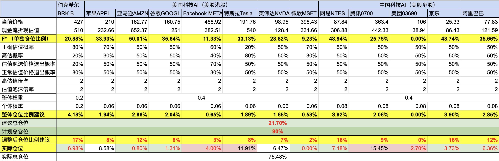

# 【教程】继续聊史上最赚钱的财富公式

先总结一下以前聊过的内容，关于凯利和香农的历史与八卦我就不重复了。这次重点聊那些枯燥的公式，和我的应用方法。

## 原始的凯利公式

$$
F* = \dfrac{bp - q}{b} = \dfrac{p(b+1)-1}{b}
$$

其中：

* *F*∗ 是每次投注的最优比例（即应该投入总资金的比例）

* *b* 是赔率，即获胜时的净收益相对于所投入金额的比率

* *p* 是获胜的概率

* *q* 是失败的概率，也就是1-p

## 无效的凯利公式变种

$$
F∗=\dfrac{(E[R]−R_f) }{σ2}
$$

其中：

* $$F∗$$ 是资金的分配比例。

* $$E[R]$$ 是投资的期望收益率。

* $$R_f$$ 是无风险利率。

* $$σ^2$$ 是投资收益率的标准差（即波动率）。

为什么说它无效呢？因为这个公式里，收益和波动密切相关，如果我不是每天买卖的话，波动关我什么事呢？毕竟，只有真正卖出时的价格才会影响到收益。真正影响收益的，是估值的准确概率，以及因此影响的实际卖出价位。所以，我用的是下面这个：

## 我认为有用的凯利公式变种

$$
F∗=  \dfrac{b_1p_1+b_2p_2+...+b_np_n}{ b_{max}}
$$

其中：

* $$b_n$$是每种情况下的收益

* $$p_n$$是每种情况发生的概率

* $$b_{max}$$是最大收益

**Note：这里有一个需要注意的小地方，当最大收益$$b_{max}$$ 也是负数时，也就是不管怎样都亏钱时，上面这个公式可能算出一个负负得正的值，遇到这种情况，记住一分钱不要投就好了。也就是说此时，$$F*=0$$ **
$$
F* =
\begin{cases}
\dfrac{b_1p_1+b_2p_2+...+b_np_n}{ b_{max}}, & \text{if }b_{max}>0 \\
0, & \text{if }b_{max}<=0 \\
0, & \text{if }(b_1p_1+b_2p_2+...+b_np_n) < 0
\end{cases}
$$

## 我是怎么用的呢？

### 1. 先估值

首先，可以用现金流折现法对要买的股票进行估值。参考我昨天的文章《[【随笔】苹果买不买](20240807【随笔】苹果买不买.md)》，可以用Excel，或者找GPT。我的Excel公式是这样的：



注意，Excel里2024年的估值用的这个公式： 

```
=NPV($H$1,B16:B30)
```

与之相关的，还有最后一行的终值计算，是使用**永续增长模型**（Perpetuity Growth Model，也称为戈登增长模型）来计算的：
$$
终值= \dfrac{FCF_终\times (1+g)}{WACC - g}
$$
其中：

* $$FCF_终$$：预测期最后一年的自由现金流。

* $$g$$：永续增长率，通常反映企业的长期可持续增长率。

* $$WACC$$：加权平均资本成本，作为贴现率使用。

用9%的加权平均资本成本（WACC）或者说贴现率，3%的永续增长率，Excel里的公式是这样：

```
=B26*(1+3%)/(9%-3%)
```

### 2. 用凯利公式计算建议仓位

考虑到既要模糊的正确，又能给出数量化的建议。我是这么处理的，既然估值是否正确本身是个概率，同样的，市场也会产生估值错配产生不同价位的退出机会。那么我就简化成四种情况来计算、对冲这些模糊的概率：

* A：正确估值，在正确估值且真实价值的价格退出
* B：高估，在真实价值的价格退出
* C：正确估值，在市场泡沫价格退出
* D：高估，在相对真实价值的市场泡沫价格退出

所以，就有了昨天文章里的下面这张Excel表格：



其中的公式是这样的：

```
=if((B11*B4-B3)>0,((B11*B4-B3)/(B3)*B6*B8+(B4-B3)/B3*B6*B9+(B11/B10)*(B4-B3)/B3*B7*B8+(B4/B10-B3)/B3*B7*B9)/((B11*B4-B3)/B3),0)
```


就是分别计算各种情况发生的概率和对应的收益率，最后计算出仓位建议值$$F*$$
$$
\begin{align*}
&b_1=\dfrac{B11_{估值泡沫倍率}\times B4_{现金流折现估值}-B3_{当前价格}}{B3_{当前价格}} = b_{max}
\\
&p1 = B6_{正确估值概率}\times B8_{估值泡沫价格退出概率}
\\\\
&b_2=\dfrac{B4_{现金流折现估值}-B3_{当前价格}}{B3_{当前价格}} 
\\
&p_2 = B6_{正确估值概率}\times B9_{正常估值价格退出概率}
\\\\
&b_3=\dfrac{\dfrac{B11_{估值泡沫倍率}}{B10_{高估值倍率}}\times B4_{现金流折现估值}-B3_{当前价格}}{B3_{当前价格}} 
\\
&p_3 = B7_{高估概率}\times B8_{估值泡沫价格退出概率}
\\\\
&b_4=\dfrac{\dfrac{B4_{现金流折现估值}}{B10_{高估值倍率}} -B3_{当前价格}}{B3_{当前价格}} 
\\
&p_4 = B7_{高估概率}\times B9_{正常估值价格退出概率}
\\\\\\
&F* =
\begin{cases}
\dfrac{b_1p_1+b_2p_2+...+b_np_n}{ b_{max}}, & \text{if }b_{max}>0 \\
0, & \text{if }b_{max}<=0 \\
\end{cases}
\end{align*}
$$


### 3. 综合计算各股票建议仓位

那么，有多只股票怎么办呢？我一开始还在想，要怎么综合一下。根据单独各股票$$F*$$ 加权算出各自的比例。后来忽然意识到，这样既把问题搞复杂化了，又重复计算、放大了$$F*$$的影响力。不然简单弄个权重，根据需要调整就好。于是乎，我现在帮大宝做的表格像下面这样：



所有持仓分成3大类，伯克希尔单独一类，美国科技AI公司（也就是著名的美股七姐妹）一类，中国科技AI公司一类。权重比例为2:4:4。至于各大类内部、各家公司之间，暂时都平均分配权重。

具体步骤如下：

#### 1. 计算各家公司现金流折现估值

我这里大部分都是根据财务报表计算，除了特斯拉算法另类（见《[【教程】如何在GPT的帮助下使用芒格的思维框架做投资分析](20240626【教程】如何在GPT的帮助下使用芒格的思维框架做投资分析.md)》）。

#### 2. 结合估值过程，给出估值概率，泡沫倍率等参数

比如，伯克希尔。我觉得正确概率就很高，所以给到80%，并且泡沫价格退出的概率不高，给到20%；而亚马逊，是否能继续在AI时代继续过去互联网时代的增长，我只能猜大概率可以，五五开吧，正确概率给50%；但因为是潮流股，泡沫退出的概率也给了50%；特斯拉，考虑我的算法另类，错误高估概率可能更大，直接20%；同样因为是潮流股，泡沫退出的概率还是给了50%。

这样子，第一行黄色的「**F\* （单独仓位比例）**」就能够自动算出了。

### 3. 计算并调整整体仓位比例

第二行黄色的「**整体仓位比例建议**」也会自动计算出来。Excel里的公式是这样的：

```
=if(SUMPRODUCT(B5,B13)>0,SUMPRODUCT(B5,B13),0)
```

主要用到的就是个体权重，和上面计算出来的「**F\* （单独仓位比例）**」；注意所有股票的权重加起来要等于1。如果因为某些原因，想重仓或清仓哪些股票，修改相关权重就好。

#### 4.根据实际操作情况，调整仓位，对比实际持仓

这一步是什么意思呢？因为我们知道，按照凯利公式的原则，永远不可孤注一掷。所以，计算出来的最大仓位通常不会超过50%。综合加权之后就更低了。

但实际上，如果我们采用的是定投法，或者场外还有其他备用资金。那么股票账户上的资金是不必拘泥于50%这个数字的。假设，考虑美股的暴跌。我要把账户上90%的资金全都买成股票。那么，我可以根据这个比例来放大各股票的持仓建议。

只要在表格中输入「计划总仓位就好」。调整后仓位比例建议的公式如下：

```
=B14*$B$16/$B$15
```

Excel会自动根据比例，算出更有指导意义的仓位建议。也就是上面第三行黄色的「调整后仓位比例建议」。

#### 4. 对比实际持仓，考虑适时调仓

接下来，就可以对比实际仓位，来进行调仓了。比如，在目前表格中，绿色是仓位偏低需要补仓的。红色是仓位偏高需要减仓的。参考着进行调整就好。

以上，就是目前我使用凯利公式进行仓位控制的方法。投资有风险，决策需谨慎，上面提到的股票，用到的分析数据和例子，仅供参考，风险自担。
