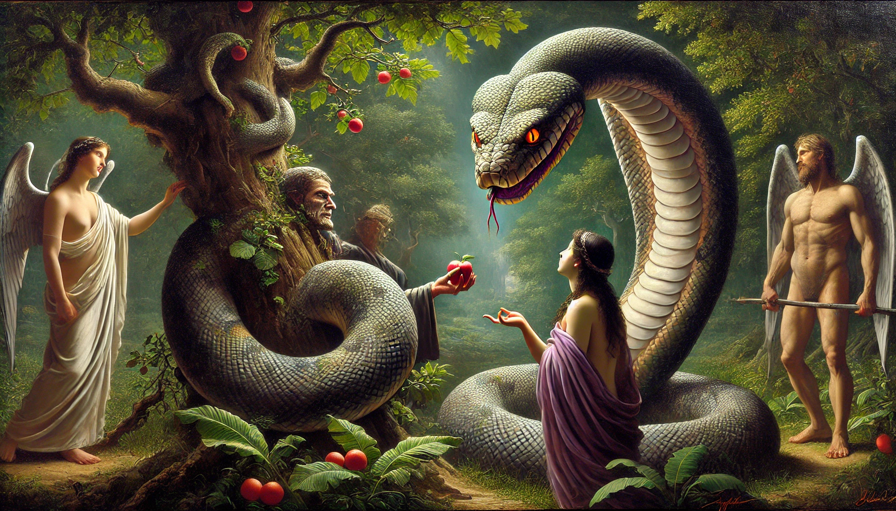
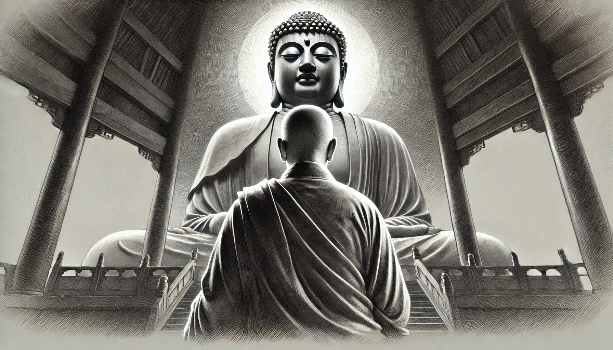

# 【生命⋅修行】修行路上的魔障

于我而言，这修行路上最大的魔障，应该就是那些痛苦的情绪，以及沉湎于痛苦情绪的行为吧。

或许是独处太久，或许是思念太重，这几天情绪和日常作息状态都在崩溃的边缘摆荡，头一直痛着，心情也一直低落着。大宝开解我：

> 就跟和尚修佛一下，好像是要进去一种状态还是成佛，耳边就会有各种妖魔鬼怪，诱惑你，恐吓你。
>
> 大师都是坚定的走，最终成佛的。
>
> 我想做事应该是一样的。

我也因此想起在大报恩寺看到的，那名为「千年凝望」的玄奘雕像来。闭上眼睛，那情景尤在眼前一般。传承千年又千年的力量，瞬间重新回到了自己胸膛，不禁感动到要流出泪来。

既然方向就在那里，先贤所传承的力量也在那里，接过这传承，继续前进就好了！

痛苦觉察到了，就结束，不必分析也更不必沉湎。

把时间和精力花在那些让自己内心舒展的事情上。

后味不好的事和人，都尽可能地断、舍、离……

平时看电脑本来就多，抓紧一切机会，多多运动、注意睡觉！

