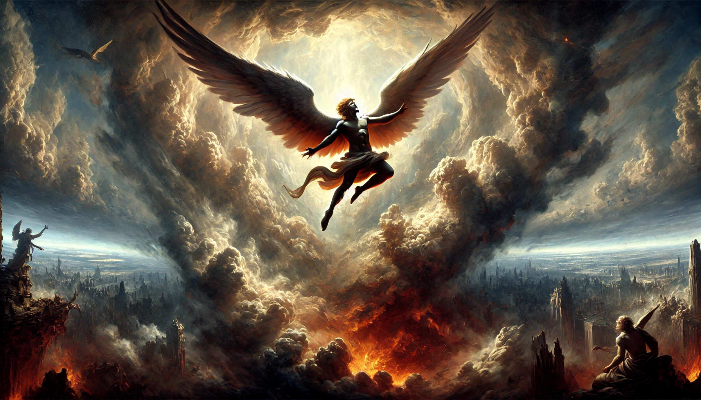
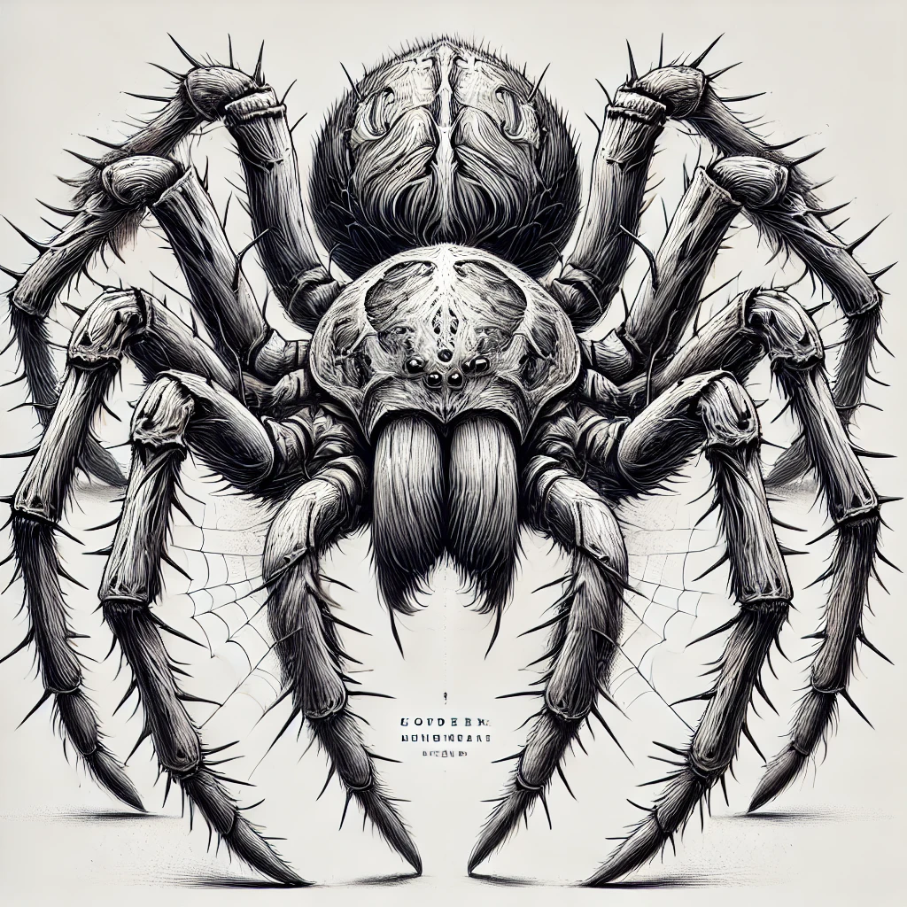

# 【生命⋅修行】路西法的隐喻

## ——《邪恶心理学》读后

这两天，在网上把这本[《邪恶心理学》](https://book.douban.com/subject/2075107/)翻完了，还是在之前提到的那个「[JT叔叔大本营](https://www.addd.net/)」看的。说实话，蛮有趣的一本书。

### 总体 🌟🌟🌟🌟4星

这本书的作者是美国的[斯科特•派克（M. Scott Peck）](http://www.mscottpeck.com/index.html)，提起他的另一本书[《少有人走的路（The Road Less Traveled）》](https://book.douban.com/subject/1775691/)，想必你一定知道了。

相比那本更有名的畅销书，这本书更小众一点，但其中探讨了一个个人修行中必须要注意到的一个微妙关键点——何为恶？何为善？如何弃恶从善？或反过来与魔鬼签约？

### 好看 🌟🌟🌟🌟4星

虽然作者在试图提出一个颇有些诘屈聱牙的心理学观点，但他用了好几个不同的案例故事来层层抽丝剥茧。于是乎，看起来也颇为顺畅。反正我是昨天傍晚，一口气就把这本小书读完了。具体故事我就不多说了。

接下来，我会剧透一下对我的启发，介意剧透的同学可以就此打住，先去找书来读读再说。

### 启发 🌟🌟🌟🌟🌟5星

#### 路西法的故事

派克在书里引用了摩门教神话中关于路西法故事的演绎，来为邪恶的本质做出注解：

> 摩门教的神话对于恶人过度的控制欲有精彩的描写。简述如下：
>
> 耶稣基督与路西法需向 上帝缴交一份对待婴儿的计划书。
>
> 路西法的计划书很简单，与现今企业及军事领导人提出的企划案， 同属一类：上帝只需调派众多天使中具有赏罚能力的天使，分派给每一位人类，如此一来，就不会 产生管束的麻烦了！
>
> 耶稣基督提出的计划书与路西法截然不同，比较富有想像力：使人类拥有自由意 志，走自己的道路，但是且让我与人类同生死，做人类的榜样.启发他们如何享受生命，让他们知 道上帝对人类的关爱。
>
> 上帝当然看中了耶稣基督所提出创造力较丰富的计划书。路西法则对于自己的 计划未中选颇感不满。

说来还真是，路西法的计划书与现代管理套路如出一辙。二十多年前在I记时，我的领导兼导师Eric在一次1:1 的辅导中就告诉过我：

> 管理就两条：
>
> 1. 是诱之以利
> 2. 是恫之以害

在菊厂工作时，发现任老板的管理哲学也无非如此，并且把「给利」贯彻得相当到位。于是一招鲜，吃遍天，其它管理手段再粗糙，似乎也没造成什么不好的影响。

而最近看一篇讲黄峥的文章，他管理拼多多也是如此：

> 黄峥认为，世界是由简单和常识构成的，但人的思想是很容易被污染的，对一件事做判断的时候，往往会被偏见和个人利益的诉求蒙蔽。
>
> 人性中的贪婪、自私等特点，让“人”是一个极其复杂的变量，而控制这种变量的方法也很简单，那就是握住人性中最根本的那部分。
>
> 1957年，美国心理学家麦格雷戈在《企业中人的方面》一文中提出，人的本性是懒惰的，厌恶工作，绝大多数人胸无大志，缺乏进取心。唯一的办法是经济利益为主要激励手段和采取严厉的惩罚制度，即“胡萝卜加大棒”的激励和惩罚手段。
>
> 拼多多是这一理论付诸实践最彻底的公司之一。
>
> 比如在招聘时拼多多可以给出独一档的薪资，因为拼多多认为：激励员工，超预期的薪酬不够，要远超预期才行。
>
> 同时，拼多多也是行业工作强度最大的公司之一……
>
> 而对于用户，拼多多始终用低价来激励用户,但黄峥说:**“拼多多的核心不是便宜，而是满足用户心里占便宜的感觉。”**

芒格也在不同演讲中反复强调：

> As Dr. Johnson so wisely observed, truth is hard to assimilate in any mind when opposed by interest. 
>
> 正如约翰逊博士明智地指出的那样，当真理与个人利益相冲突时，任何人都很难接受它。

然而，这源自六翼炽天使，神奇好用近乎神通的手段，却也是路西法堕落为撒旦的原因。无他，傲慢而已！

这「神圣」的傲慢，完全蒙蔽无视了自己可能的缺陷与黑暗，同时也无视并压制了他人内心对「善」与「恶」的判断与感知，无怪乎被称之为大魔王——撒旦呢！

还记得很久以前上L.E.T课程时，那个老师对我们说的话：

> 你们在这里学到的一切，用自己身上，那叫做修行。用到别人身上，那叫做「入魔」！

#### 蜘蛛的恐惧

派克在比莉的案例中，详细介绍了她对蜘蛛的恐惧。比莉痛苦于摆脱母亲的侵入与控制，而她自己也终于意识到，自己同样地有这样的控制与依赖。这一切，被显化为她对蜘蛛的强烈恐惧。

这也是我特别容易犯规的地方，在与大宝的相处中，在与孩子们的相处中，都需要经常留意才行。既要小心，避免用各种奇怪的手段施加控制；更要小心，自我屏蔽、「我没有那个意思」的逃避倾向。

必须牢记，自己的情绪是一个信号灯，是自己认知偏差的信号灯。一定要注意到这个信号，去弄清楚事实是什么，他们的实际感受是什么，而不是锁死在「我以为」上面打圈圈。

#### 所以，在自我的修行中，需牢记以下这些：

1. 不要因懒惰而把自主权交给别人，要时刻倾听自己内心「良知」的呼唤！
2. 不要傲慢，要谦卑
   1. 要正视自己会犯错误、有黑暗面
   2. 不要企图控制别人、更不要无视并压制别人的感受、别人内心的声音
3. 要极度地求真
4. 善用爱的力量

是的，这真的是一个修行中需要特别特别小心的地方。

再次推荐一下这本书，值得一读！