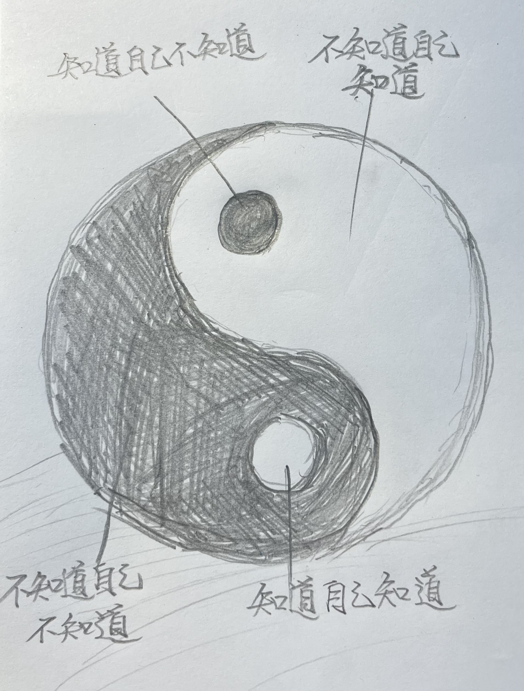

# 【生命⋅修行】不知为不知

前两天Sayyid在《【生命⋅修行】芒格智慧中最最核心的关键》文章后面留言说：

> intellectual honesty的核心就是知道自己不知道，学习的目的就是为了让自己知道自己还有很多不知道，知识越多认知越高的人越是谦逊，越是渴望知道更多自己不知道的事情，这就是成功的壁垒和知识的复利

我觉得Sayyid说得很有道理。在网上搜罗了一下关于intellectual honesty的定义与讨论，感觉更多的聚焦在「Honesty」这一个点上，比如[Wikiversity上的这篇关于Intellectual Honesty的论述](https://en.wikiversity.org/wiki/Intellectual_honesty)。但是，这些讨论中少了一点Sayyid所说的，那个「谦逊」的态度。

相比之下反而孔子的那句来得更简单、更直接、更完整均衡：

> 知之为知之，不知为不知，是知也！

然而，这两天身体倦怠得不行，哪怕是一次超过12小时的睡眠，也不能彻底解决头疼脑胀的苦恼。于是，看到Sayyid这段留言，脑子里更多盘旋的是《庄子•养生主》里的那句话：

> 吾生也有涯，而知也無涯。以有涯隨無涯，殆已；已而為知者，殆而已矣。為善無近名，為惡無近刑，緣督以為經，可以保身，可以全生，可以養親，可以盡年。

生命是有限的，然而这个世界的知识是无限的。唯一的确定性就是不确定性：

> 我们不知道的很多……
>
> 我们知道的很少……
>
> 我们知道的那点还有巨大的局限性，并且还很可能是错的……

怎么办呢？庄子在《养生主》指出了两条道路，也指明了这两条道路的区别：

* 硬是要拼着穷尽知识——危途！明知如此，却还以为自己已经掌握了真理，那就真是彻底完蛋了！
* 為善無近名，為惡無近刑，緣督以為經——做「自认为正确、别人也认为正确」的事，但别搞得千万人都追捧你；做「自认为正确、但别人以为不正确」的事，但别搞得全万人都追杀你；顺着大自然最基本的规律作为自己的行事准则——「可以保身，可以全生，可以養親，可以盡年」

本来想画几个圈，表达「不知道自己不知道」、「知道自己不知道」、「知道自己知道」与「不知道自己知道」这几个认知边界。画来画去，却终于发现，只有太极图能准确表达我此刻的认知。

对于我们而言，这个世界是一片混沌。接近我们认知边界的那些，是有「不知道自己不知道」和「不知道自己知道」这两条互相纠缠、互相生长的阴阳鱼所组成。

其实这两者之间，以及这两者向外的边界也是动态和模糊的。

而把我这两条阴阳鱼的关键点，就是那小小的两个阴阳眼。在整个世界中，小小的、微不足道的「知道自己知道」和「知道自己不知道」的部分。只有牢牢把握住这两个关键点，让他们变得更清晰牢靠，并清晰地认识到他们在这大千世界中「微不足道」的地位。

以他们为基础，「緣督以為經」，在这世界上谦卑地探索「保身，全生，養親，盡年」之道……

 symbol. The symbol should be drawn with a soft, hand-drawn style, with a slightly rough, organic look. The image.webp)