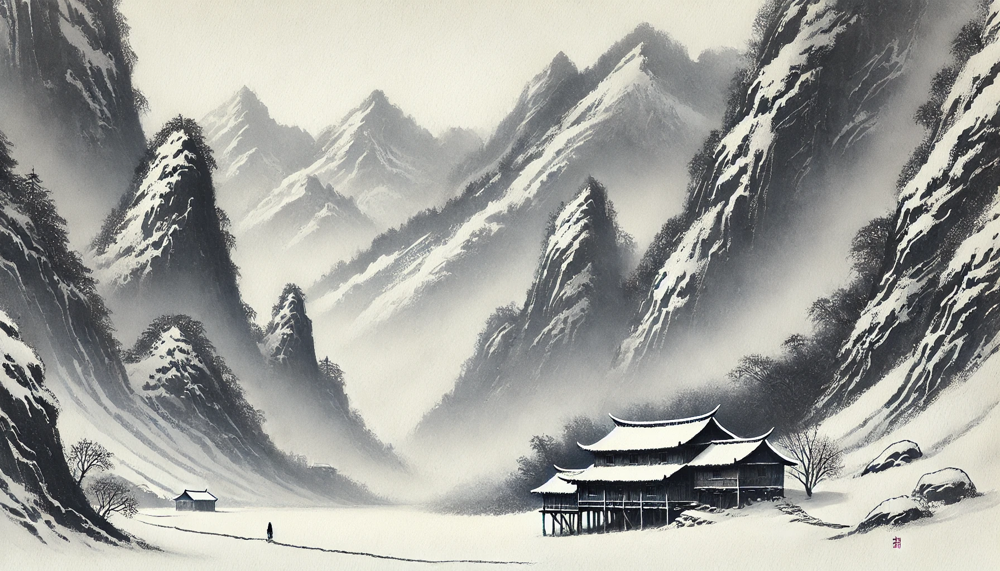

# 【生命⋅修行】再聊聊那些不知道自己知道的事

最近一周，眼睁睁地看着自己普通的不舒服一点一点滑向生病状态，不禁对自己的选择产生了深刻的怀疑——当然，最主要怀疑的就是自己「去国远家几万里为稻梁谋」这个决定。

是的，我不知道自己生病的身体是在想给自己传递什么信号？于是，昨晚头痛欲裂地在床上翻滚时，我又一次地默默念叨——请在梦中给我一些更明确的指引吧，这次生病究竟是为什么？

早上醒来，依旧疲惫不堪，依旧做了很多梦，但这次的梦记得比较清楚。我忽然意识到，还能记住的最后两个梦，似乎就是对昨晚我那个问题的解答。为了继续坚守孙思邈孙真人「不说梦」的建议，具体的梦境我就不说了。

反正我从梦中得到的启示就是：这次生病是外部原因，或者病毒🦠，或者寄生虫🪱，或者是来自别人的观念💡，把这些驱逐出境就好！

这个经历让我很是欣喜，不论自己解读得对不对，毕竟还能够和自己的身体、或者说潜意识进行沟通与链接。这说明，自己起码还属于可以挽救的大好中年吧……

----

这次大宝回家，和父母聊起一些童年旧事。她告诉我说，当妈妈给她说起那些3岁多以前，自己记不住、根本不知道的细节时，她有一种恍然的感觉。许多自己莫名其妙的执着与坚守，忽然都有了解释，那些自己根本不记得的场景其实是那么地熟悉，一直萦绕心间。

岳母怀上大宝的时候，正赶上农村计划生育抓得最严厉的风口。整整九个月，都是岳父带着岳母东躲西藏，能安全躲过一天就是最大的目标，孕期应该怎么营养是根本没想过的事情，按时吃饭是不可能的，饿肚子一饿一天是常事……

大约在岳母怀孕快到9个月的时候，隔壁屋的另一个也是8、9个月龄的孕妇被工作组抓到了，她老公没在家，于是那个孕妇被带去强制做了流产。然后，计划生育的人来到了岳父母家里，抓走了岳父。岳母在山上躲了一阵子，然而刚回到家，工作组的人又杀了个回头，她连忙藏进了大宝姑姑房间的衣柜里。

据说，那时候衣柜的门已经被打开了个缝，然后大宝的姑姑一顿狂骂。说这些男人闯进黄花闺女的卧室乱翻，不成体统。终于把那些人骂走了！

后来，岳父半路上又逃走，打斗中砍伤了某人。工作组的人一气之下，回来把房屋的木板全都拆走，只剩下个空屋架子，但总算是手下留情，没有上房揭瓦。

于是捱到大宝出生那天，大雪纷飞，岳父独自守着岳母，在四面透风的屋架子里待了一整夜。岳母告诉大宝那时的场景，说岳父抱着软绵绵的大宝手足无措，脐带不知如何剪，脸上眼睛上还都是血，根本不知该怎么办。岳母说她只好教岳父他怎么给孩子洗，后来，又让爷爷出门去请了接生婆回来剪脐带。大宝顿时想起大鱼刚出生那天，我手足无措地给软绵绵的宝宝换尿布的情形。

大宝说，那一瞬间她顿时感应到，所有这些自己记不住的情景，都真实的发生过。

大宝说，难怪她自己和父母这么亲，原来光是为了自己的出生，父母就已经拼尽全力；难怪她自己和小姑姑感觉也不一般地亲近，原来最关键的时候，是小姑姑救了她一命，甚至有可能是母女俩的性命；难怪她自己莫名会给住下面开车的叔叔介绍生意，原来幼年体弱多病时，那个叔叔去借了15元钱回来给她看病；难怪她一定要买辆车，因为她曾经答应过她的爷爷，以后要用车子载着她在村里兜圈；难怪她自己对于帮父母重修房子充满执念，原来曾经这房子因为她被拆过，而不到三岁的她也曾用稚嫩强调告诉过她的妈妈「以后我帮你们修个新的」……

----

我想，类似这些，都属于那我们不知道自己知道的事情吧！

我们以为我们不知道，其实我们都知道！
