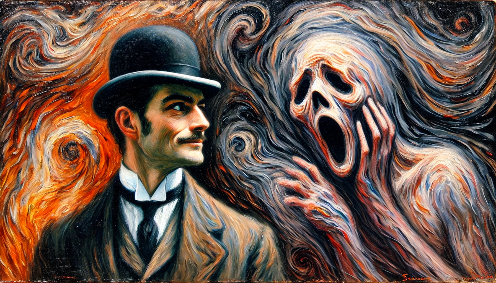

# 【生命⋅修行】不得不面对恐惧

算是求仁得仁吧，昨晚头痛得睡不着爬起来时，又再日记本上写下自己的「祈祷」：想要知道大宝的梦想和我的梦想是不是一回事，为什么自己会头痛，是不是有什么解决不了的冲突与问题？

半夜梦醒，便知道潜意识再一次如约用梦境给了我答案：

* 大宝的梦想和我的梦想不是一回事！
* 我的梦想或许是和「内观」相关的东西！

这让我很是恐惧与痛苦：

> 实现大宝的梦想不是我自己的曾经许下的誓言与心愿吗？为什么我和大宝的梦想不一样呢？为什么会不一致呢？

这次，潜意识没有给我任何新的梦境作答。从头痛欲裂中爬起来，发现已经「如愿」错过了早餐的时间，只是站起来走一走路就头重脚轻，我挪到厨房，给自己煮了几个汤圆。意识到，自己已经有点太过依赖用「梦境」来寻找答案了。而且，由于这恐惧所带来的压力，我不是放松地去寻求「潜意识」的支持，而是紧张、焦虑地在「哭求」！

我在恐惧什么呢？搜了一下过往的文章，与「恐惧」相关的结果竟然需要滚屏……无非是死亡、没有价值、不被爱与被抛弃吧……

这恐惧既然与大宝相关，我决定直接和她说，于是趁着晚上聊天她和我探讨教育孩子的理论时，我把这个话题抛了出来。大宝虽然很不满每次在她要和我分享心得时，我总有更多要说的话和观点。但不出所料的，她告诉我：

> 没什么好恐惧的！

她继续说：

> 两个人梦想不一样很正常！我们本来就是不同的人。
>
> 反正我想要的我很清楚，「物质的自由」很重要，这是毋庸置疑我一定要努力去获得的；
>
> 还有「家庭身心健康方面」，具体是什么我还要继续学习和实践，应该是在东方的传统文化里能找到些东西，一些系统化的可以指导实践的原则。

一边和她聊着天，我一边煮着面条，一整天只靠早上的几个汤圆，加上下午还喝了一杯咖啡，已经有点饿得发抖。但我欣喜地发现，虽然依旧头重脚轻，但是头疼的现象似乎消失了！

我带着「恐惧」寻求「潜意识」在梦境中给我答案，最终却发现，其实我最需要的，只是放下自己的恐惧。甚至，我在焦虑、恐惧中写下的那句卓别林的诗句就已经展现了答案，我想要达到的目标全在这首诗中，那首诗里，几乎描述了我能达到自己目标后的方方面面的行为与状态。甚至，连途径也写在了诗的标题里……

## As I began to love myself

> ### 当我开始爱自己

As I began to love myself I found that anguish and emotional suffering are only warning signs that I was living against my own truth. Today, I know, this is **AUTHENTICITY**.

> 当我开始爱自己，我发现愤怒和情感的折磨只不过是些警告的信号，提醒我已经违背了真实的自己。今天，我知道了，这就是**真诚**。

As I began to love myself I understood how much it can offend somebody if I try to force my desires on this person, even though I knew the time was not right and the person was not ready for it, and even though this person was me. Today I call it **RESPECT**.

> 当我开始爱自己，我明白了将自己的欲望强加给一个人是多么的冒犯，即便我知道只是时机不对而且这个人还没有为此做好准备，即便这个人就是我自己。今天我管这叫做**尊重**。

As I began to love myself I stopped craving for a different life, and I could see that everything that surrounded me was inviting me to grow. Today I call it **MATURITY**.

> 当我开始爱自己，我停下来不再去渴求与现在不一样的生活，我开始能够看到：围绕在我身边的一切，都是在邀请我成长。今天我管这叫做**成熟**。

As I began to love myself I understood that at any circumstance, I am in the right place at the right time, and everything happens at the exactly right moment. So I could be calm. Today I call it **SELF-CONFIDENCE**.

> 当我开始爱自己，我明白了在任何情况下，我都是恰逢其时其地，并且一切都发生得恰到好处。因此我得以从容不迫。今天我管这叫**自信**。

As I began to love myself I quit stealing my own time, and I stopped designing huge projects for the future. Today, I only do what brings me joy and happiness, things I love to do and that make my heart cheer, and I do them in my own way and in my own rhythm. Today I call it **SIMPLICITY**.

>  当我开始爱自己，我不想再偷走自己的时间，我停下来不再去为将来构想庞大的计划。今天，我只做那些能带给我快乐与幸福的事情，那些我热爱并且能让我心为之欢呼的事情，并且只用我自己的方式、自己的节奏去做这些事情。今天我管这叫做**简单**。

As I began to love myself I freed myself of anything that is no good for my health – food, people, things, situations, and everything that drew me down and away from myself. At first I called this attitude a healthy egoism. Today I know it is **LOVE OF ONESELF**.

> 当我开始爱自己，我把自己从一切对自己健康不利的东西中解放出来——食物、人、事物、局面， 以及一切会把自己拉下来并且远离我真正自己的东西。起初，我管这种态度叫做好的利己主义。今天我知道这就是**对自己的爱**。

As I began to love myself I quit trying to always be right, and ever since I was wrong less of the time. Today I discovered that is **MODESTY**.

> 当我开始爱自己，我不想再尝试做一个永远正确的人，而从那以后，我犯的错误却越来越少。今天我发现那就是**谦逊**。

As I began to love myself I refused to go on living in the past and worrying about the future. Now, I only live for the moment, where everything is happening. Today I live each day, day by day, and I call it **FULFILLMENT**.

> 当我开始爱自己，我拒绝继续活在过去，拒绝继续焦虑未来。现在，我只活在当下这一刻，这万物生发的刹那。今天，我活在每一天，一天又一天，我管这叫做**满足**。

As I began to love myself I recognized that my mind can disturb me and it can make me sick. But as I connected it to my heart, my mind became a valuable ally. Today I call this connection **WISDOM OF THE HEART**.

> 当我开始爱自己，我认识到我的头脑会干扰我，它可能会让我生病。但是当我把头脑与心灵相连接，它变成了心灵的宝贵盟友。今天，我管这管连接叫做**心灵的智慧**。

We no longer need to fear arguments, confrontations or any kind of problems with ourselves or others. Even stars collide, and out of their crashing new worlds are born. Today I know **THAT IS LIFE**!

> 我们不需要再害怕与自己和他人的争论、对抗或任何问题。即便是星辰也会碰撞，而新世界就在这碰撞后的分崩离析中诞生。今天我知道了，**那就是生命**！