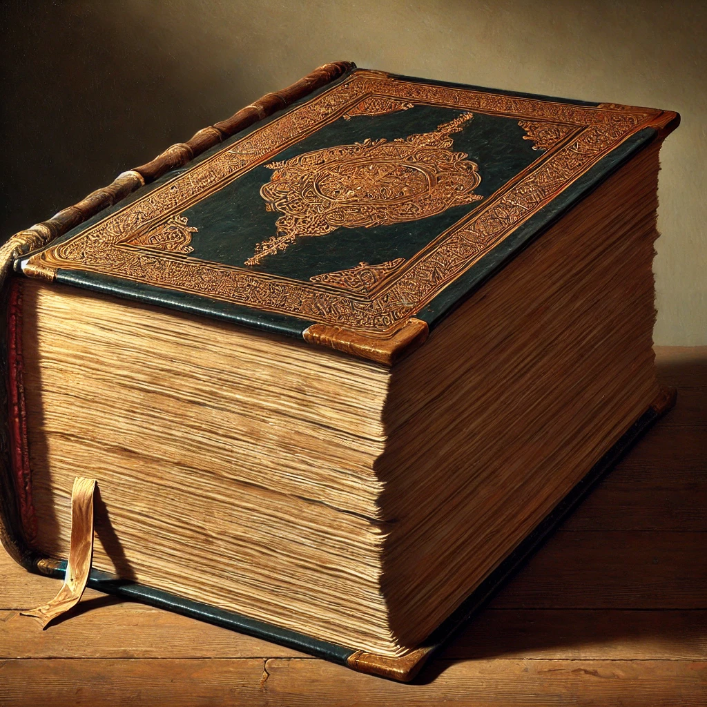

# 【随笔】纳瓦尔的赚钱宝典

《纳瓦尔宝典》这本书，在我的Kindle里躺了有一年多。我想自己是被这「宝典」两个字吓到了，翻看书才发现，原来这只是一本小书，而且纳瓦尔自己在网上放了个免费版，**https://www.navalmanack.com**，各种格式包括音频，一应俱全。

刻板印象害死人，可能因为我读过的第一本《宝典》是大学时在书店看完后，还依依不舍才从牙缝里抠出钱来买回放在书桌边时常参考的《Quick Basic编程宝典》，那是一本A4大小，比电话号码簿还要厚的书。

### 总体 🌟🌟🌟🌟4星

说回来，如果早点看这本书，我一定会更早地喜欢上纳瓦尔。当然，我怀疑我早就看过他的只言片语，比如给自己一个很高的时薪这种做法。10年前，我似乎就从哪里看到这句话，盲目照搬了一下，很遗憾，10年后自己的时薪更低了……

但，这是自己没理解透的原因。

### 好看 🌟🌟🌟🌟4星

前天下午等人时打开这本书，晚上临睡前忍不住又看了一眼，结果一口气读到凌晨2点把它翻完，总共花了大约3个多小时吧。如果[Almanack of Naval Ravikant](https://www.navalmanack.com/almanack-of-naval-ravikant) 被翻译成纳瓦尔年鉴，我或许早就把这本书读完了。

### 启发 🌟🌟🌟🌟🌟5星

纳瓦尔在这本书里讲了两个主题：

* 一是如何获得财富
* 二是如何获得幸福

虽然，他说，财富、健康、幸福这三个主题的重要性是倒过来的，但由于他自己的实践路径是先获得财富、再获得幸福，因此关于如何获得财富这件事，他讲得非常透彻、颇具可操作性。

他是一个爱读书的人，也是一个天生的商人。因此，他的方法对于我这个也有那么点爱读书的人来说，颇有亲和力。他主张大量地阅读，并且，他认为读书随性即可，不像曾国藩那么拘谨地强调：「读书不二：一书未完，不看他书」。只要爱上阅读，一切都不是问题。

同时，他认为思考与判断力重要过努力，因此建立最智慧的心智模式很重要。比如像芒格、塔勒布、富兰克林那样……

基于此，他认为在十年内赚到足够财富的核心就是利用好时代的杠杆，学会销售与创造，发挥自己独特优势，玩长期游戏，站在时间与复利的同一边。

既然是长期游戏，诚信、责任就非常重要。

拥有公司的股权也至关重要！

当然，还有行动——因为许多重要的能力，比如商业能力都是靠学校培训不来的！

纳瓦尔与我几乎同龄，但由于在「人生早期几件大事——在哪里生活、与谁共事、做什么事情」上更好的判断力和持续的复利效应，财富与自由的程度差距巨大。

我想起另外几个20来岁时和我在同一个公司、同一个部门的几位同事与好友，同样也是这样一点点判断与行动上细微的差距，在财富这件事情上，二十多年积累下来，差距也是相当明显。

好在，人生很长。每一天都是新的一天。

关于幸福，纳瓦尔的实践中有两点与我心有戚戚：

1. 坚持锻炼
2. 坚持冥想

核心是要向内求，如果能够接受死亡，就没有什么不能失去！

### 总而言之，强力推荐 🌟🌟🌟🌟！

想学习赚取财富与自由，这本书值得反复读读，并且好好实践其中的重要原则！毕竟这是新时代用新方法赚到新钱的智者！反正，我自己是这么想的。

书后有推荐一些书，费曼的那几本已经见过好多人推荐了，我也要找来看看。

但最重要，还是行动，行动，行动！在真正重要的方向上，行动起来！！！

