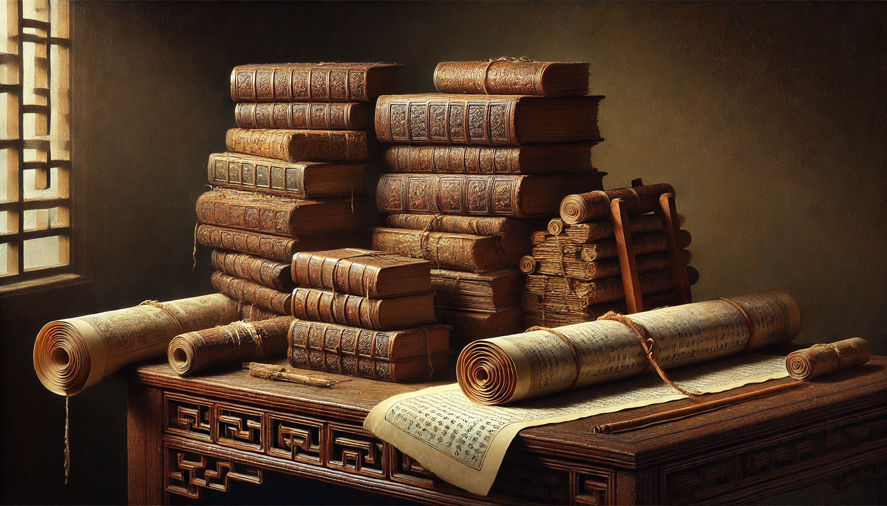
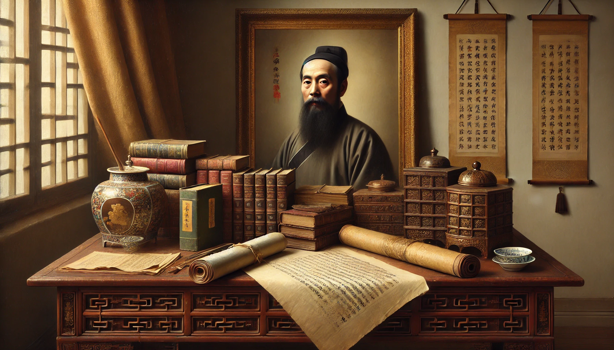

# 【生命⋅修行】在曾国藩梁启超那里寻找家训（一）

那天大宝看了一本外国人写的关于孩子教育的书后，感叹还是要在中国传统文化里、在那些古书和先贤中去寻找可以传家的教育之道。然后，她扔给我一个任务：

> 你去曾国藩的文章里找找看，然后和我讨论！

正好手边有一本《冯唐品读：曾国藩嘉言钞》，这可是集曾国藩、梁启超、冯唐三人智慧于一身的书呀。于是赶紧奉手谕，把这本书又翻看圈点一遍。

在分享我自己不成熟的归纳总结之前，我想还是先引用一段冯唐的序言，向大家郑重推荐一下这本书：

> 在写作的过程中，我抵制了试图总结归纳的诱惑，还是保持梁启超编选的顺序，和《论语》一样，没头没尾，从任何一页都可以读起，在任何一页都可以停下。我渐渐理解了孔子后人和梁启超为什么这么做，为什么没有试图建立一个不重不漏的体系：总结归纳难免遗漏和变形，不如像草木流水一样把文字放在这里，读过之后，读者自然有自己的总结归纳或者再读一遍的欲望。

### 总体 🌟🌟🌟🌟🌟5星

就像冯唐说的，「从任何一页都可以读起，在任何一页都可以停下」。并且几乎每一句话，都可以拿来践行许多年、甚至一辈子。

## 最根本的信念

站在搜寻可传家之道的角度，我觉得最根本的是那个目标与信仰一体的信念：

### 扫荡一副旧习，赤地立新

> 欲学为文，当扫荡一副旧习，赤地立新。将前此所业荡然若丧其所有，乃始别有一番文境。（与刘霞仙）
>
> （启超按：此又不惟学文为然也。）

学文难在创新，如梁启超说，万事也都是如此。人的本质，乃至生命的本质也是如此。一切传承旧识只是基础，要更进一步，却得荡平这一切——将那些基础乃至过往成绩都化为沃土，然后才能长出新东西来。

难！

但这却是生命的本质与信念。任何时候，任何境遇，只要活着，都可以继往开来、推陈出新。最近流行的所谓「成长型思维模型」，背后的也是说的这个关于「生命本质」的信念吧。

曾国藩在给弟弟的家书中写道：

> 袁了凡所谓「从前种种譬如昨日死，从后种种譬如今日生」，另起炉灶，重开世界。安知此两番大败，非天之磨炼英雄，使弟大有长进乎？谚云「吃一堑，长一智」，吾生平长进，全在受挫受辱之时。务需咬牙励志，蓄其气而长其智，切不可茶然自馁也。

曾国藩的人生经验，就是屡败屡战。这也是从另一个角度在阐述这「生命本质」吧。他还有另外一句：

> 天下凡物加倍磨治，皆能变换本质，别生精彩，况人之于学乎！

我想，这就是对学习、对生命成长能力的根本信念吧！无生命之凡物，都能琢磨成器，何况有生命之人，孜孜以学呢？

## 最基本的准则

### 正心诚意

曾国藩给弟子的四条日课之中，首先就是这条：

> #### 一曰 慎独则心安
>
> 自修之道，莫难于养心。心既知有善有恶，而不能实用其力，以为善去恶，则谓之自欺。方寸之自欺与否，盖他人所不及知，而己独知之。故《大学》之「诚意」章，两言慎独。……
>
> 能慎独，则内省不疚，可以对天地质鬼神，断无行有不慊于心则馁之时。人无一内愧之事，则天君泰然，此心常快足宽平。是人生第一自强之道，第一寻乐之方。

这是来自儒家从孟子、到阳明先生再到曾国藩的一路传承。归根结底就一个字——「诚」，而且是对自己诚，对的继续做，发现错了就改。为善去恶，内省不疚。

每个人都有自己的定盘针，就在那「方寸之间」。要善用！情绪、感受都是「心」的信号，要善听！

能不能睡个安稳觉，倒是一个最最客观的标准，可用于自查。关于这点，梁启超在书中还摘录了许多曾国藩的文字，想必大家都觉得，这是非常非常重要和基本的准则吧！

> 吾辈所最宜畏惧敬慎者，第一则以方寸为严师，其次则左右近习之人，又其次乃畏清议。

> 吾辈位高望重，他人不敢指摘，惟当奉方寸如严师，畏天理如刑罚，庶几刻刻敬惮。（复李希庵）

> 余死生早已置之度外，但求临死之际，寸心无可悔憾，斯为大幸。

临死之时，能心安，这恐怕也是人生最高的目标了吧。能做到像阳明先生去世前那样：

> 此心光明，亦复何言……

该是多么让人向往的境界啊！

### 志存高远

王阳明曾说：「故立志而圣则圣矣，立志而贤则贤矣。志不立，如无舵之舟，无衔之马，漂荡奔逸，终亦何所底乎？」曾国藩也同样这么认为，并且不止成圣成贤的人生终极目标如此，但凡要成长要改变，哪怕是一点点，像戒烟这样的小事也是同样如此：

> 人之气质由于天生，本难改变，欲求变之之法，总须先立坚卓之志。即以余生平言之，三十岁前最好吃烟，片刻不离。至道光壬寅十一月二十一日立志戒烟，至今不再吃。四十六岁以前做事无恒，近五年深以为戒，现在大小事均有恒。即此二端，可见无事不可变也。
>
> 古称金丹换骨，余谓立志即丹也。

以他自己的例子，三十岁、四十六岁依旧可以「金丹换骨」，真的让人鼓舞振奋。苟日新、日日新，无论年岁，总可以立志为开端。

> 士人第一要有志，第二要有识，第三要有恒。有志则不甘为下流，有识则知学无尽，不敢以一得足，有恒则断无不成之事，三者缺一不可。诸弟此时，惟有识不可骤几，有志有恒，则诸弟勉之而已。

> 学贵初有决定不移之志，中有勇猛精进之心，末有坚贞永固之力。

当然，立志只是开始，接下来还有许多具体的修行方法，不知不觉总结了快两千字。要不下次再继续吧……

<待续>