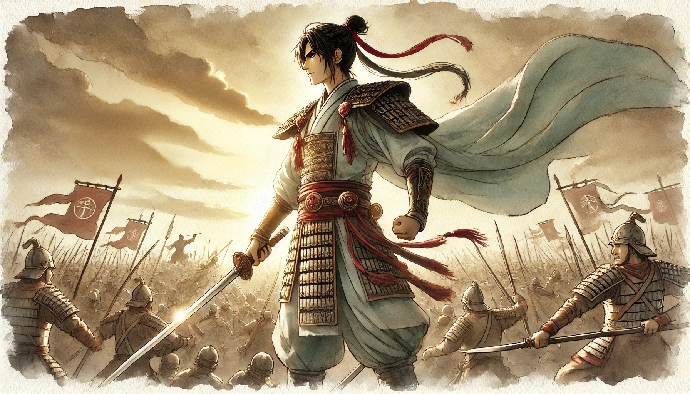
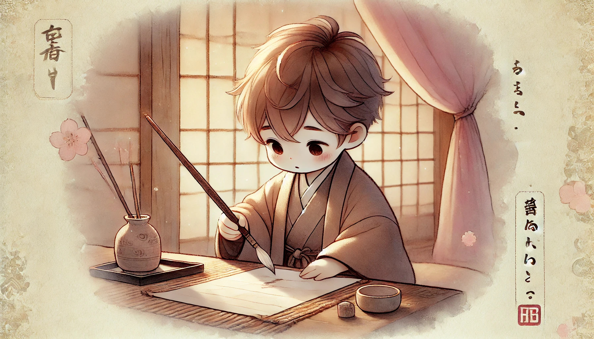
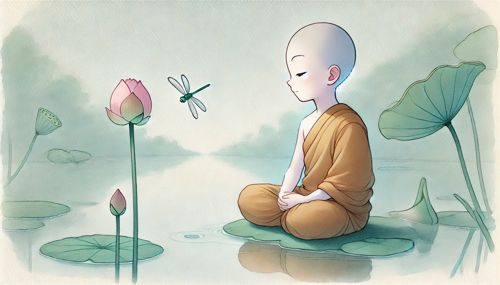

# 【生命⋅修行】在曾国藩梁启超那里寻找家训（二）

## 那些具体的修身齐家之道

很想继续有系统、有次第地选出立志之后最关键的一、二、三来。却发现非常难，不禁也体会到一点冯唐所说为什么梁启超和他最后都没有用这种方法总结的原因了：那终极的道理其实不可言说，这绵绵密密，如流水草木的每一句话，都是窥其一孔，互相之间也颇多联系。怎么归纳总结，都觉得差点意思。

虽然如此，还是把我个人、此时觉得最重要的一条先搬出来吧。那就是：

### 用兵之道，最重自立，不贵求人

> 用兵之道，最重自立，不贵求人。驭将之道，最贵推诚，不贵权术。（复李少荃）

这是写给李鸿章的，后一条就不多说了。而「自立」，既是所有修行的目标、也是修行的路径、更是框定了修行的范围。

一切动作，都是奔着增强自己的能力、创造自己的价值、打磨自己的身心而去。哪些是自己的事情，哪些是别人的事情，一定要分清楚。自己的事情，自己动手，自己承担责任。在自己影响力范围之外的事情：不碰、不说、不想、不理！

原因也很简单，待到临死那一刹那。无人能助，惟有自救。而任何事情，无论大小，到了关键点上，最能依靠的，也惟有自己。

> 军事呼吸之际，父子兄弟不能相顾，全靠一己耳。

> 凡危急之时，只有在己者能靠得住，其在人者皆不可靠。恃之以守，恐其临危而先乱；恃之以战，恐其猛进而骤退。

而自立，背后还有一层意思，就是那做事修身的真正目标也是在自己身上、自己心里。不必被其他人的喜怒哀乐所影响动摇：

> **我辈办事，成败听之于天，毁誉听之于人，惟在己之规模气象，则我有可以自主者，亦曰不随众人之喜惧为喜惧而**。（与李次青）

> **富贵功名皆人世浮荣，惟胸次浩大是真受用**。

> 急于求效，杂以浮情客气，则或泰山当前而不克见。以瓦注者巧，以钩注者惮，以黄金注者昏。**外重而内轻者，其为弊也久矣**。（与李次青）

一言以蔽之，专心向内，才是修身根本。而且：

> 知心治身，理不必太多，知不可太杂，切身日日用得着的不过一两句，所谓守约也。（复李申夫）

除开之前所说，要有「赤地立新」的精神、以「方寸为严师」、立志「金丹换骨」，时时刻刻要下的功夫，就是厘清哪些是自己的事（所谓关你屁事），哪些不关自己的事（所谓关我屁事），然后在自己的事上全力以赴罢了。

是非审之于我，成败听之于天，毁誉听之于人！

那么，何谓全力以赴呢？

### 「敬」字、「恒」字二端，是彻始彻终功夫

> 「敬」字、「恒」字二端，是彻始彻终功夫，鄙人生平欠此二字，至今老而无成，深自悔憾。（复葛翠山）

梁启超摘录这段时，去掉了前面的「吾辈读书」几个字。这两个字，确实不止适用于读书，做事也一样。

「敬」，敬天悯人，尊重常识和积累，不走捷径。是《庄子•庖丁解牛》里「每至於族，吾見其難爲，怵然爲戒，視爲止，行爲遟，動刀甚微」那种态度。

「恒」，在对的事情上坚持投入时间和精力，几年、十几年、几十年如一日，不求速效。

关于「敬」，曾国藩在给弟子的四条日课中专门提到：

> #### 二曰 主敬则身强
>
> 敬之一字，孔门持之以教人，至程朱则千言万语不离此旨。……
>
> 吾谓敬字切近之效，尤在能固人肌肤之会，筋骸之束。庄敬日强，安肆日偷，皆自然之征应。虽有衰年病躯，一遇坛庙祭献之时，战阵危急之际，亦不觉神为之悚，气为之振，斯足知敬能使人身强矣。若人无众寡，事无大小，一一恭敬，不敢懈慢，则身体之强健，又何疑乎？

冯唐说：「敬」，通俗说就是认真。这可能是曾国藩给人们最最深刻的印象了。不过我个人觉得，这背后最重要的是尊重与谦卑：

尊重天，尊重客观规律；尊重人，每一个人每一个生命；尊重事，尊重客观事实！

关于「恒」字，大宝练字一定颇有体悟。曾国藩也有这样一段论述：

> #### 凡事皆用困知勉行工夫，
>
> 不可求名太骤，求效太捷也。尔以后每日宜习柳字百个，单日以生纸临之，双日以油纸摹之。临帖宜徐，摹帖宜疾。数月之后，手愈拙，字愈丑，意兴愈低，所谓困也。困时切莫间断，熬过此关，便可少进。再进再困，再熬再奋，自有亨通精进之日。不特习字，凡事皆有极困极难之时，打得通的，便是好汉。

在一件件小事中，体悟熬过困境后打通少进的快感。这个「恒」字，也是这样一点点练成的。

### 崇俭习劳

这是曾国藩认定要营造的家庭小环境和小氛围。他说：

> 吾屡教家人崇俭习劳，盖艰苦则筋骨坚强，娇养则精力愈弱也。

人是活物，身体和脑子都是越用越好。所以，

第一：自己的事情自己做，按冯唐的说法——少请助理。

第二：无论是身体还是脑子，都要坚持锻炼。最好每天都有在Stretch Zone的锻炼，包括烧脑，包括燃脂。

这也是选人、组团队的标准。

> 习劳为办事之本。引用一班能耐劳耐苦之正人，日久自有大效。

而且，对身心健康有好处。他说：

> 处多难之世，若能风霜磨炼，苦心劳神，自足坚筋骨而长识见。沅浦叔向最赢弱，近日从军，反得健壮，亦其证也。

曾国藩给弟子的日课之四正是习劳：

> #### 四曰 习劳则神钦
>
> 凡人之情，莫不好逸而恶劳，无论贵贱智愚老少，皆贪于逸而惮于劳，古今之所同也。人一日所着之衣、所进之食，与一日所行之事、所用之力相称，则旁人韪之，鬼神许之，以为彼自食其力……
>
> 是以君子欲为人神所凭依，莫大于习劳也。

崇俭也是一样。

> 居家之道，惟崇俭可以长久，处乱世尤以戒奢侈为要义。

> 《易》曰：「劳谦君子有终。吉。」「劳谦」二字，受用无穷。劳所以戒惰也，谦所以戒傲也。有此二者，何恶不去，何善不臻？

> 吾兄弟报国之道，总求实浮于名，劳浮于赏，才浮于事。从此三句切实做去，或免于大戾。

咦，这最后这句，不就是达利欧总结建议的，世界经济机器运行的三条法则吗？

>#### Rule One 第一条法则
>
>Don't have debt rise faster than income. 不要让负债的增长超过收入的增长。
>
>#### Rule Two 第二条法则
>
>Don't have income rise faster than productivity. 不要让收入的增长超过生产力的增长。
>
>#### Rule Three 第三条法则
>
>Do all that you can to raise your productivity. 尽一切可能，提升你的生产力。

曾国藩是一个极度勤勉之人，然而，带兵打仗的他，最知道「气」不能竭。

### 常存有余不尽之气

> 锐气暗损，最为兵家所忌。用兵无他谬巧，常存有余不尽之气而已。（与李次青）

怎么长存这个气，冯唐总结了五条。落到个人身上，有用的是最后两点：

第四，永远有一个有挑战、有胜算、有诱惑力的近期目标，哪怕大势及其恶劣。

第五，永远有事儿做，哪怕看不出明确的短期作用。有仗打，打仗；没仗打，备战。

Paul Graham在怎么干大事那篇文章中，也强调士气的万分重要。我记得还有人提出过一个有趣的技巧，就是在还想要继续干时停下来。把这点「士气」留待下次或者明天再用。王建硕提到过的，每天不要跑过1000米也是这个意思。

写道这里，我忽然意识到，其实，我也应该停下来了。

还有很多我觉得重要的教诲、或是经验之谈。同样还有很多我翻过去没有太留意，但同样重要的文字，这一本书的内容，曾国藩这一世的经验，不可能穷尽在这一两篇文章之中。

下面这段权当作结尾吧：

> 日中则昃，月盈则亏，故古诗「花未全开月未圆」之句，君子以为知道。自仆行军以来，每介疑胜疑败之际，战兢恐惧，上下怵惧者，其后恒得大胜；或当志得意满之候，狃于屡胜，将卒衿慢，其后常有意外之失。（与罗伯宜）
>
> （启超按：处一切境遇皆如此，岂惟用兵？）

