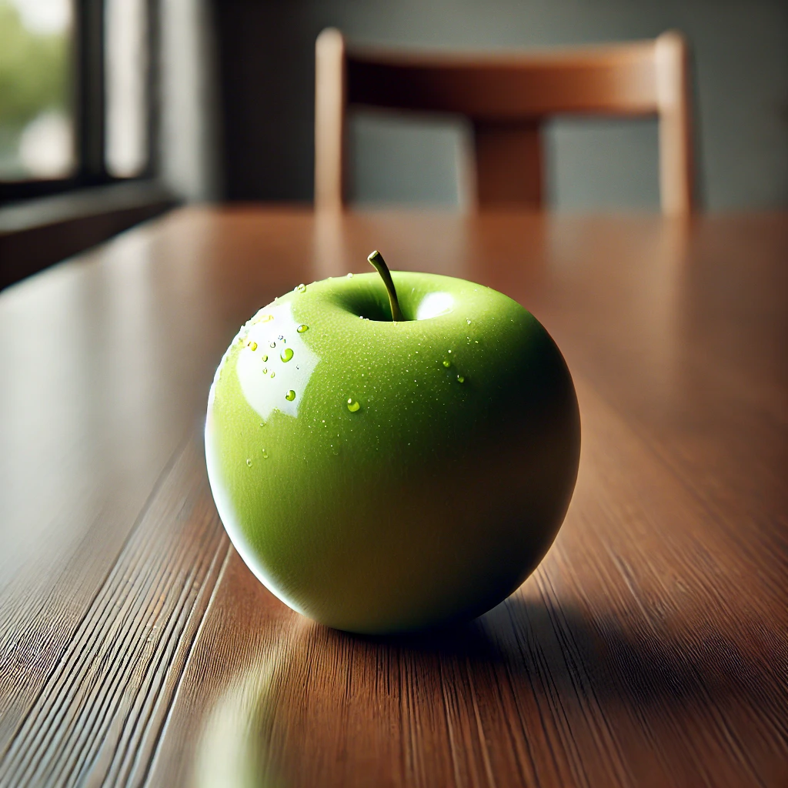
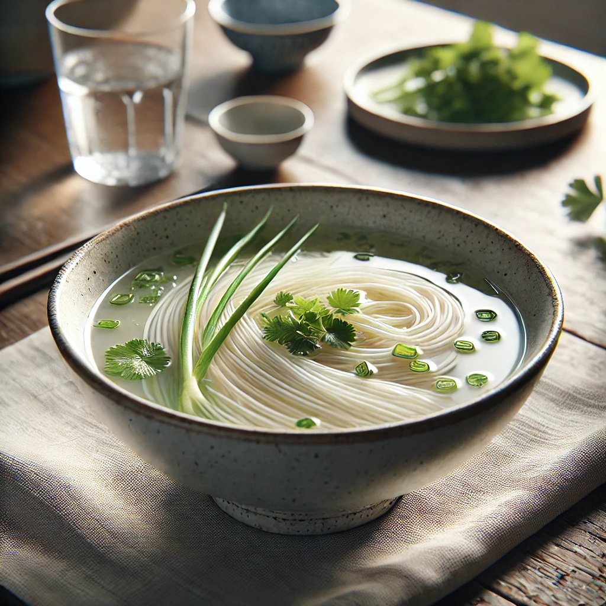
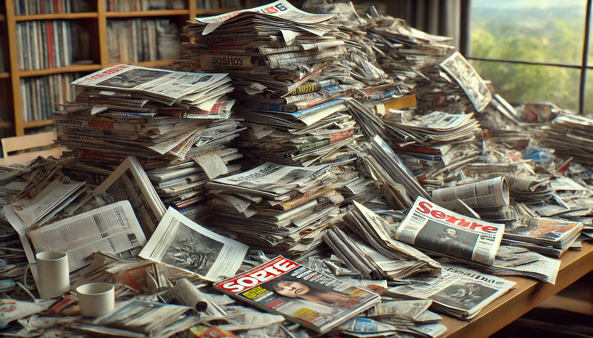

# 【生命⋅修行】留心自己在吃什么

前一天晚上睡前翻了几页萨古鲁的书《三个幸福的真相》，里面提到一些神秘学的词，也提到了选择食物的重要性。我意识到，自己对于食物的选择其实非常盲目和无知。

最大的习惯，或者说习性反应，就是只要面前有食物，我就会一直吃，直到把自己吃得撑得不行。而且，通常是全部吃完才停下来，或者不得不到了离开餐桌的时候。以至于以前常和我一起吃饭的朋友会养成这么一个习惯，只要有我在，就不用担心东西点多了。近年来有些收敛和觉知，但很多时候依然如此。

尤其是一些聊天或聚会，有零食或水果放在我面前的时候，我会下意识地，不停地去拿东西来吃。这时，我常常心里会纳闷，别人是怎么忍住不吃的。

这段时间因为酒店早上提供自助餐，一开始每天早上我都会把自己吃到肚胀溜圆。每天吃完，都会难受很久，但几乎每天都会吃那么多。直到几个星期后，我开始有意识地控制并记住自己拿的食物数量，如果吃撑了，第二天就少拿一点。才终于找到了让自己不那么难受的量。但依然，大部分时候每次还是会吃多，只不过没那么难受了而已。

除了偶尔一两次，实在没空。随便吃两口就离开，仔细感觉，其实也饱了，而且不撑不难受。无非只是下午饥饿感来得更早一点。

看过那几页书，我开始设想第二天早上的早餐吃什么。应该还是会要一个Omelet，水果少拿几块。香肠就不要了，回想起来，那牛肉肠的味道有些咸，并且每次吃香肠时都已经撑到了。再拿一片全麦面包，把它烤成焦黄香脆，抹上一些黄油。拿两片菜叶和几个黄瓜片，把面包对角切开，做成三明治。咖啡可要可不要，鲜榨的橙汁依然可以来一杯。想来，这样的食物，应该足够大半天的能量了吧。

然而，这天早上，我没能赶上餐厅的早餐时间。一开始，自己并不饿，心想索性断食一天算了。但忽然在某个时候，肚子咕咕叫了两声。于是，我找到桌上放了两三天的那个苹果，洗了洗，一口一口干掉了它。很脆很甜，只是啃的时候得小心，别把自己已经有些老化的牙龈弄出血来。吃完，肚子竟然完全饱了，甚至有些撑的感觉。想来这是苹果这个食物本身的原因。

一个多小时之后，我又饿了，于是跑去厨房给自己煮了一碗清水面。除了酱油和醋，什么都没放。同事留给我的那瓶老干妈已经几乎被我吃完了，但这次我并不想放辣椒。酱油没放太多，咸味正好。我多放了些醋，酸酸的，吃起来很是舒服。

看来，饥饿真是让自己一点一点恢复对食物觉知的好办法。不同的食物，会给人不同的能量。自己在不同的时间与状态下，所需要的食物分量与内容也不一样。而且，食物被消化所需要的时间与能量也是不一样的。

大脑的食物，不也是一样的吗？我的大脑也同样养成了疯狂攫取各种「食物」的习惯，不接受些「信息」根本安定不下来。而且，会更加习惯于依赖眼睛，攫取一切能看到的文字、图片、视频。尤其是文字——它常常隐藏在「学习」的外衣下，全然忽视了自己大脑早已处于「信息过量」的状态。

或许，真应该像给「胃」一样，给「大脑」也来个「禁食」，让它恢复对于觉知，然后精挑细选，留心要喂给它的东西。像早上看过的那篇关于「是锡」的那些「是时候存钱了」的文章们，就别看了。许多憋闷难受的情绪，其实都是来自那里的。

如今，早已不是打造我这副身体的上古时代，原始人要面临的资源匮乏和信息匮乏早已经消失得不见踪影。所以，只能多留些心，不管是胃还是大脑，自己在吃些什么千万要注意。

