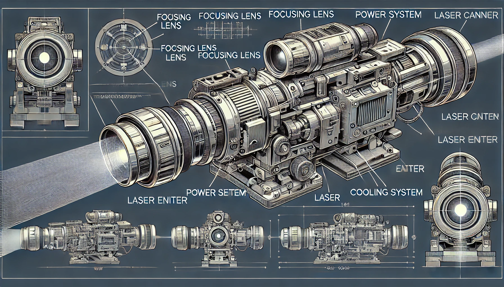

# 【生命⋅修行】不聚焦的生命

晚上的时候，从手机上看到一篇文章，谈巴菲特的5/25法则。真的是有点讽刺，先是被一件自己不那么认可，但不得不做的工作耗费完精力后；接着又和重要的人一起处理一件不知道可能不是此时最重要的事情，没搞定；然后莫名其名地折腾了一件被搁置很久的问题，中途开始分神刷手机，却看到了这篇关于「专注」的文章。

也不知道这个故事是杜撰的还是真的，据说巴菲特给他的飞行教练麦克•弗林特职业建议时，让他列下自己25个职业目标，接着从中选出最重要的5个。然后，重点来了：

**他让麦克•弗林特特别当心剩下那20个「不那么重要」的目标，千万不要被他们分散和牵扯了精力！一点都不行！！！**

肉眼可见的那些世俗世界成功者，都是及其「专注」的。在有一次访谈中，巴菲特说，当年比尔•盖茨父亲在一次聚会活动上，让在场所有人20多人在纸上写下一个对成功来说最重要的词。那时候巴菲特和比尔•盖茨才见第二面，但他们俩不约而同地写下了「专注」这个词。

乔布斯的妻子劳伦曾经谈过他时说：

> 乔布斯就像激光那么专注，当他聚焦在你身上时，你会觉他的关爱像阳光一般沐浴着你，而当他的光芒转移到其他关注点时，你就会感觉人生陷入完全的黑暗。”

而我，恰恰是不聚焦的反面教材。做事时，我有时专注、有时不专注。但真正的麻烦在于，我想要做的事情，以及每天、每年乃至这几十年来做过的事情实在是太多太杂了！

而且，这些事情，与我生命中最最核心的目标偏差之大，让我自己都不忍卒视……

生命，真的很短暂。最重要的人，最重要的事没那么多！

