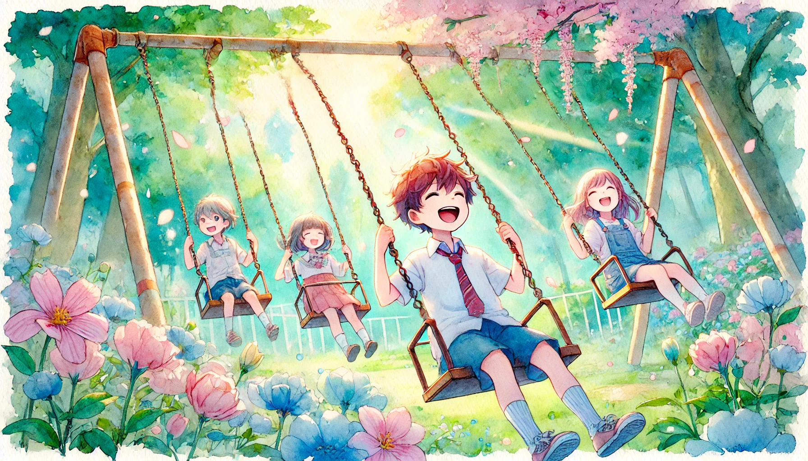

# 【生命⋅修行】余生最重要的事

聊到聚焦与专注，我禁不住开始仔细思考什么是我余生最重要的事情。早上和大宝聊天时，我把这个问题抛给她，她愣了一下，说：

> 这个问题真大呀，我平时没怎么思考过，让我想一想先，别回答偏了……

平时不用思考这个问题，就知道自己想要什么，该做什么的人真是让人羡慕！大宝想了一会儿，就告诉了我答案：

1. 好好陪着孩子们长大。
2. 练太极拳。
3. 赚到足够财务自由的钱。

> 就这？没了？

我有点惊讶，她也太聚焦了吧！话说，赚钱这条，还是我补充后她确认的，一开始她只说了前两条。我想了想又问：

> 学英语和练字呢？

她说：

> 那个算爱好，可以用来打发无聊的时间。嗯，这么说也不准确。
>
> 第一呢，我老公现在常常往海外跑，如果我跟着一起出去玩的时候，英语就用得到呀。然后，我学习投资，将来可能会需要直接阅读英文分析和材料的情况，这也是可能会用到的场景。总之，这就是一个工具。
>
> 至于练字，这是另外一个陶冶性情、让自己开心的方法。和太极不同的方法，我也喜欢，算是另外一个排在后面的爱好而已。

我有点羡慕她。又默默回顾了一下想过很多次，昨晚也再次琢磨过的自己那份答案。对我而言：

**第一重要的事情，还是寻求能够幸福、快乐生活的「生活之道」**。我希望自己能寻着这「道」，慢慢地活得痛苦越来越少，到临死时能坦然面对自己经过的一生与即将到来的死亡。不过，这个事情、这个目标、这个追求，就我目前的了解看来，不会与任何其它目标冲突。它本来就需要我在一件件事情、在一次次相处、在每一个瞬间持续地磨炼、求索。离开了，再回来。放下了，再捡起。一点一滴 地观照、一点一滴地更加爱自己、更好的做自己、一点一滴（或大刀阔斧）地把限制自己幸福和快乐、遮蔽心中之「道」的桎梏与阴霾扫除掉，如此而已……和大宝聊起这一点时，她很愉快地告诉我说：

> 嗯，这是你需要的。还好，我没有这个问题的困扰！

**第二重要的事情，关乎到最最重要的人。**首先，我希望能和大宝一起，陪伴她、帮助她去完成那些对她来说重要的事情。

**第三重要的事情，还是那些重要的人。**包括我的孩子们，还有父母，还有少数几个特别熟悉、要好、相处愉快的朋友。大女儿C已经独自踏上了去异国求学的旅程。过去十年不能给她一个完整的家和足够多的陪伴，是我深深的遗憾，也是愧疚。再过十年，阿宝也一样会到这个离开我们独自前行的年纪，大鱼也不过再多个三、四年。自己已经七十多岁的父母，所能够健康陪伴我们的时间究竟有多长就更不可知了，在这之前，总归需要在尽可能陪伴、支持他们的同时，做好自己身心上的准备（当然，能看开自己生死时，应该也能看开一切了。但也可能永远准备不好）。

**第四，也到必须解决钱的问题了。**天呐，虽然这也是要和大宝一起奋斗的目标之一。但这对我个人来说也同样重要，因为，物质上的限制，目前看到的确会影响其它目标。所以，先解决所有的债务问题，再一步一步走向财富自由。只不过，在这过程中，需要努力不向第二、第三目标妥协吧。

最重要的名额，只剩下最后一条，真的好难选。感觉自己脑子里随便就能冒出想出很多要做的事情来，尤其是那些念想已久，始终未能完成的事情。比如学会吹尺八；坚持写作的练习，最终写成一本，或者几本自己的书，关于技术（比如区块链、AI）、关于商业、关于投资、关于传统文化、关于哲学、或者只是记录和分享幸福的感觉、或者只是故事、真实的或者科幻的；搞成一件和教育相关的、对所有人特别是下一代教育来说有意义的事情；写自己想写的那许多程序和应用；搞成一个产品；搞成一个公司；练好书法，学会黄庭坚的字体；学画画，学会丰子恺和蔡志忠的那种漫画；捡起儿时的梦想，学学天文或天体物理，当不了科学家也当个专业的科学爱好者；还有，如果能有机会的话，去太空看看；对了，地球上也有很多地方没去过呢，还有些地方想去看看；嗯，法语也还没学会，英语也不够流利，欠大宝的木雕猴子越积越多；小时候学过的篆刻，想捡起来再学学；那些想看的书，想看的电影不知道算不算；另外，说实话，太极拳我也想练得更好些……

粗粗罗列就有这么多，要是细化一下，更不止二十条。呜呼！无法作出选择，要投降了（再次默默地羡慕简单、干脆、天生懂得聚焦的大宝）。或许，我只能把它们围绕着目标四，来进行组合、找交集，然后取舍和优选了。不知道我这样算不算是选择困难症患者的逃避行为……然而，想到这里，我却意识到另一件事情至关重要。好吧，第五重要的事情出现了：

**第五，保持健康的前提下，尽可能活长一点。**现如今的科技条件下，得起码超过100岁吧。这样我才好有更多的时间，在这辈子好好地一一实现上述目标。

呼呼～感觉自己挺贪心的。贪婪和欲望，是人类前行的原动力，不是嘛！

