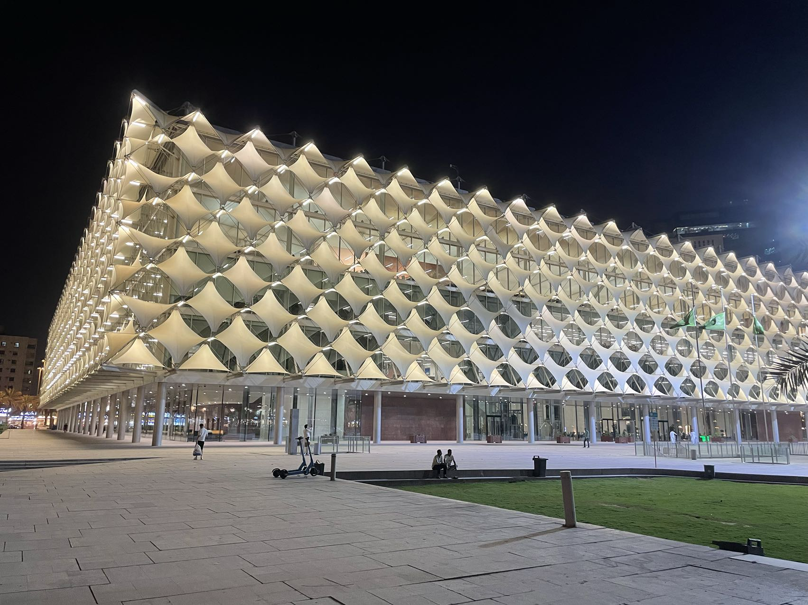
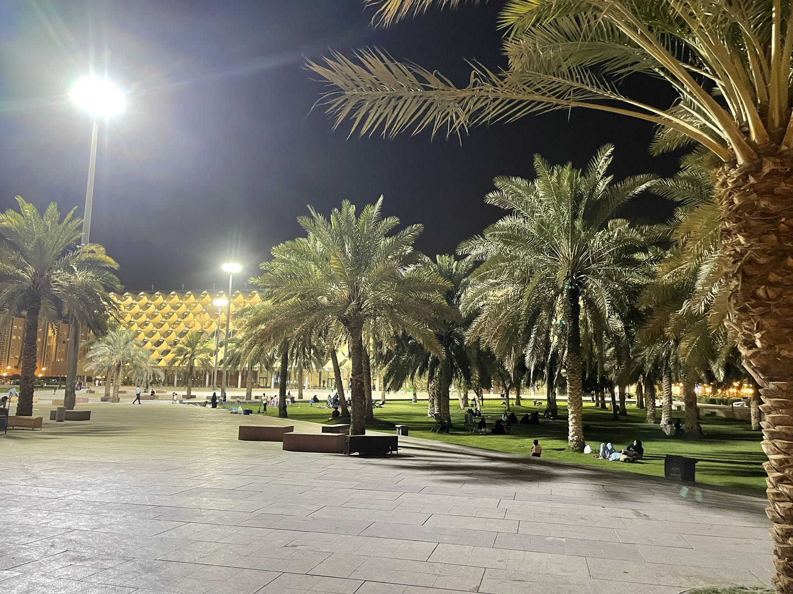

# 【随笔】利雅得好像一个烤箱

埋头电脑前整整一天，晚上决定一个人出去吃点正经好吃的东西。

太阳已经明明已经落山，可是一出门就有一种被热气猛然砸在脸上的感觉。然而，与阿布扎比不同的是，眼镜居然没有起任何水雾！或许是天气太干燥了吧……热烘烘的空气，刚猛霸道地迅速抽干了从汗毛孔冒出来的任何水分。如果阿布扎比是桑拿房，利雅得就是一个烤箱。

竟然有不少人愿意坐在临街外面的座位，有些高档点的餐厅会在餐桌边布置上一些喷水雾的设备，营造出一片专属的凉爽空间，有些没有。但似乎还是有不少穿着白袍、不知是本地还是来自哪里的穆斯林年轻人，毫不在意街边的热浪，就坐在热气腾腾的路边，开始呼朋唤友。

从地图上看，大约走15分钟的路程就有一片绿地，在King Fahad Library 门口。果然没走多远就到了，说实在话，这是一座挺漂亮的建筑。

门口的草坪上，已经坐了不少人，还有许多小孩子在玩着滑板车。看来夜幕降临之后，当地人喜欢的活动之一，也是拖家带口来到这茵茵绿草地上接受点地气。

有些朋友说，利雅得的气候更舒适，不像阿联酋或吉达那种城市那么潮湿。但也有些朋友喜欢海边不那么热、不那么干燥。

对我而言，却好像没什么区别。不管走到哪里，烤箱也好，桑拿房也好，内心要面对的挑战与波澜却还是那些。真的是不管在哪里，在玩的依旧还是内心的那些小把戏罢了。

天气预报显示，早上7点之后温度就会迅猛上升，那么明天能不能赶在7点前，早起出门运动一下呢？小小期待……