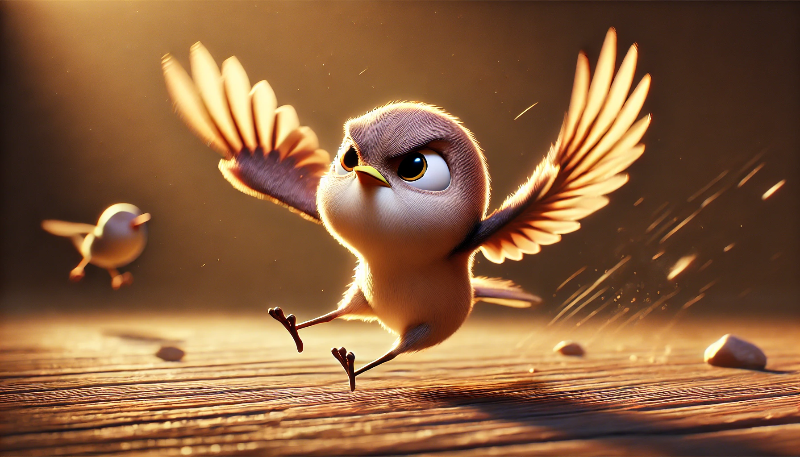

# 【生命⋅修行】安于笨拙

前两天和朋友聊天，不知说起啥事来，他忽然低头沉吟片刻，然后抬起头来，露出一副感慨的表情，却欲言又止。过了一会儿，可能是找到了一个合适的词语，他终于开口：

> XXX，我发现，你怎么这么天真呢？

嗯，不止一个人这么说我了，似乎我常常会显露出与自己年纪和资历不匹配的愚蠢。而想到这里，我更想起曾国藩说过关于读书人「笨拙」的一句话来（为了找到这句原话，我几乎把《曾国藩嘉言钞》又翻了一遍，真可谓笨拙之极）：

> 吾辈读书人，大约失之笨拙，即当自安于拙，而以勤补之，以慎出之，不可弄巧卖智，而所误更甚。（复宋子久）

以前真没有这样的自知之明。因为读书成绩还凑活，直到高中阶段才被那些天才孩子们「羞辱」一番，更加上一直喜欢诸葛亮、刘伯温这种高智商谋士的故事。不知不觉已养成像孔乙己那样的心高气傲，自以为是。许多年来，在待人接物做事上，总是自以为聪明，还常常看不起别人。

直到忽然有一天，猛然惊觉，自己竟然是那「百无一用的书生」！

念书一直念到大学读完，平时又依然爱看几页书，自诩读书人——可不就是一介书生么。真的「百无一用」了么？还好，有曾国藩告诉我说，书生不是无用，只是笨拙而已。但关键在于，要安于笨拙的本分。既然喜欢读书，就要知道和明白自己这笨拙的天性与本份。

作为一介书生，要认命！认自己确实笨拙的命！

就像「素富贵，行乎富贵；素贫贱，行乎贫贱」一样，「素笨拙」，也得「行乎笨拙」吧。

所以，坦然面对与接受自己的笨拙。不需要企图让自己显得更聪明，更圆滑。尽管安于笨拙，最多更加勤劳一点、更加谨慎一点就好了。

