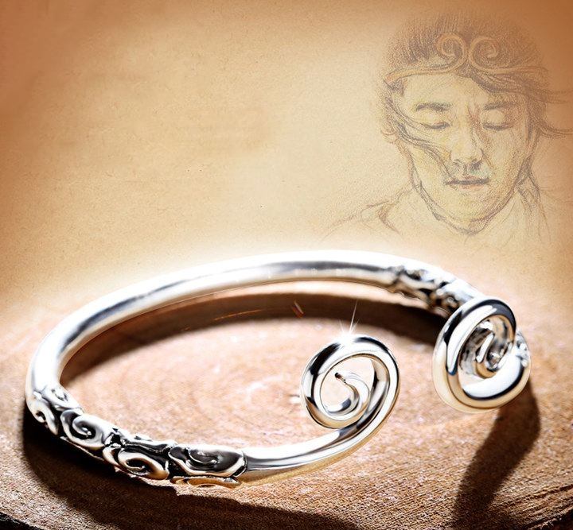

# 【生命⋅修行】对自由的向往

昨夜完成前一天计划的大部分工作时（除了运动，除了静坐），已经是凌晨1点30。不知何故，猛地又陷入一种巨大的不开心情绪里。

躲进卧室，拿出笔和本子，我疯狂地写啊写啊，想要借着这种办法，找到那触发情绪的关键点。然而，只看着自己的笔记从潦草到混乱，再略微恢复工整，再度混乱，再度工整起来，见证了自己心情的起起伏伏。最终，我想到如果只是想要心情平静下来，不如默写两句心经吧。

也不知是「心经」的力量，还是困了倦了，带着一丝丝莫名奇妙的感觉，我终于进入了梦乡。

等一觉睡醒，发现难受的情绪已烟消云散。然而一转念才想起这事儿，又感觉不开心如同乌云般升起。我不由得对这种情况感觉到无聊，刚睡醒时明明很舒服的，为啥紧接着就要捡起昨晚的「不开心」来呢？不知是不是这么一想，乌云又悄悄地散开了。

那种「不开心」，恐怕是来自于对自由的极度向往和对不自由的极度恐惧吧。因为连续几件「不得不」如何的境遇，触发了自己内心的开关。

想起当年申请从菊厂毕业时，一个最大的触发点就是大女儿C的外婆和我说的那句话：

> 我也有很多喜欢做的事情，读书，写毛笔字，但是一直不能去做。我只能让自己忙起来，忙碌起来，就不会因为这些而痛苦了！

我对自己说：

> 我绝不让自己老的时候，同样的只能用忙碌来麻痹自己，不能做自己喜欢做的事情的痛苦，绝不！

所以，当自己兜兜转转，8年过去，却发现自己依然困顿于职场，依然不能自由自在时，才会「苦」从心生！但这「苦」，却依然是假象。

人生总是会被什么东西困住，挣脱开枷锁，却发现自己还在牢房；钻出牢门，却发现自己不过身处一个更大的监狱；踏碎凌霄，却被囚于五行山下；好容易出山西行，却又被紧箍儿咒……

总有一天，这自己戴上的箍儿，会自己除去吧！

