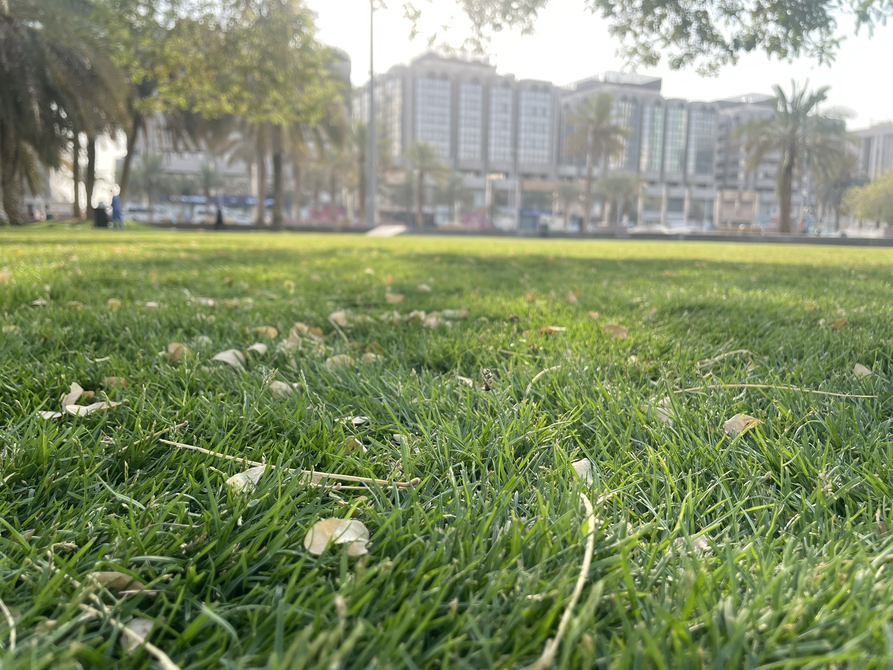
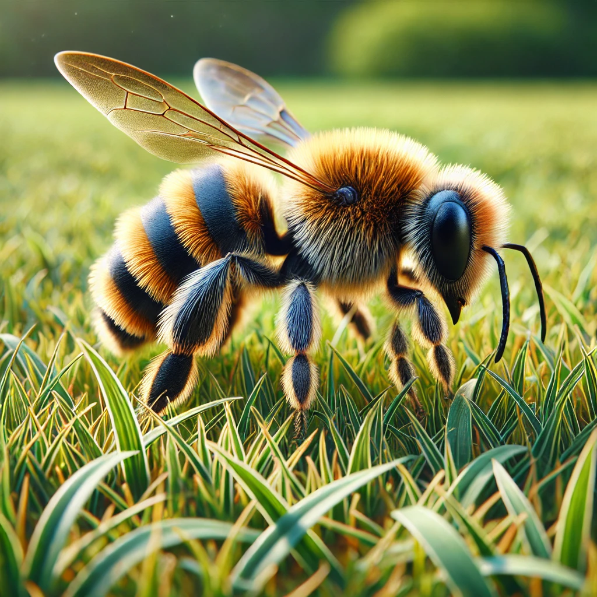

# 【随笔】努力啃草的小蜜蜂

清晨7点多，天还没开始热起来，阳光已经洒满了草地。我原以为树荫下是昨晚的游人扔下的垃圾，低头看过去，才发现那几乎都是树上落下的树叶还是花瓣罢了。

更让我惊奇的是，草地上飞舞着许多小蜜蜂，不远处大楼的空调声和公路上往来汽车的噪音完全压住了小蜜蜂的嗡嗡声。于是，只觉得它们安静地在草丛上空掠过，然后抱住一株小草，拼命地扭过来、扭过去，努力地啃啊啃啊，忙得不亦乐乎。少顷，又飞起来。换到一厘米开外的另外一株小草，继续抱啃。

再凑近点，才知道，那小草株上竟然开着一串小小的花朵，站着时根本没发觉原来这嫩绿的小草，早已开满了花儿。虽然这草儿不起眼，花儿更不起眼，蜜蜂🐝却不嫌弃，兀自努力地在几乎只有它们能发现的花间忙碌着。

每一个生命，都在自己的角度里努力地活着。

失火博物馆里的名画、猫与你，你选择救谁呢？如果把猫换成蟑螂呢？如果，这不是失火的博物馆，而是末世的你最后一次选择机会，究竟和谁度过你最后孤独的余生？

蔡康永真的厉害，点透最深刻的道理，却微笑着不肯说破！

